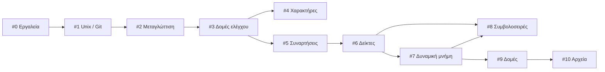

  
  

# Εργαστήρια — Εισαγωγή στον Προγραμματισμό :leopard:

Υλικό εργαστηρίων για το μάθημα **Εισαγωγή στον Προγραμματισμό** (Κ08) του Τμήματος
Πληροφορικής και Τηλεπικοινωνιών του ΕΚΠΑ.

Τα έντεκα εργαστήρια ξεκινούν από το πρώτο άνοιγμα ενός τερματικού και φτάνουν μέχρι
τις αυτοαναφορικές δομές και τη διαχείριση αρχείων στη γλώσσα C. Κάθε εργαστήριο
ξεκινά με τους στόχους του, τι χρειάζεται να ξέρετε από πριν και ποια αρχεία θα
φτιάξετε.

## Η πορεία του μαθήματος

Τα εργαστήρια χωρίζονται σε τρία μέρη. Το πρώτο σας μαθαίνει τα εργαλεία, το δεύτερο
τη γλώσσα, και το τρίτο τη μνήμη και τις δομές δεδομένων.

### Μέρος Α — Τα εργαλεία

Πριν γράψουμε C, χρειάζεται να μπορούμε να συνδεθούμε, να γράψουμε ένα αρχείο και να
το μεταγλωττίσουμε. Τα τρία πρώτα εργαστήρια είναι καθοδηγούμενα **βήματα** και όχι
ασκήσεις.

| # | Εργαστήριο | Θέματα |
|---|---|---|
| 0 | [Καλημέρα Κόσμε! Εισαγωγή και Χρήσιμες Εφαρμογές](labs/lab00/) | webmail, Piazza, λογαριασμός Linux, ssh, shell, editors, Hello World |
| 1 | [Unix και Git](labs/lab01/) | εντολές Unix, δικαιώματα, ανακατεύθυνση, σωληνώσεις, git, GitHub |
| 2 | [Προγραμματιστικά Περιβάλλοντα (Editors / IDEs)](labs/lab02/) | VS Code, scp / WinSCP, μεταγλώττιση, `scanf` |

### Μέρος Β — Τα θεμέλια της C

| # | Εργαστήριο | Θέματα |
|---|---|---|
| 3 | [Μεταβλητές, Δομές Ελέγχου και Επανάληψης](labs/lab03/) | τύποι, `while` / `for` / `do…while`, `if…else`, σειρές |
| 4 | [Είσοδος και Έξοδος Χαρακτήρων](labs/lab04/) | `getchar`, `putchar`, ASCII, κωδικοποίηση |
| 5 | [Συναρτήσεις και Αναδρομή](labs/lab05/) | συναρτήσεις, αναδρομή, Collatz, Fibonacci |

### Μέρος Γ — Μνήμη, δομές και αρχεία

| # | Εργαστήριο | Θέματα |
|---|---|---|
| 6 | [Δείκτες και Πίνακες](labs/lab06/) | δείκτες, αριθμητική δεικτών, πίνακες, κόσκινο Ερατοσθένη |
| 7 | [Πολυδιάστατοι Πίνακες και Δυναμική Δέσμευση Μνήμης](labs/lab07/) | 2Δ πίνακες, `malloc` / `free` |
| 8 | [Συμβολοσειρές και Ορίσματα Γραμμής Εντολών](labs/lab08/) | `string.h`, `argc` / `argv` |
| 9 | [Δομές και Αυτοαναφορικές Δομές](labs/lab09/) | `struct`, συνδεδεμένες λίστες, δυαδικά δένδρα |
| 10 | [Είσοδος και Έξοδος με Αρχεία](labs/lab10/) | ρεύματα, αρχεία κειμένου και δυαδικά, πολλαπλά αρχεία και `make` |

## Τι προϋποθέτει τι

Τα εργαστήρια δεν είναι μια απλή αλυσίδα: κάποια πατούν σε ένα προηγούμενο που δεν
είναι το αμέσως προηγούμενο. Αν χρειαστεί να χάσετε ένα εργαστήριο ή να
αναδιοργανώσετε τη σειρά, το παρακάτω διάγραμμα δείχνει τι πρέπει να έχει προηγηθεί:

## Η σειρά αποσφαλμάτωσης

Πέντε εργαστήρια κλείνουν με ένα παράρτημα αποσφαλμάτωσης. Δεν είναι ανεξάρτητα
κείμενα — είναι μία σειρά που χτίζεται σταδιακά:

| Πράξη | Εργαστήριο | Θέμα |
|---|---|---|
| 1η | [#2](labs/lab02/) | συντακτικά λάθη |
| 2η | [#3](labs/lab03/) | λογικά λάθη και ιχνηλάτηση με `printf` |
| 3η | [#7](labs/lab07/) | σφάλματα μνήμης και ο debugger `gdb` |
| 4η | [#8](labs/lab08/) | αποσφαλμάτωση σε συμβολοσειρές και πίνακες |
| 5η | [#9](labs/lab09/) | διαρροές μνήμης και `valgrind` |

Το [#10](labs/lab10/) κλείνει με παράρτημα διαφορετικού είδους: οργάνωση προγράμματος
σε πολλαπλά αρχεία και αυτοματοποίηση με `make`.

## Σε μορφή PDF

Κάθε εργαστήριο διατίθεται και σε PDF, μαζί με ένα ενιαίο αρχείο `all.pdf` που τα
περιέχει όλα, με εξώφυλλο, ενιαία περιεχόμενα και τα τρία μέρη ως χωριστές ενότητες:

**[⬇ Κατεβάστε την τελευταία έκδοση](https://github.com/progintro/lab-material/releases/latest)**

## Συνεισφορές

Δεχόμαστε με χαρά διορθώσεις και προσθήκες — δείτε το
[CONTRIBUTING.md](https://github.com/progintro/lab-material/blob/main/CONTRIBUTING.md) για το πώς χτίζονται τα PDF, ποιες συμβάσεις
ακολουθεί το υλικό και πώς να στείλετε μια αλλαγή.

## Άδεια χρήσης

[MIT](LICENSE.md) · © University of Athens
