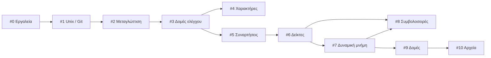

  
  

# Εργαστήρια - Εισαγωγή στον Προγραμματισμό :leopard:

Υλικό εργαστηρίων για το μάθημα **Εισαγωγή στον Προγραμματισμό** (Κ08) του Τμήματος
Πληροφορικής και Τηλεπικοινωνιών του ΕΚΠΑ.

Τα έντεκα εργαστήρια ξεκινούν από το πρώτο άνοιγμα ενός τερματικού και φτάνουν μέχρι
τις αυτοαναφορικές δομές και τη διαχείριση αρχείων στη γλώσσα C. Κάθε εργαστήριο
ξεκινά με τους στόχους του, με όσα χρειάζεται να ξέρετε από πριν, και με τα αρχεία που
θα φτιάξετε.

## Τα εργαστήρια

Στα τρία πρώτα εργαστήρια στήνουμε τα εργαλεία: λογαριασμό, γραμμή εντολών, git και
μεταγλωττιστή. Από το #3 και μετά γράφουμε C.

<table class="lab-index">
  <thead>
    <tr>
      <th>Μέρος</th>
      <th>#</th>
      <th>Εργαστήριο</th>
      <th>Θέματα</th>
    </tr>
  </thead>
  <tbody>
    <tr>
      <td rowspan="3" class="part">Α: Εργαλεία</td>
      <td class="num">0</td>
      <td><a href="labs/lab00/">Καλημέρα Κόσμε! Εισαγωγή και Χρήσιμες Εφαρμογές</a></td>
      <td>webmail, Piazza, λογαριασμός Linux, ssh, shell, editors, Hello World</td>
    </tr>
    <tr>
      <td class="num">1</td>
      <td><a href="labs/lab01/">Unix και Git</a></td>
      <td>εντολές Unix, δικαιώματα, ανακατεύθυνση, σωληνώσεις, git, GitHub</td>
    </tr>
    <tr>
      <td class="num">2</td>
      <td><a href="labs/lab02/">Προγραμματιστικά Περιβάλλοντα (Editors / IDEs)</a></td>
      <td>VS Code, scp / WinSCP, μεταγλώττιση, <code>scanf</code></td>
    </tr>
    <tr>
      <td rowspan="3" class="part">Β: Θεμέλια της C</td>
      <td class="num">3</td>
      <td><a href="labs/lab03/">Μεταβλητές, Δομές Ελέγχου και Επανάληψης</a></td>
      <td>τύποι, <code>while</code> / <code>for</code> / <code>do…while</code>, <code>if…else</code>, σειρές</td>
    </tr>
    <tr>
      <td class="num">4</td>
      <td><a href="labs/lab04/">Είσοδος και Έξοδος Χαρακτήρων</a></td>
      <td><code>getchar</code>, <code>putchar</code>, ASCII, κωδικοποίηση</td>
    </tr>
    <tr>
      <td class="num">5</td>
      <td><a href="labs/lab05/">Συναρτήσεις και Αναδρομή</a></td>
      <td>συναρτήσεις, αναδρομή, Collatz, Fibonacci</td>
    </tr>
    <tr>
      <td rowspan="5" class="part">Γ: Μνήμη και δομές</td>
      <td class="num">6</td>
      <td><a href="labs/lab06/">Δείκτες και Πίνακες</a></td>
      <td>δείκτες, αριθμητική δεικτών, πίνακες, κόσκινο Ερατοσθένη</td>
    </tr>
    <tr>
      <td class="num">7</td>
      <td><a href="labs/lab07/">Πολυδιάστατοι Πίνακες και Δυναμική Δέσμευση Μνήμης</a></td>
      <td>2Δ πίνακες, <code>malloc</code> / <code>free</code></td>
    </tr>
    <tr>
      <td class="num">8</td>
      <td><a href="labs/lab08/">Συμβολοσειρές και Ορίσματα Γραμμής Εντολών</a></td>
      <td><code>string.h</code>, <code>argc</code> / <code>argv</code></td>
    </tr>
    <tr>
      <td class="num">9</td>
      <td><a href="labs/lab09/">Δομές και Αυτοαναφορικές Δομές</a></td>
      <td><code>struct</code>, συνδεδεμένες λίστες, δυαδικά δένδρα</td>
    </tr>
    <tr>
      <td class="num">10</td>
      <td><a href="labs/lab10/">Είσοδος και Έξοδος με Αρχεία</a></td>
      <td>ρεύματα, αρχεία κειμένου και δυαδικά, πολλαπλά αρχεία και <code>make</code></td>
    </tr>
  </tbody>
</table>

## Τι προϋποθέτει τι

Η αρίθμηση δεν αποτυπώνει τις εξαρτήσεις. Το #5 πατάει στο #3, το #8 στο #6 και στο
#7, το #9 στο #7. Αν χάσετε ένα εργαστήριο ή θέλετε να αλλάξετε τη σειρά, δείτε πρώτα
τι πρέπει να έχει προηγηθεί:

## Η σειρά αποσφαλμάτωσης

Πέντε εργαστήρια κλείνουν με παράρτημα αποσφαλμάτωσης. Το καθένα προϋποθέτει το
προηγούμενο και προσθέτει ένα νέο είδος σφάλματος ή ένα νέο εργαλείο:

| Πράξη | Εργαστήριο | Θέμα |
|---|---|---|
| 1η | [#2](labs/lab02/) | συντακτικά λάθη |
| 2η | [#3](labs/lab03/) | λογικά λάθη και ιχνηλάτηση με `printf` |
| 3η | [#7](labs/lab07/) | σφάλματα μνήμης και ο debugger `gdb` |
| 4η | [#8](labs/lab08/) | αποσφαλμάτωση σε συμβολοσειρές και πίνακες |
| 5η | [#9](labs/lab09/) | διαρροές μνήμης και `valgrind` |

Το [#10](labs/lab10/) κλείνει με παράρτημα άλλου είδους: οργάνωση προγράμματος σε
πολλαπλά αρχεία και αυτοματοποίηση με `make`.

## Σε μορφή PDF

Κάθε εργαστήριο διατίθεται και σε PDF. Το ενιαίο `all.pdf` τα περιέχει όλα, με
εξώφυλλο, ενιαία περιεχόμενα και τα τρία μέρη ως χωριστές ενότητες.

**[⬇ Κατεβάστε την τελευταία έκδοση](https://github.com/progintro/lab-material/releases/latest)**

## Συνεισφορές

Δεχόμαστε με χαρά διορθώσεις και προσθήκες. Στο
[CONTRIBUTING.md](https://github.com/progintro/lab-material/blob/main/CONTRIBUTING.md)
θα βρείτε πώς χτίζονται τα PDF, ποιες συμβάσεις ακολουθεί το υλικό και πώς να στείλετε
μια αλλαγή.

## Άδεια χρήσης

[MIT](LICENSE.md) · © University of Athens
