**ΕΡΓΑΣΤΗΡΙΟ 1:**[^1]

**Εισαγωγή, Χρήσιμες Εφαρμογές**

Σκοπός του εργαστηρίου αυτού είναι η εξοικείωση με κάποιες εφαρμογές που
θα μας φανούν πολύ χρήσιμες κατά τη διάρκεια του μαθήματος της Εισαγωγής
στον Προγραμματισμό.

Για το λόγο αυτό θα μάθουμε:

-   Να διαχειριζόμαστε την ηλεκτρονική μας αλληλογραφία μέσω της
    ιστοσελίδας διαχείρισης ηλεκτρονικής αλληλογραφίας webmail.

-   Να εγγραφούμε στο ηλεκτρονικό φόρουμ του μαθήματος.

-   Να ενεργοποιήσουμε το λογαριασμό μας στο εργαστήριο linux του
    τμήματος.

-   Να συνδεόμαστε απομακρυσμένα στα μηχανήματα της σχολής μέσω του
    προγράμματος PuTTY.

-   Να εκτελέσουμε τις πρώτες μας εντολές σε περιβάλλον Unix/linux.

**1. Το περιβάλλον διαχείρισης ηλεκτρονικής αλληλογραφίας webmail**

Το webmail είναι ένα περιβάλλον διαχείρισης της ηλεκτρονικής μας
αλληλογραφίας μέσω ιστοσελίδας για το e-mail που έχουμε από τη σχολή.
Εδώ θα δούμε πώς μπορούμε να στείλουμε ένα μήνυμα, να διαβάσουμε τα
μηνύματα που λαμβάνουμε και να απαντήσουμε σε αυτά.

Ενώ είμαστε συνδεδεμένοι στο Internet, ανοίγουμε ένα παράθυρο
φυλλομετρητή (browser) και πληκτρολογούμε την διεύθυνση
[http://webmail.noc.uoa.gr](http://webmail.noc.uoa.gr/), οπότε και
εμφανίζεται στην ιστοσελίδα η προτροπή για εισαγωγή των στοιχείων μας.

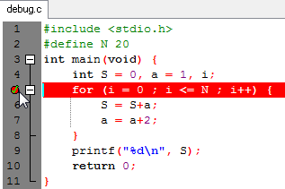

Πληκτρολογούμε το όνομα χρήστη sdiXXYYYYY και τον κωδικό μας και πατάμε
το κουμπί «Σύνδεση».

Στο πάνω μέρος της οθόνης εμφανίζεται ένα σύνολο από εικονίδια, που
αντιστοιχούν στις διαθέσιμες επιλογές για την διαχείριση της
ηλεκτρονικής μας αλληλογραφίας.

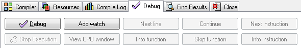

Στο κάτω μέρος της σελίδας υπάρχει μία λίστα με τα μηνύματα του
ηλεκτρονικού μας ταχυδρομείου. Θα δούμε σε επόμενη ενότητα, πώς μπορούμε
να τα διαχειριστούμε.

Με την επιλογή «Σύνθεση» μπορούμε να δημιουργήσουμε ένα νέο μήνυμα.
Πατώντας το κουμπί εμφανίζεται ένα νέο παράθυρο (βλέπε επόμενη οθόνη)
στο οποίο συμπληρώνουμε το μήνυμά μας:

-   Προς: Συμπληρώνουμε την ηλεκτρονική διεύθυνση του αποδέκτη, ή τις
    ηλεκτρονικές διευθύνσεις χωρισμένες με κόμματα (εφόσον θέλουμε να το
    αποστείλουμε σε πολλαπλούς αποδέκτες).

-   Κοινοπ.: Συμπληρώνουμε τις ηλεκτρονικές διευθύνσεις αυτών στους
    οποίους κοινοποιείται το μήνυμα.

-   Κρυφ. Κοινοπ.: Συμπληρώνουμε τις ηλεκτρονικές διευθύνσεις αυτών που
    θέλουμε να λάβουν το μήνυμα χωρίς να εμφανίζονται οι διευθύνσεις
    τους σε αυτούς που λαμβάνουν το μήνυμα.

-   Θέμα: Συμπληρώνουμε το θέμα του μηνύματος.

-   Στο ορθογώνιο πλαίσιο συμπληρώνουμε το κείμενο του μηνύματος.

-   Συνημμένα: Για την επισύναψη στο μήνυμα κάποιου αρχείου, κάνουμε
    κλικ στο “Browse” και επιλέγουμε το αρχείο που θέλουμε.

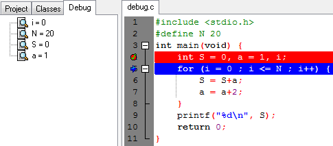

Αφού συμπληρώσουμε όσα από τα παραπάνω στοιχεία μας ενδιαφέρει, πατάμε
το κουμπί «Αποστολή».

Ανάγνωση Εισερχόμενης Αλληλογραφίας

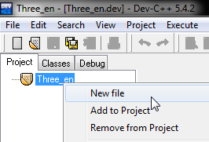

Για να διαβάσουμε ένα εισερχόμενο μήνυμα, κάνουμε κλικ στο θέμα του,
οπότε και εμφανίζεται το μήνυμα σε αναλυτική μορφή.

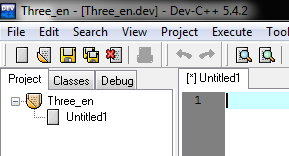

Εδώ υπάρχουν οι διαθέσιμες επιλογές, από τις οποίες πιο ενδιαφέρουσες
είναι οι εξής:

-   «Απάντηση» με την οποία απαντάμε στο τρέχον μήνυμα. Εμφανίζεται μία
    οθόνη αντίστοιχη με αυτή της σύνθεσης νέου μηνύματος, μόνο που τα
    στοιχεία του παραλήπτη, του θέματος και του κειμένου του μηνύματος
    εμφανίζονται αρχικοποιημένα με τα στοιχεία του τρέχοντος μηνύματος.

-   «Προώθηση» με την οποία προωθούμε το τρέχον μήνυμα σε άλλους
    παραλήπτες. Εμφανίζεται η οθόνη σύνθεσης μηνύματος, που
    επαναλαμβάνει το τρέχον μήνυμα, στην οποία πληκτρολογούμε τις
    ηλεκτρονικές διευθύνσεις των παραληπτών.

-   «Διαγραφή» με την οποία διαγράφουμε το τρέχον μήνυμα και
    επαναφερόμαστε στην αρχική σελίδα με την εισερχόμενη αλληλογραφία.

Μόλις ολοκληρώσουμε τη διαχείριση της ηλεκτρονικής μας αλληλογραφίας,
πατάμε το κουμπί «Αποσύνδεση» που βρίσκεται στο πάνω μέρος της οθόνης,
ώστε να αποσυνδεθούμε από την εφαρμογή.

Εναλλακτικά, για να διαχειρίζεστε την ηλεκτρονική αλληλογραφία σας,
μπορείτε να εγκαταστήσετε στον προσωπικό σας υπολογιστή ένα
πρόγραμμα-πελάτη ηλεκτρονικής αλληλογραφίας (mail client), όπως, για
παράδειγμα, το Thunderbird (<http://www.mozilla.org/el/thunderbird/>).
Θα πρέπει στο πρόγραμμα αυτό να ορίσετε κάποιες παραμέτρους, ώστε να
είναι σε θέση να διαχειρίζεται την ηλεκτρονική σας αλληλογραφία
(παραλαβή και αποστολή μηνυμάτων). Αναλυτικές οδηγίες μπορείτε να βρείτε
στον σύνδεσμο
<http://www.noc.uoa.gr/hlektroniko-taxydromeio/ry8miseis.html>.

**2. Εγγραφή στην περιοχή συζητήσεων (piazza)**

Όπως ήδη έχετε ενημερωθεί, στο μάθημα υπάρχει ηλεκτρονικό φόρουμ
συζήτησης, μέσω του οποίου θα μπορούμε να ανταλλάσσουμε απόψεις για
θέματα προγραμματισμού, για τις εργασίες του μαθήματος, απορίες κ.λ.π.

Στην ενότητα αυτή θα δούμε πώς μπορούμε να γραφτούμε στο φόρουμ του
μαθήματος. Ανοίγουμε έναν browser και πληκτρολογούμε την ηλεκτρονική
διεύθυνση της σελίδας του μαθήματος:

[https://progintro.github.io](https://progintro.github.io/)

Στην ενότητα «**Επικοινωνία**» επιλέγουμε το σύνδεσμο για την εγγραφή
στο **Piazza**

Στη σελίδα του Piazza επιλέγουμε το “Join as: student” και πατάμε το
“Join Classes” στο κάτω μέρος της φόρμας.

Στην επόμενη σελίδα συμπληρώνουμε το ακαδημαϊκό μας email και πατάμε
“Submit Email”

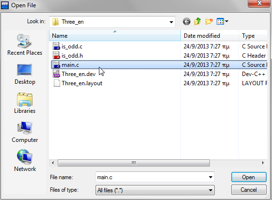

Από το webmail ανοίγουμε το email που θα έχει έρθει από το Piazza και
αντιγράφουμε το activation code που υπάρχει σε αυτό.

Συμπληρώνουμε το activation code στη σελίδα του Piazza και πατάμε το
“Submit Code”

Στην επόμενη σελίδα συμπληρώνουμε το πλήρες ονοματεπώνυμο μας, δύο φορές
τον κωδικό πρόσβασης που θα έχουμε για να συνδεόμαστε στο Piazza, κάποια
στοιχεία για τις σπουδές μας, επιλέγουμε τη συμφωνία με τους όρους
χρήσης της υπηρεσίας και τέλος πατάμε το “continue”

Έπειτα επιλέγουμε το “Don’t join the network”

Πλέον ο λογαριασμός μας στο Piazza είναι έτοιμος!

Μπορούμε να επιλέξουμε τα μηνύματα από τη λίστα στα αριστερά για να τα
δούμε, να απαντήσουμε στο κάτω μέρος σε κάποιο από αυτά, ή να στείλουμε
κάποιο νέο από την επιλογή “New Post” που βρίσκεται στο πάνω μέρος της
λίστας.

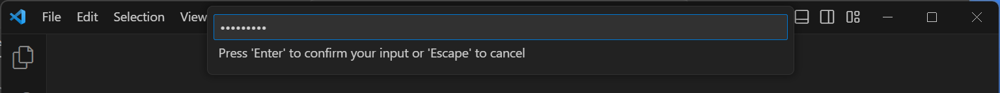

**3. Ενεργοποίηση λογαριασμού στο εργαστήριο linux του Τμήματος**

Το Τμήμα παρέχει σε κάθε φοιτητή, λογαριασμό για την πρόσβαση στα
μηχανήματα του εργαστηρίου linux. Για να μπορέσουμε να χρησιμοποιήσουμε
το λογαριασμό αυτό, θα πρέπει να τον ενεργοποιήσουμε ορίζοντας έναν
κωδικό με τον οποίο θα συνδεόμαστε. Αυτή η διαδικασία μπορεί να γίνει
μέσω της ιστοσελίδας <https://account.di.uoa.gr/>

Ανοίγουμε ένα παράθυρο φυλλομετρητή (browser) **σε ανώνυμη περιήγηση**
και πληκτρολογούμε την παραπάνω διεύθυνση. Στη συνέχεια συνδεόμαστε στην
υπηρεσία με τον ακαδημαϊκό μας λογαριασμό.

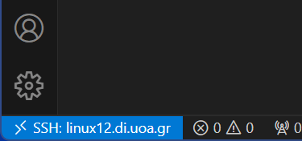

Αφότου συνδεθούμε και μας δείξει τα στοιχεία μας, επιλέγουμε το μπλε
κουμπί με το λουκέτο.

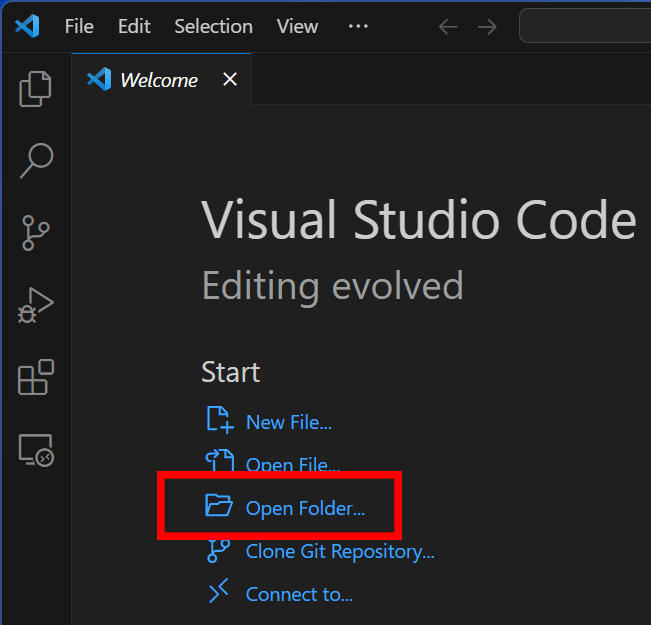

Στην σελίδα που θα ανοίξει ορίζουμε τον κωδικό με τον οποίο θα
συνδεόμαστε στο λογαριασμό μας για το εργαστήριο linux. Πρέπει να τον
πληκτρολογήσουμε δύο φορές και να πατήσουμε Αποθήκευση. Μπορούμε να
επιλέξουμε οτιδήποτε θέλουμε, αρκεί να πληροί όλους τους κανόνες που
αναφέρονται πιο κάτω στην ίδια σελίδα.

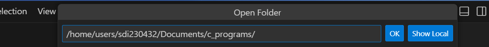

Αν ο κωδικός που πληκτρολογήσαμε πληροί όλους τους κανόνες, η εφαρμογή
μας ενημερώνει ότι η διαδικασία ολοκληρώθηκε με επιτυχία. Πατάμε
Αποσύνδεση και κλείνουμε αυτό το παράθυρο περιήγησης.

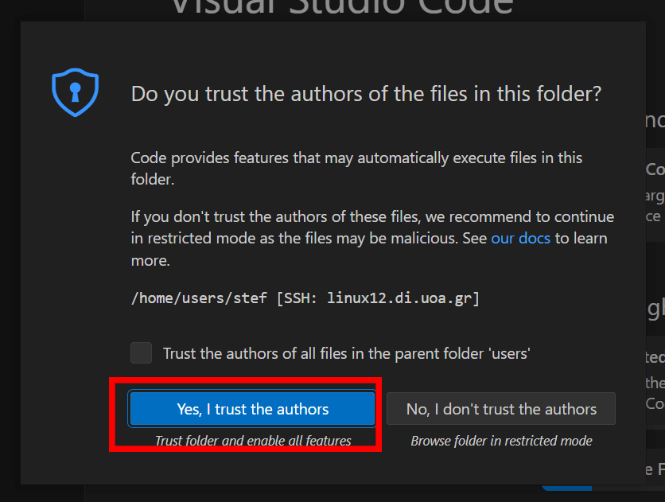

Αν ο κωδικός που πληκτρολογήσαμε δεν πληρούσε κάποιον από τους κανόνες,
θα εμφανιστεί αντίστοιχο μήνυμα σφάλματος και θα πρέπει να δοκιμάσουμε
ξανά με διαφορετικό κωδικό που να τους πληροί.

Μπορούμε να επαναλάβουμε την ίδια διαδικασία και να ορίσουμε νέο κωδικό
ανά πάσα στιγμή, είτε σε περίπτωση που ξεχάσουμε, είτε όταν θέλουμε να
αλλάξουμε τον κωδικό για το λογαριασμό μας στα μηχανήματα του
εργαστηρίου linux του τμήματος.

**4. Η εφαρμογή PuTTY – Εξοικείωση με το Unix**

Το PuTTY είναι πρόγραμμα απομακρυσμένης σύνδεσης, δηλαδή μέσω αυτού
μπορούμε να συνδεόμαστε σε απομακρυσμένους υπολογιστές και να δουλεύουμε
σαν να καθόμασταν μπροστά σε αυτούς! Έτσι, μπορούμε να συνδεθούμε και να
δουλέψουμε στα συστήματα Linux της σχολής.

Πατάμε στα Windows[^2], Start-\>Run και στο παράθυρο που εμφανίζεται:

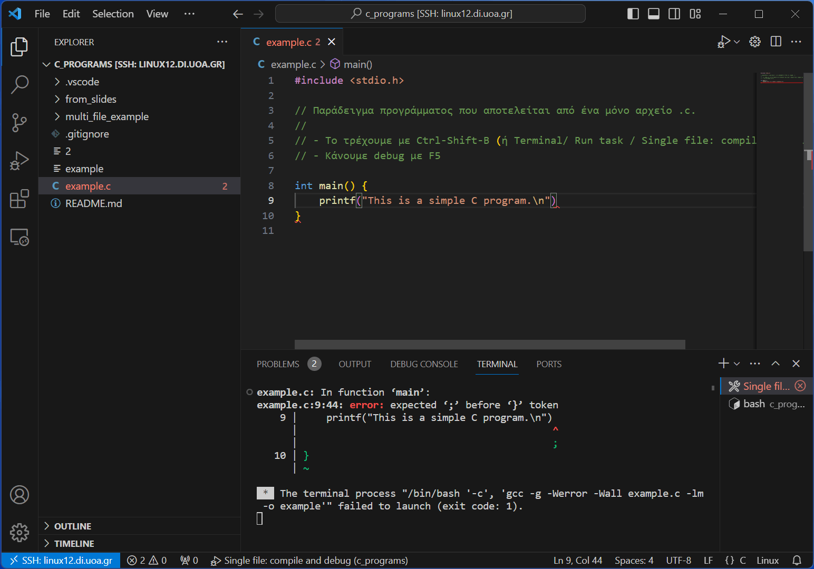

Γράφουμε “putty” και πατάμε ΟΚ. H οθόνη που εμφανίζεται είναι η
ακόλουθη:

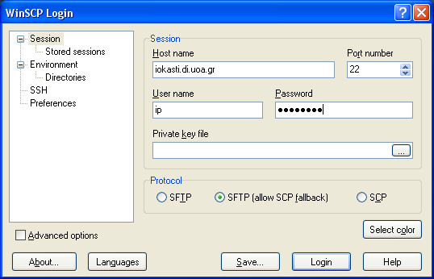

Το σημαντικό κουτάκι είναι το «Host Name» στο οποίο συμπληρώνουμε το
όνομα του υπολογιστή που θέλουμε να συνδεθούμε. Τα μηχανήματα που
μπορούμε να συνδεθούμε έχουν ένα όνομα ακολουθούμενο από το .di.uoa.gr
(το οποίο σημαίνει ότι “βρίσκονται” στη σχολή μας). Για τις ανάγκες του
μαθήματος, μία λίστα με τους υπολογιστές που μπορούμε να
χρησιμοποιήσουμε είναι η ακόλουθη:

-   linux01.di.uoa.gr

-   linux02.di.uoa.gr

-   linux03.di.uoa.gr

-   …………………

-   linux28.di.uoa.gr

-   linux29.di.uoa.gr

> Επιλέγουμε λοιπόν ένα από αυτά (π.χ. linux08.di.uoa.gr) και πατάμε το
> “Open”.
>
> 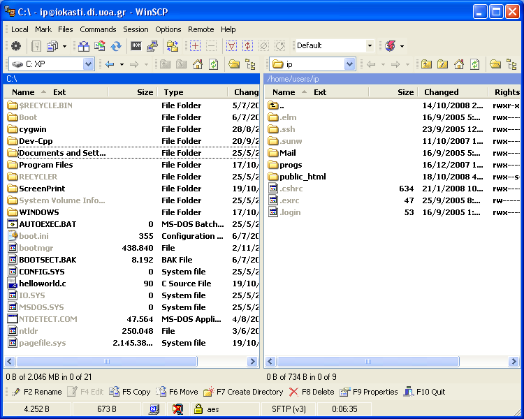 style="width:5.35069in;height:3.31944in" />

Γίνεται προτροπή να εισαγάγουμε το όνομα χρήστη μας (login as) όπου και
πληκτρολογούμε το sdiXXYYYYY. Πατάμε Enter και βλέπουμε την προτροπή για
εισαγωγή του κωδικού μας. Για λόγους ασφαλείας, όσο πληκτρολογούμε τον
κωδικό μας, δεν εμφανίζεται κάτι στην οθόνη, οπότε μόλις το
πληκτρολογήσουμε πατάμε Enter.

Αν όλα έχουν πάει καλά τότε θα δούμε στην οθόνη μας κάτι σαν το εξής:

που σημαίνει ότι είμαστε στον κατάλογο που έχει τα αρχεία μας.

**5. Περιήγηση στο περιβάλλον του Unix**

Το λειτουργικό σύστημα είναι τώρα έτοιμο να αλληλεπιδράσει μαζί μας,
περιμένοντας τις εντολές μας για να δράσει αναλόγως.

Για το λόγο αυτό, πληκτρολογούμε στην γραμμή εντολών:

ls

Βλέπουμε τα περιεχόμενα του καταλόγου στον οποίο βρισκόμαστε. Για να
δούμε εκτενέστερες πληροφορίες για αυτά πληκτρολογούμε:

ls –l

Το αποτέλεσμα που θα δούμε στην οθόνη μας θα είναι κάτι σαν το εξής:

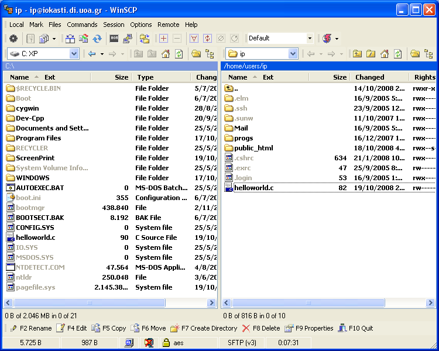

Ας δούμε λίγο πιο αναλυτικά τι σημαίνουν αυτά που βλέπουμε στην οθόνη
μας:

-   Το πρώτο γράμμα (d ή -) υποδηλώνει αν το αντικείμενο είναι κατάλογος
    ή αρχείο αντίστοιχα.

-   Τα επόμενα 9 γράμματα ορίζουν τα δικαιώματα χρήσης του καταλόγου ή
    του αρχείου (θα επανέλθουμε σε αυτό σε επόμενο εργαστήριο).

-   Ακολουθεί η πληροφορία του ιδιοκτήτη του αρχείου και η ομάδα στην
    οποία ανήκει.

-   Το μέγεθος του.

-   Η ημερομηνία και ώρα τελευταίας τροποποίησης.

-   Το όνομα του αρχείου ή του καταλόγου αντίστοιχα.

Για να εισέλθουμε σε έναν κατάλογο πληκτρολογούμε:

cd όνομα_καταλόγου

Ας μπούμε τώρα στον κατάλογο Mail και να ελέγξουμε τα περιεχόμενα του.
Πληκτρολογούμε:

cd Mail

ls -l

Για να επιστρέψουμε στον αρχικό κατάλογό μας, γράφουμε:

cd ..

Στο επόμενο εργαστήριο θα μάθουμε ένα υποσύνολο εντολών του Unix, που θα
μας φανούν χρήσιμες για να μπορούμε να διαχειριζόμαστε τα αρχεία μας και
να εκτελούμε ενέργειες επί αυτών, ώστε να είναι δυνατό να γράψουμε τα
πρώτα μας προγράμματα σε γλώσσα C σε περιβάλλον Unix.

**6. Ο κειμενογράφος pico (ή nano)**

Εδώ θα φτιάξουμε ένα αρχείο κειμένου, θα γράψουμε κάτι σε αυτό και θα το
αποθηκεύσουμε στον λογαριασμό μας. Το πρόγραμμα που θα χρησιμοποιήσουμε
είναι ο κειμενογράφος pico.

Πληκτρολογούμε στο prompt

pico

Ανοίγει το περιβάλλον του pico, το οποίο φαίνεται στην ακόλουθη οθόνη:

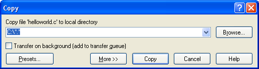

Εδώ μπορούμε να πληκτρολογήσουμε κάποιο κείμενο και να το
επεξεργαστούμε. Στο κάτω μέρος της οθόνης φαίνονται οι διαθέσιμες
επιλογές που έχουμε, όπως για παράδειγμα να σώσουμε το κείμενο, να
αναζητήσουμε σε αυτό, να βγούμε από το περιβάλλον του pico κ.λ.π.

Οι πιο ενδιαφέρουσες επιλογές είναι οι εξής:

<table>
<colgroup>
<col style="width: 13%" />
<col style="width: 86%" />
</colgroup>
<tbody>
<tr class="odd">
<td>Ctrl+O</td>
<td>
Αποθήκευση Κειμένου.

Εμφανίζει μία προτροπή για εισαγωγή του ονόματος του αρχείου
</td>
</tr>
<tr class="even">
<td>Ctrl+X</td>
<td>
Έξοδος.

Αν δεν έχουν αποθηκευτεί οι τελευταίες αλλαγές, τότε εμφανίζει μήνυμα
για την αποθήκευση αυτών.
</td>
</tr>
<tr class="odd">
<td>
Ctrl+Υ

Ctrl+V
</td>
<td>
Μετάβαση στην προηγούμενη σελίδα

Μετάβαση στην επόμενη σελίδα
</td>
</tr>
</tbody>
</table>

Για παράδειγμα ας ακολουθήσουμε την διαδικασία για την αποθήκευση ενός
μικρού κειμένου σε ένα αρχείο.

1.  Πληκτρολογούμε ένα σύντομο κείμενο

2.  Πατάμε Ctrl+O. Μας εμφανίζεται στο κάτω μέρος της οθόνης η προτροπή
    να δώσουμε ένα όνομα στο αρχείο που δημιουργήσαμε.

> 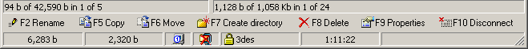 style="width:5.00208in;height:0.40208in" />

3.  Πληκτρολογούμε ένα όνομα (π.χ. file.txt) και πατάμε Enter.

4.  Πατάμε Ctrl+X για να βγούμε από το περιβάλλον του pico.

Για να τυπώσουμε στην οθόνη τα περιεχόμενα του αρχείου που
δημιουργήσαμε, πληκτρολογούμε:

cat file.txt

[^1]: Ευχαριστίες στους συνεργάτες του μαθήματος Δημήτρη Ψούνη, Στέφανο
    Σταμάτη, Νίκο Ποθητό, Μάνο Καρβούνη, Γιώργο Καστρίνη, Βασίλη
    Αναστασίου και στον Δρ. Ιωάννη Χαμόδρακα για τη συνεισφορά τους στη
    συγγραφή των εργαστηριακών φυλλαδίων του μαθήματος.

    Το υλικό των φυλλαδίων είναι βασισμένο στο αντίστοιχο υλικό που είχε
    αναπτυχθεί για το μάθημα από τον καθ. Παναγιώτη Σταματόπουλο τον
    οποίο και ευχαριστούμε θερμά

[^2]: Μπορούμε να χρησιμοποιήσουμε το PuTTY και από τον υπολογιστή του
    σπιτιού μας, ώστε να συνδεόμαστε στους υπολογιστές της σχολής μέσω
    Internet. Θα πρέπει να κατεβάσουμε το εκτελέσιμο αρχείο putty.exe
    από την ηλεκτρονική διεύθυνση:
    <https://the.earth.li/~sgtatham/putty/latest/w64/putty.exe>
