# Εργαστήριο #0: Καλημέρα Κόσμε! Εισαγωγή και Χρήσιμες Εφαρμογές

> **Στόχοι**
>
> Μετά το εργαστήριο αυτό θα μπορείτε:
>
> - Να διαχειρίζεστε το ακαδημαϊκό σας email με το [Webmail](#webmail).
> - Να εγγραφείτε στο ηλεκτρονικό φόρουμ του μαθήματος, το [Piazza](#piazza).
> - Να ενεργοποιήσετε τον λογαριασμό σας στο εργαστήριο [Linux](#linux).
> - Να συνδέεστε απομακρυσμένα στα μηχανήματα της σχολής με [ssh](#ssh).
> - Να εκτελείτε τις πρώτες σας εντολές στο [shell](#shell) του Linux.
> - Να χρησιμοποιείτε έναν [κειμενογράφο](#editors) για να γράψετε κώδικα.
> - Να μεταγλωττίσετε και να τρέξετε το πρώτο σας [πρόγραμμα](#helloworld) σε C.
>
> **Προαπαιτούμενα:** Κανένα - αυτό είναι το πρώτο εργαστήριο.
>
> **Αρχεία που θα φτιάξετε:** `hello.c`, `about.c`, `overflow.c`


> A man is only as good as his tools. -- Emmert Wolf

Καλωσήρθατε στο εργαστήριο! Σκοπός των πρώτων συναντήσεών μας είναι η εξοικείωση με τα βασικά εργαλεία του μαθήματος.

Το υλικό των εργαστηρίων είναι αποτέλεσμα προσπάθειας πολλών και εξαίρετων συνεργατών. Θερμές ευχαριστίες στους Δημήτρη Ψούνη (ο οποίος έχει και [εξαιρετικό κανάλι με εκπαιδευτικό υλικό](https://www.youtube.com/watch?v=hx9ddaIyi6k&list=PLLMmbOLFy25F31qiV5Gsx8Zzq9QndUZbL)), Στέφανο Σταμάτη, Νίκο Ποθητό, Μάνο Καρβούνη, Γιώργο Καστρίνη, Βασίλη Αναστασίου, Γιώργο Σπύρου και στον Δρ. Ιωάννη Χαμόδρακα για τη συνεισφορά τους. Το υλικό των φυλλαδίων είναι βασισμένο στο αντίστοιχο υλικό που αναπτύχθηκε για το μάθημα από τον καθηγητή Παναγιώτη Σταματόπουλο τον οποίο ευχαριστούμε θερμότατα.

<!-- toc -->

**Περιεχόμενα**

- [Βήμα 1: Το ακαδημαϊκό σας email (webmail)](#βήμα-1-το-ακαδημαϊκό-σας-email-webmail)
  - [Σύνδεση (Login)](#σύνδεση-login)
  - [Ανάγνωση Εισερχόμενης Αλληλογραφίας](#ανάγνωση-εισερχόμενης-αλληλογραφίας)
- [Βήμα 2: Το φόρουμ του μαθήματος (Piazza)](#βήμα-2-το-φόρουμ-του-μαθήματος-piazza)
- [Βήμα 3: Ο λογαριασμός σας στο εργαστήριο (Linux)](#βήμα-3-ο-λογαριασμός-σας-στο-εργαστήριο-linux)
- [Βήμα 4: Απομακρυσμένη σύνδεση (ssh)](#βήμα-4-απομακρυσμένη-σύνδεση-ssh)
  - [Native ssh](#native-ssh)
  - [PuTTY](#putty)
- [Βήμα 5: Οι πρώτες σας εντολές (shell)](#βήμα-5-οι-πρώτες-σας-εντολές-shell)
  - [ls (LiSt)](#ls-list)
  - [cd (Change Directory)](#cd-change-directory)
- [Βήμα 6: Γράφοντας αρχεία με κειμενογράφο (pico)](#βήμα-6-γράφοντας-αρχεία-με-κειμενογράφο-pico)
- [Βήμα 7: Το πρώτο σας πρόγραμμα (hello.c)](#βήμα-7-το-πρώτο-σας-πρόγραμμα-helloc)
- [Άσκηση 1 (Παλιό θέμα): Στοιχεία φοιτητή (about.c)](#άσκηση-1-παλιό-θέμα-στοιχεία-φοιτητή-aboutc)
- [Άσκηση 2: Υπερχείλιση ακεραίων (overflow.c)](#άσκηση-2-υπερχείλιση-ακεραίων-overflowc)
  - [2.1 Ειδικές ακολουθίες χαρακτήρων (Προχωρημένο, Προαιρετικό)](#21-ειδικές-ακολουθίες-χαρακτήρων-προχωρημένο-προαιρετικό)

<!-- /toc -->

<a id="webmail"></a>

## Βήμα 1: Το ακαδημαϊκό σας email (webmail)

> If you just communicate, you can get by. But if you communicate skillfully, you can work miracles. -- Jim Rohn

Το webmail είναι ένα περιβάλλον διαχείρισης της ηλεκτρονικής μας αλληλογραφίας μέσω ιστοσελίδας για το email που έχουμε από τη σχολή. Εδώ θα δούμε πώς μπορούμε να στείλουμε ένα μήνυμα, να διαβάσουμε τα μηνύματα που λαμβάνουμε και να απαντήσουμε σε αυτά.

### Σύνδεση (Login)

Ενώ είμαστε συνδεδεμένοι στο Internet, ανοίγουμε ένα παράθυρο φυλλομετρητή (browser - Firefox, Chrome, Brave ή ακόμα και Lynx αν είστε γενναία παιδιά) και πληκτρολογούμε την διεύθυνση [http://webmail.noc.uoa.gr](http://webmail.noc.uoa.gr/), οπότε και εμφανίζεται στην ιστοσελίδα η προτροπή για εισαγωγή των στοιχείων μας.

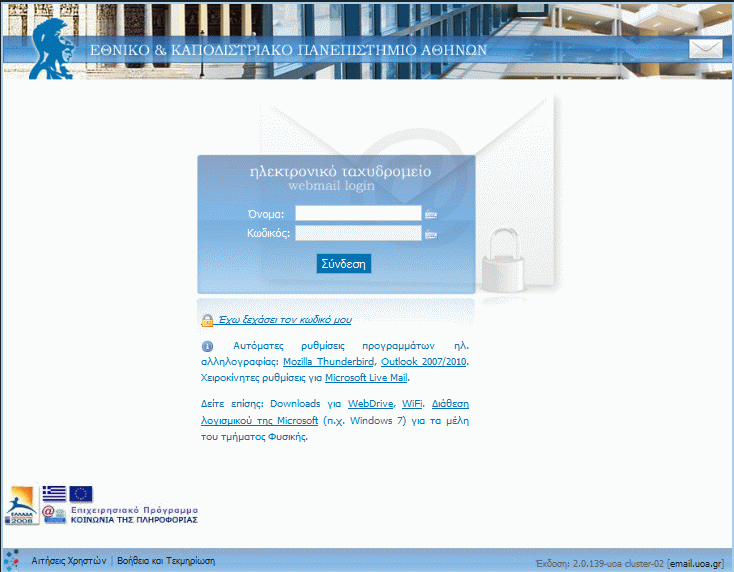

Πληκτρολογούμε το όνομα χρήστη sdiXXYYYYY και τον κωδικό μας και πατάμε το κουμπί «Σύνδεση» (δεν έχετε λογαριασμό ακόμα; ακολουθήστε τις οδηγίες [εδώ](http://www.noc.uoa.gr/dhmioyrgia-logariasmoy/odhgies-dhmioyrgias-kai-energopoihshs-logariasmoy.html)).

Στο πάνω μέρος της οθόνης εμφανίζεται ένα σύνολο από εικονίδια, που αντιστοιχούν στις διαθέσιμες επιλογές για την διαχείριση της ηλεκτρονικής μας αλληλογραφίας.

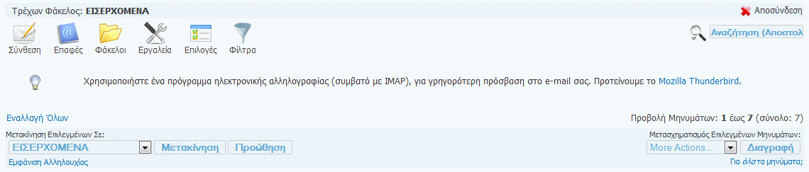

Στο κάτω μέρος της σελίδας υπάρχει μία λίστα με τα μηνύματα του ηλεκτρονικού μας ταχυδρομείου. Θα δούμε σε επόμενη ενότητα, πώς μπορούμε να τα διαχειριστούμε.

Με την επιλογή «Σύνθεση» μπορούμε να δημιουργήσουμε ένα νέο μήνυμα. Πατώντας το κουμπί εμφανίζεται ένα νέο παράθυρο (βλέπε επόμενη οθόνη) στο οποίο συμπληρώνουμε το μήνυμά μας:

-   Προς (To): Συμπληρώνουμε την ηλεκτρονική διεύθυνση του αποδέκτη, ή τις ηλεκτρονικές διευθύνσεις χωρισμένες με κόμματα (εφόσον θέλουμε να το αποστείλουμε σε πολλαπλούς αποδέκτες).

-   Κοινοπ. (CC): Συμπληρώνουμε τις ηλεκτρονικές διευθύνσεις αυτών στους οποίους κοινοποιείται το μήνυμα.

-   Κρυφ. Κοινοπ. (BCC): Συμπληρώνουμε τις ηλεκτρονικές διευθύνσεις αυτών που θέλουμε να λάβουν το μήνυμα χωρίς να εμφανίζονται οι διευθύνσεις τους σε αυτούς που λαμβάνουν το μήνυμα.

-   Θέμα (Topic): Συμπληρώνουμε το θέμα του μηνύματος - φροντίζουμε να είναι κάτι περιεκτικό και ευανάγνωστο.

-   Στο ορθογώνιο πλαίσιο συμπληρώνουμε το κείμενο του μηνύματος.

-   Συνημμένα: Για την επισύναψη στο μήνυμα κάποιου αρχείου, κάνουμε
    κλικ στο "Browse" και επιλέγουμε το αρχείο που θέλουμε.

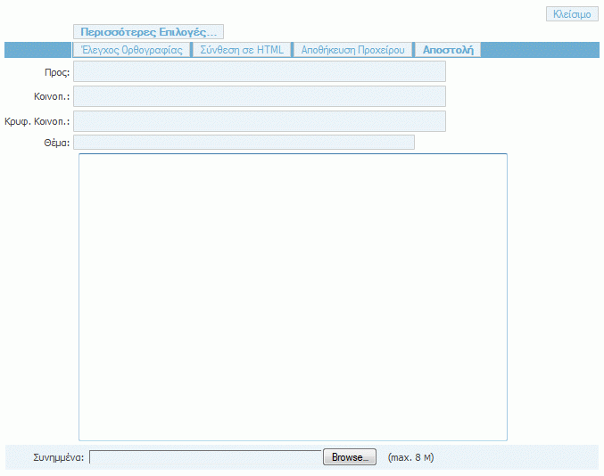

Αφού συμπληρώσουμε όσα από τα παραπάνω στοιχεία μας ενδιαφέρει, πατάμε το κουμπί «Αποστολή».

### Ανάγνωση Εισερχόμενης Αλληλογραφίας

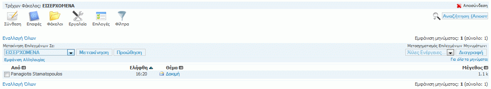

Για να διαβάσουμε ένα εισερχόμενο μήνυμα, κάνουμε κλικ στο θέμα του, οπότε και εμφανίζεται το μήνυμα σε αναλυτική μορφή.

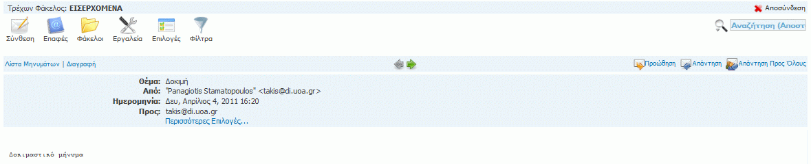

Εδώ υπάρχουν οι διαθέσιμες επιλογές, από τις οποίες πιο ενδιαφέρουσες είναι οι εξής:

-   «Απάντηση» με την οποία απαντάμε στο τρέχον μήνυμα. Εμφανίζεται μία
    οθόνη αντίστοιχη με αυτή της σύνθεσης νέου μηνύματος, μόνο που τα
    στοιχεία του παραλήπτη, του θέματος και του κειμένου του μηνύματος
    εμφανίζονται αρχικοποιημένα με τα στοιχεία του τρέχοντος μηνύματος.

-   «Προώθηση» με την οποία προωθούμε το τρέχον μήνυμα σε άλλους
    παραλήπτες. Εμφανίζεται η οθόνη σύνθεσης μηνύματος, που
    επαναλαμβάνει το τρέχον μήνυμα, στην οποία πληκτρολογούμε τις
    ηλεκτρονικές διευθύνσεις των παραληπτών.

-   «Διαγραφή» με την οποία διαγράφουμε το τρέχον μήνυμα και
    επαναφερόμαστε στην αρχική σελίδα με την εισερχόμενη αλληλογραφία.

Μόλις ολοκληρώσουμε τη διαχείριση της ηλεκτρονικής μας αλληλογραφίας, πατάμε το κουμπί «Αποσύνδεση» που βρίσκεται στο πάνω μέρος της οθόνης, ώστε να αποσυνδεθούμε από την εφαρμογή.

Εναλλακτικά, για να διαχειρίζεστε την ηλεκτρονική αλληλογραφία σας, μπορείτε να εγκαταστήσετε στον προσωπικό σας υπολογιστή ένα πρόγραμμα-πελάτη ηλεκτρονικής αλληλογραφίας (mail client), όπως, για παράδειγμα, το Thunderbird (<http://www.mozilla.org/el/thunderbird/>). Θα πρέπει στο πρόγραμμα αυτό να ορίσετε κάποιες παραμέτρους, ώστε να είναι σε θέση να διαχειρίζεται την ηλεκτρονική σας αλληλογραφία (παραλαβή και αποστολή μηνυμάτων). Αναλυτικές οδηγίες μπορείτε να βρείτε στον σύνδεσμο <http://www.noc.uoa.gr/hlektroniko-taxydromeio/ry8miseis.html>.

<a id="piazza"></a>

## Βήμα 2: Το φόρουμ του μαθήματος (Piazza)

Όπως ίσως ακούσατε - αν παρευρεθήκατε στην 1η διάλεξη - στο μάθημα υπάρχει ηλεκτρονικό φόρουμ συζήτησης, μέσω του οποίου ενημερωνόμαστε για τις ανακοινώσεις του μαθήματος, κάνουμε απορίες ή ανταλλάσσουμε απόψεις γενικά για θέματα προγραμματισμού και ό,τι άλλο σχετικό με το μάθημα.

Στην ενότητα αυτή θα δούμε πώς μπορούμε να γραφτούμε στο φόρουμ του μαθήματος. Ανοίγουμε έναν browser και πληκτρολογούμε την ηλεκτρονική διεύθυνση της σελίδας του μαθήματος:

[https://progintro.github.io](https://progintro.github.io/)

Στην ενότητα «**Επικοινωνία**» επιλέγουμε το σύνδεσμο για την εγγραφή στο **Piazza**

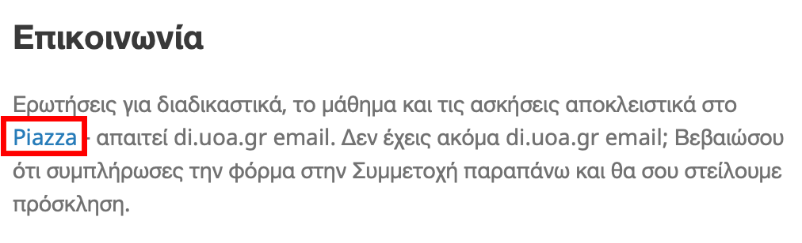

Στη σελίδα του Piazza επιλέγουμε το "Join as: student" και πατάμε το "Join Classes" στο κάτω μέρος της φόρμας.

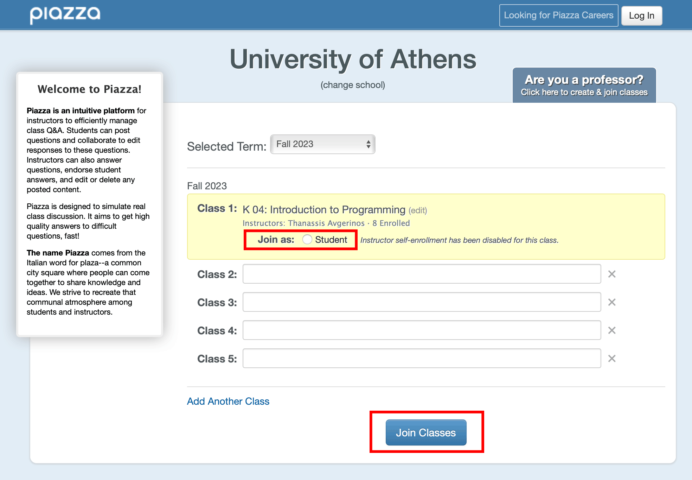

Στην επόμενη σελίδα συμπληρώνουμε το ακαδημαϊκό μας email και πατάμε "Submit Email".

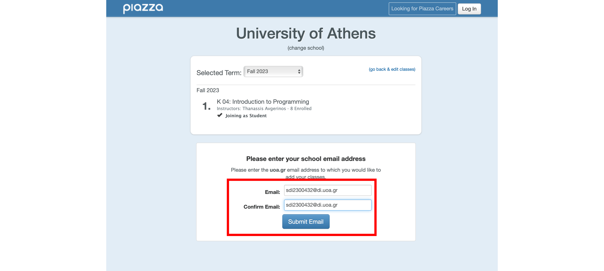

Από το webmail ανοίγουμε το email που θα έχει έρθει από το Piazza και αντιγράφουμε το activation code που υπάρχει σε αυτό.

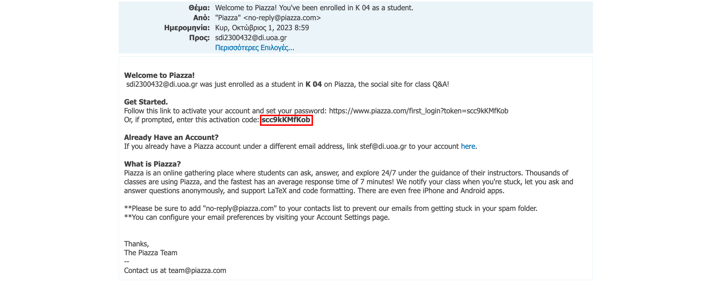

Συμπληρώνουμε το activation code στη σελίδα του Piazza και πατάμε το "Submit Code".

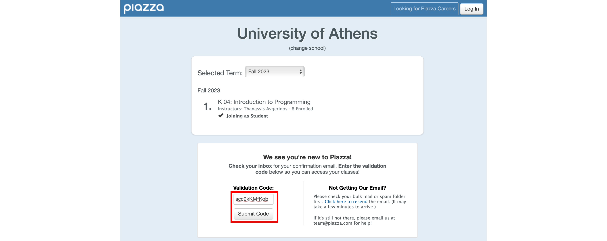

Στην επόμενη σελίδα συμπληρώνουμε το πλήρες ονοματεπώνυμο μας, δύο φορές τον κωδικό πρόσβασης που θα έχουμε για να συνδεόμαστε στο Piazza, κάποια στοιχεία για τις σπουδές μας, επιλέγουμε τη συμφωνία με τους όρους χρήσης της υπηρεσίας και τέλος πατάμε το "continue".

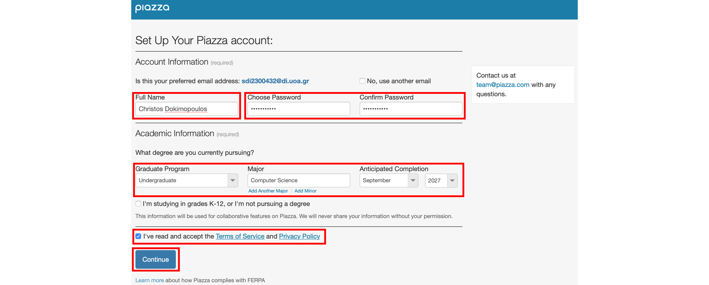

Έπειτα επιλέγουμε το "Don't join the network".

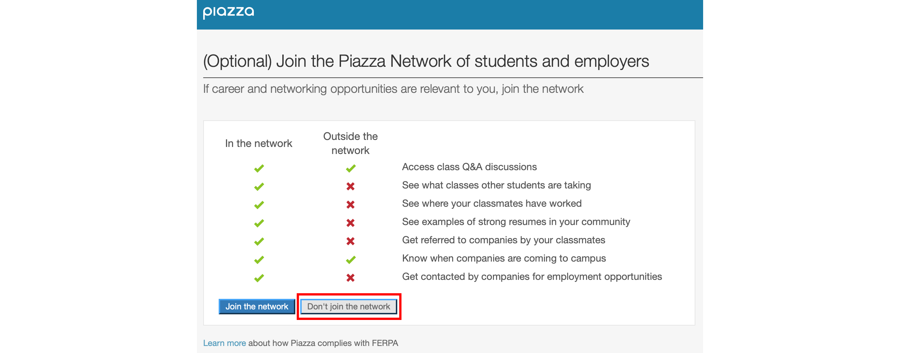

Πλέον ο λογαριασμός μας στο Piazza είναι έτοιμος!

Μπορούμε να επιλέξουμε τα μηνύματα από τη λίστα στα αριστερά για να τα δούμε, να απαντήσουμε στο κάτω μέρος σε κάποιο από αυτά, ή να στείλουμε κάποιο νέο από την επιλογή "New Post" που βρίσκεται στο πάνω μέρος της λίστας.

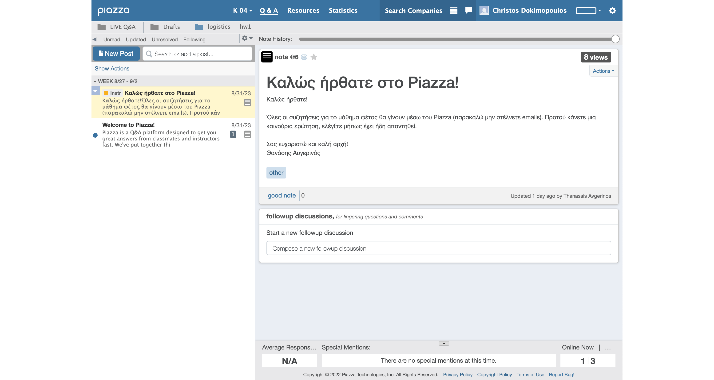


Πώς μπορούμε να κάνουμε ερωτήσεις με τρόπο που βελτιστοποιεί την πιθανότητα του να πάρουμε απάντηση; Μπορείτε να βρείτε έναν χρήσιμο οδηγό [εδώ](https://progintro.github.io/assets/pdf/forums.pdf).


<a id="linux"></a>

## Βήμα 3: Ο λογαριασμός σας στο εργαστήριο (Linux)

> All the best people in life seem to like LINUX. -- Steve Wozniak

Το Τμήμα παρέχει σε κάθε φοιτητή, λογαριασμό για την πρόσβαση στα μηχανήματα του εργαστηρίου Linux. Για να μπορέσουμε να χρησιμοποιήσουμε το λογαριασμό αυτό, θα πρέπει να τον ενεργοποιήσουμε ορίζοντας έναν κωδικό με τον οποίο θα συνδεόμαστε. Αυτή η διαδικασία μπορεί να γίνει μέσω της ιστοσελίδας <https://account.di.uoa.gr/>

Ανοίγουμε ένα παράθυρο φυλλομετρητή (browser) **σε ανώνυμη περιήγηση** και πληκτρολογούμε την παραπάνω διεύθυνση. Στη συνέχεια συνδεόμαστε στην υπηρεσία με τον ακαδημαϊκό μας λογαριασμό.

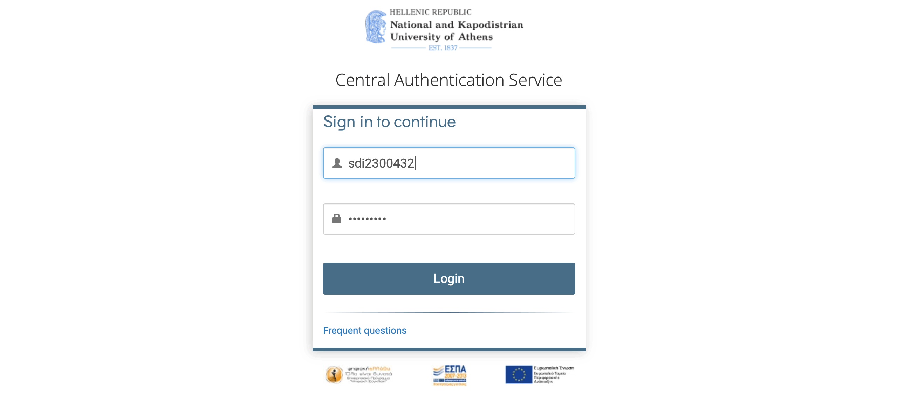

Αφότου συνδεθούμε και μας δείξει τα στοιχεία μας, επιλέγουμε το μπλε κουμπί με το λουκέτο.

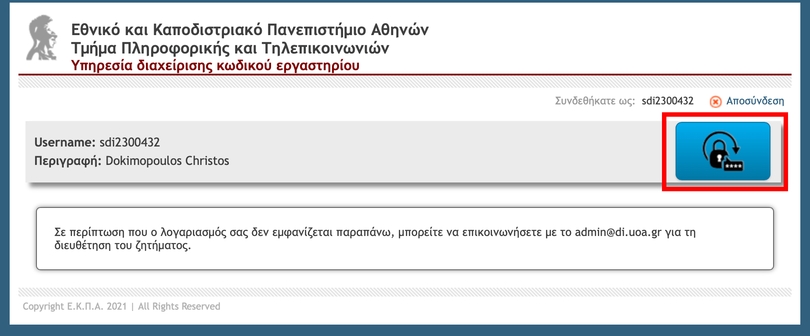

Στην σελίδα που θα ανοίξει ορίζουμε τον κωδικό με τον οποίο θα συνδεόμαστε στο λογαριασμό μας για το εργαστήριο linux. Πρέπει να τον πληκτρολογήσουμε δύο φορές και να πατήσουμε Αποθήκευση. Μπορούμε να επιλέξουμε οτιδήποτε θέλουμε, αρκεί να πληροί όλους τους κανόνες που αναφέρονται πιο κάτω στην ίδια σελίδα.

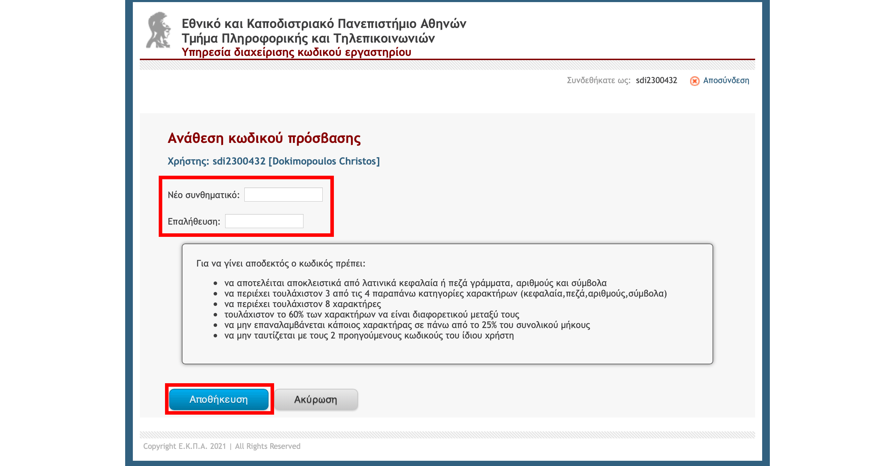

Αν ο κωδικός που πληκτρολογήσαμε πληροί όλους τους κανόνες, η εφαρμογή μας ενημερώνει ότι η διαδικασία ολοκληρώθηκε με επιτυχία. Πατάμε Αποσύνδεση και κλείνουμε αυτό το παράθυρο περιήγησης.

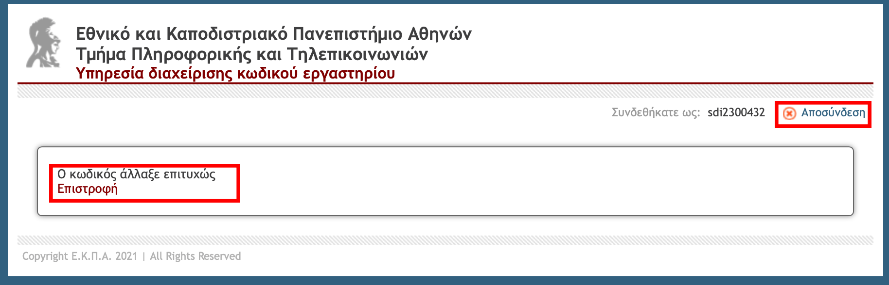

Αν ο κωδικός που πληκτρολογήσαμε δεν πληρούσε κάποιον από τους κανόνες, θα εμφανιστεί αντίστοιχο μήνυμα σφάλματος και θα πρέπει να δοκιμάσουμε ξανά με διαφορετικό κωδικό που να τους πληροί.

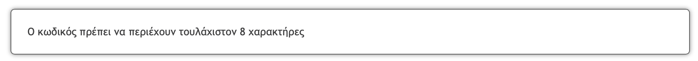

Μπορούμε να επαναλάβουμε την ίδια διαδικασία και να ορίσουμε νέο κωδικό ανά πάσα στιγμή, είτε σε περίπτωση που ξεχάσουμε, είτε όταν θέλουμε να αλλάξουμε τον κωδικό για το λογαριασμό μας στα μηχανήματα του εργαστηρίου linux του τμήματος.

<a id="ssh"></a>

## Βήμα 4: Απομακρυσμένη σύνδεση (ssh)

Το SSH (Secure Shell) είναι ένα πρωτόκολλο δικτύου που επιτρέπει την ασφαλή απομακρυσμένη σύνδεση και διαχείριση ενός υπολογιστή ή server μέσω κρυπτογραφημένης επικοινωνίας. Χρησιμοποιείται από μηχανικούς λογισμικού για τη διαχείριση servers, τη μεταφορά αρχείων και την εκτέλεση εντολών εξ αποστάσεως, εξασφαλίζοντας παράλληλα την ασφάλεια των δεδομένων από υποκλοπές και επιθέσεις. Είναι χρήσιμο γιατί επιτρέπει την απομακρυσμένη εργασία και διαχείριση συστημάτων με ασφάλεια, ανεξαρτήτως γεωγραφικής τοποθεσίας. Είχατε πάει διακοπές στην Κύθνο και ξαφνικά έσκασε ένα incident στην εφαρμογή που τρέχει σε datacenter στην Καισαριανή; Δεν χρειάζεστε ούτε πλοίο ούτε αεροπλάνο, μόνο σύνδεση internet. Συνδεθείτε με SSH στιγμιαία και λύστε όποιο πρόβλημα προκύψει απομακρυσμένα.

Υπάρχουν δύο τρόποι να συνδεθείτε σε ένα από τα συστήματα του εργαστηρίου:

1. Χρησιμοποιώντας την εφαρμογή ssh που έχει το σύστημά σας (native στο Linux, Mac, Windows 11+).
2. Εγκαθιστώντας την εφαρμογή PuTTY και χρησιμοποιώντας την ως την εφαρμογή SSH εάν είστε σε παλαιότερο σύστημα Windows.

### Native ssh

Εφόσον το λειτουργικό σας το υποστηρίζει, ο απλούστερος τρόπος να συνδεθείτε σε ένα από τα συστήματα του εργαστηρίου είναι ο εξής:

1. Ανοίγετε ένα τερματικό (terminal ή command prompt).

2. Τρέχετε την ακόλουθη εντολή:
```text
ssh sdiXXYYYYY@linux08.di.uoa.gr
```

3. Αφού αποδεχτείτε το κλειδί και βάλετε τον κωδικό σας μπορείτε να ολοκληρώσετε την σύνδεσή σας:

```text
The authenticity of host 'linux08.di.uoa.gr (195.134.65.79)' can't be established.
ECDSA key fingerprint is SHA256:72FjL3k3ojnkAkjuk5hnysuBZhpnGhpYZPjnLu8nThc.
Are you sure you want to continue connecting (yes/no/[fingerprint])? yes
Warning: Permanently added 'linux08.di.uoa.gr,195.134.65.79' (ECDSA) to the list of known hosts.
sdiXXYYYYY@linux08.di.uoa.gr's password:
Welcome to Ubuntu 20.04.6 LTS (GNU/Linux 5.4.0-186-generic x86_64)

 * Documentation:  https://help.ubuntu.com
 * Management:     https://landscape.canonical.com
 * Support:        https://ubuntu.com/pro

Expanded Security Maintenance for Applications is not enabled.

10 updates can be applied immediately.
To see these additional updates run: apt list --upgradable

54 additional security updates can be applied with ESM Apps.
Learn more about enabling ESM Apps service at https://ubuntu.com/esm

*** System restart required ***
linux08:/home/users/sdiXXYYYYY>
```

Αντίστοιχα υπάρχουν γύρω στα 30 υπολογιστικά συστήματα στα οποία μπορείτε να συνδεθείτε με αντίστοιχα domain names (linux01.di.uoa.gr, linux02.di.uoa.gr, ... linux29.di.uoa.gr). Έχουμε τόσα συστήματα για δύο λόγους: (1) redundancy - αν ένα σύστημα έχει πρόβλημα, μπορείτε να συνδεθείτε σε κάποιο άλλο, και (2) load balancing - αν μπείτε και οι 300 σε ένα σύστημα ταυτόχρονα το πιθανότερο είναι πως θα καταρρεύσει - αποφύγετε να συνδεθείτε όλοι στο linux01 :) . Τα αρχεία σας συγχρονίζονται αυτόματα ανάμεσα σε όλα τα συστήματα.


### PuTTY

Εάν η πλατφόρμα που χρησιμοποιείτε δεν έχει ssh, θα χρειαστεί να καταφύγετε στο PuTTY. Το PuTTY είναι άλλο ένα πρόγραμμα απομακρυσμένης σύνδεσης, δηλαδή μέσω αυτού μπορούμε να συνδεόμαστε σε απομακρυσμένους υπολογιστές και να δουλεύουμε σαν να καθόμασταν μπροστά σε αυτούς! Έτσι, μπορούμε να συνδεθούμε και να δουλέψουμε στα συστήματα Linux της σχολής.

> Μπορούμε να χρησιμοποιήσουμε το PuTTY και από τον υπολογιστή του σπιτιού μας, ώστε να συνδεόμαστε στους υπολογιστές της σχολής μέσω Internet. Θα πρέπει να κατεβάσουμε το εκτελέσιμο αρχείο putty.exe από την ηλεκτρονική διεύθυνση: <https://the.earth.li/~sgtatham/putty/latest/w64/putty.exe>

Πατάμε στα Windows, Start->Run και στο παράθυρο που εμφανίζεται:


Γράφουμε "putty" και πατάμε ΟΚ. Η οθόνη που εμφανίζεται είναι η ακόλουθη:

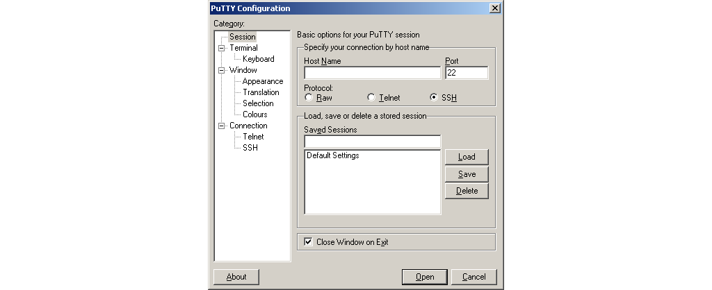

Το σημαντικό κουτάκι είναι το «Host Name» στο οποίο συμπληρώνουμε το όνομα του υπολογιστή που θέλουμε να συνδεθούμε. Τα μηχανήματα που μπορούμε να συνδεθούμε έχουν ένα όνομα ακολουθούμενο από το .di.uoa.gr (το οποίο σημαίνει ότι "βρίσκονται" στη σχολή μας). Για τις ανάγκες του μαθήματος, μία λίστα με τους υπολογιστές που μπορούμε να χρησιμοποιήσουμε είναι η ακόλουθη:

-   linux01.di.uoa.gr

-   linux02.di.uoa.gr

-   linux03.di.uoa.gr

-   .....................

-   linux28.di.uoa.gr

-   linux29.di.uoa.gr

Επιλέγουμε λοιπόν ένα από αυτά (π.χ. linux08.di.uoa.gr) και πατάμε το "Open".

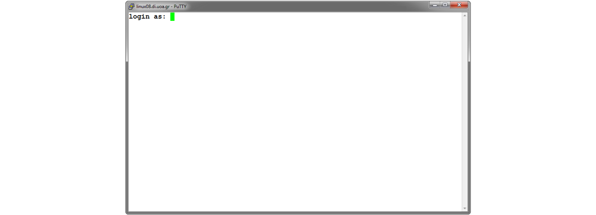

Γίνεται προτροπή να εισαγάγουμε το όνομα χρήστη μας (login as) όπου και πληκτρολογούμε το sdiXXYYYYY. Πατάμε Enter και βλέπουμε την προτροπή για εισαγωγή του κωδικού μας. Για λόγους ασφαλείας, όσο πληκτρολογούμε τον κωδικό μας, δεν εμφανίζεται κάτι στην οθόνη, οπότε μόλις το πληκτρολογήσουμε πατάμε Enter.

Αν όλα έχουν πάει καλά τότε θα δούμε στην οθόνη μας κάτι σαν το εξής:

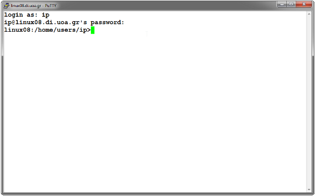

που σημαίνει ότι είμαστε στον κατάλογο που έχει τα αρχεία μας.

<a id="shell"></a>

## Βήμα 5: Οι πρώτες σας εντολές (shell)

Παραπάνω συνδεθήκαμε (με ssh ή PuTTY) σε ένα από τα συστήματα Linux. Το λειτουργικό σύστημα είναι τώρα έτοιμο να αλληλεπιδράσει μαζί μας, περιμένοντας τις εντολές μας για να δράσει αναλόγως.

Η γραμμή στην οποία γράφουμε τις εντολές μας λέγεται command line interface (γραμμή εντολών ή CLI) και το πρόγραμμα που ερμηνεύει αυτές τις εντολές λέγεται shell (sh ή κέλυφος). Σε αντίθεση με τα προγράμματα που απαιτούν γραφικό περιβάλλον (Graphical User Interface - GUI), η γραμμή εντολών απαιτεί χρήση του πληκτρολογίου. Στην αρχή ίσως να σας ξενίσει και να σας κάνει να νιώθετε "δεν ξέρω τι να κάνω σε αυτήν την γραμμή", αλλά σας διαβεβαιώνουμε πως μετά από αρκετή χρήση η γραμμή εντολών γίνεται δεύτερη φύση και ένα πολύ χρήσιμο εργαλείο στην φαρέτρα σας.

Θα μάθουμε διάφορες εντολές κατά την διάρκεια του μαθήματος και θα ξεκινήσουμε με τις δύο που μας επιτρέπουν να περιηγούμαστε στο σύστημα αρχείων μας: (1) `ls` και (2) `cd`.

### ls (LiSt)

Ας ξεκινήσουμε! Πρώτα πληκτρολογούμε στην γραμμή εντολών:

```text
ls
```

και ως αποτέλεσμα βλέπουμε τα περιεχόμενα του καταλόγου στον οποίο βρισκόμαστε. Για να δούμε εκτενέστερες πληροφορίες για αυτά πληκτρολογούμε:

```text
ls -l
```

Το αποτέλεσμα που θα δούμε στην οθόνη μας θα είναι κάτι σαν το εξής:

```text
linux14:/home/users/sdiXXYYYYY>ls -l
total 676
...
-rw-r--r--   1 sdiXXYYYYY dep    652 Oct  1 10:25 list.py
-rwxr-xr-x   1 sdiXXYYYYY dep  61258 Nov 23  2023 main*
-rw-r--r--   1 sdiXXYYYYY dep    400 Nov 22  2023 main.c
drwxr-xr-x   3 sdiXXYYYYY dep   4096 Oct 13  2023 progintro/
drwxr-s---   6 sdiXXYYYYY www   4096 Oct  3 22:40 public_html/
linux14:/home/users/sdiXXYYYYY>
```

Ας δούμε λίγο πιο αναλυτικά τι σημαίνουν αυτά που βλέπουμε στην οθόνη μας:

-   Το πρώτο γράμμα (d ή -) υποδηλώνει αν το αντικείμενο είναι κατάλογος (directory) ή αρχείο (file) αντίστοιχα.

-   Τα επόμενα 9 γράμματα ορίζουν τα δικαιώματα χρήσης του καταλόγου ή
    του αρχείου (θα επανέλθουμε σε αυτό σε επόμενο εργαστήριο).

-   Ακολουθεί η πληροφορία του ιδιοκτήτη του αρχείου και η ομάδα στην
    οποία ανήκει.

-   Το μέγεθός του.

-   Η ημερομηνία και ώρα τελευταίας τροποποίησης.

-   Το όνομα του αρχείου ή του καταλόγου αντίστοιχα.

### cd (Change Directory)

Για να εισέλθουμε σε έναν κατάλογο (directory) πληκτρολογούμε:

```text
cd όνομα_καταλόγου
```

Ας μπούμε τώρα στον κατάλογο `public_html` (ή όποιον άλλο φάκελο φτιάξετε με την εντολή `mkdir`) και να ελέγξουμε τα περιεχόμενα του. Πληκτρολογούμε:

```text
cd public_html

ls -l
```

Για να επιστρέψουμε στον γονικό κατάλογο (parent directory), γράφουμε:

```text
cd ..
```

Στο επόμενο εργαστήριο θα μάθουμε ένα υποσύνολο εντολών του Unix, που θα μας φανούν χρήσιμες για να μπορούμε να διαχειριζόμαστε τα αρχεία μας και να εκτελούμε ενέργειες επί αυτών, ώστε να είναι δυνατό να γράψουμε τα πρώτα μας προγράμματα σε γλώσσα C σε περιβάλλον Unix.

<a id="editors"></a>

## Βήμα 6: Γράφοντας αρχεία με κειμενογράφο (pico)

Εδώ θα φτιάξουμε ένα αρχείο κειμένου, θα γράψουμε κάτι σε αυτό και θα το αποθηκεύσουμε στον λογαριασμό μας. Το πρόγραμμα που θα χρησιμοποιήσουμε είναι ο κειμενογράφος (editor) `pico`. Στα επόμενα μαθήματα θα δούμε και άλλους editors, αλλά εδώ ξεκινάμε από τον πιο μικρό και απλό (εξού και το όνομά του).

Για να ξεκινήσουμε τον pico, πληκτρολογούμε στο prompt:

```text
pico
```

Ανοίγει το περιβάλλον του pico, το οποίο φαίνεται στην ακόλουθη οθόνη:

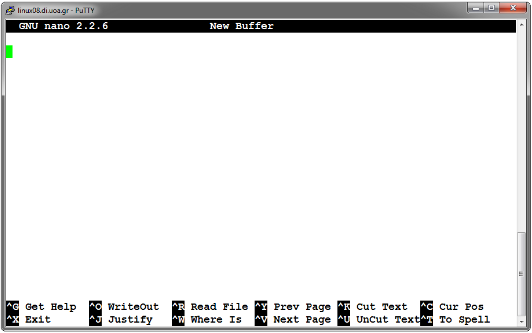

Εδώ μπορούμε να πληκτρολογήσουμε κάποιο κείμενο και να το επεξεργαστούμε. Στο κάτω μέρος της οθόνης φαίνονται οι διαθέσιμες επιλογές που έχουμε, όπως για παράδειγμα να σώσουμε το κείμενο, να αναζητήσουμε σε αυτό, να βγούμε από το περιβάλλον του pico κ.λπ.

Οι πιο ενδιαφέρουσες επιλογές είναι οι εξής:

| Hotkey | Description |
|--------|-------------|
| Ctrl+O | Αποθήκευση Κειμένου. <br> <br> Εμφανίζει μία προτροπή για εισαγωγή του ονόματος του αρχείου.|
| Ctrl+X | Έξοδος. <br> <br> Αν δεν έχουν αποθηκευτεί οι τελευταίες αλλαγές, τότε εμφανίζει μήνυμα για την αποθήκευση αυτών.|
| Ctrl+Y | Μετάβαση στην προηγούμενη σελίδα.|
| Ctrl+V | Μετάβαση στην επόμενη σελίδα.|


Για παράδειγμα ας ακολουθήσουμε την διαδικασία για την αποθήκευση ενός μικρού κειμένου σε ένα αρχείο.

1.  Πληκτρολογούμε ένα σύντομο κείμενο

2.  Πατάμε Ctrl+O. Μας εμφανίζεται στο κάτω μέρος της οθόνης η προτροπή
    να δώσουμε ένα όνομα στο αρχείο που δημιουργήσαμε.

    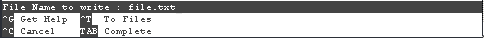

3.  Πληκτρολογούμε ένα όνομα (π.χ. file.txt) και πατάμε Enter.

4.  Πατάμε Ctrl+X για να βγούμε από το περιβάλλον του pico.

Για να τυπώσουμε στην οθόνη τα περιεχόμενα του αρχείου που δημιουργήσαμε χρησιμοποιούμε την εντολή `cat` και πληκτρολογούμε:

```text
cat file.txt
```

<a id="helloworld"></a>

## Βήμα 7: Το πρώτο σας πρόγραμμα (hello.c)

Το πρώτο πρόγραμμα που γράφουμε σε κάποια γλώσσα προγραμματισμού, είθισται να είναι το τύπωμα της φράσης "Hello World!". Για να τα καταφέρουμε πρέπει να προσπαθήσουμε να το γράψουμε:

```c
/* File: hello.c */
#include <stdio.h>
int main() {
  printf("Hello world!\n");
  return 0;
}
```

Χρησιμοποιώντας τον `pico` editor, φτιάχνουμε ένα αρχείο `hello.c` με τα παραπάνω περιεχόμενα. Στην συνέχεια μεταγλωττίζουμε το πρόγραμμά μας:

```text
gcc -o hello hello.c
```

Και στην συνέχεια το τρέχουμε:

```text
./hello
Hello world!
```

Αυτό ήταν! Μόλις τρέξατε το πρώτο σας πρόγραμμα!

## Άσκηση 1 (Παλιό θέμα): Στοιχεία φοιτητή (about.c)

Γράψτε ένα πρόγραμμα `about` το οποίο τυπώνει 3 γραμμές στην πρότυπη έξοδο (stdout): 1) το όνομά σας με λατινικούς χαρακτήρες στην 1η, 2) το sdi σας στην 2η και 3) `I'm 100% "ready"!` στην 3η. Παράδειγμα εξόδου από την εκτέλεση του προγράμματος `about`:

```text
$ ./about
Michael Jordan
sdi2300999
I'm 100% "ready"!
$
```

## Άσκηση 2: Υπερχείλιση ακεραίων (overflow.c)

Μεταγλωττίστε και τρέξτε το ακόλουθο πρόγραμμα:
```c
#include <stdio.h>

int main() {
  printf("%d\n", 2000000000 + 2000000000);
  return 0;
}
```
Συμπεριφέρεται όπως θα περιμένατε; Γιατί / γιατί όχι; Διορθώστε το αν μπορείτε.

### 2.1 Ειδικές ακολουθίες χαρακτήρων (Προχωρημένο, Προαιρετικό)

Παραπάνω χρησιμοποιήσαμε την ειδική ακολουθία `\n` για να τυπώσουμε μια νέα γραμμή μετά το μήνυμά μας. Αντίστοιχα μπορούμε να χρησιμοποιήσουμε άλλες ακολουθίες προκειμένου να τυπώσουμε ειδικούς χαρακτήρες ή να δώσουμε συγκεκριμένη μορφοποίηση στο κείμενό μας.

**Παράδειγμα 1.**

Δοκιμάστε να τυπώσετε την ειδική ακολουθία `\U0001F525`. Τι τυπώνεται στην κονσόλα; Μπορείτε να βρείτε μια εκτενή λίστα με άλλες ειδικές ακολουθίες [εδώ](https://unicode.org/emoji/charts/full-emoji-list.html) ενώ για να μάθετε περισσότερα μπορείτε να διαβάσετε για Unicode χαρακτήρες στην [wikipedia](https://en.wikipedia.org/wiki/List_of_Unicode_characters).

**Παράδειγμα 2.**

Χρησιμοποιήστε την `printf` για να τυπώσετε την ακολουθία `"Hello \033[1m world \033[0m !"`. Τι παρατηρείτε; Μπορείτε να φανταστείτε τι σημαίνουν οι ακολουθίες `\033[1m` και `\033[0m`; Τι συμβαίνει αν αντικαταστήσετε την ακολουθία `\033[1m` με την ακολουθία `\033[5m`; Μπορείτε να μάθετε περισσότερα διαβάζοντας για [ANSI Escape codes](https://en.wikipedia.org/wiki/ANSI_escape_code).

