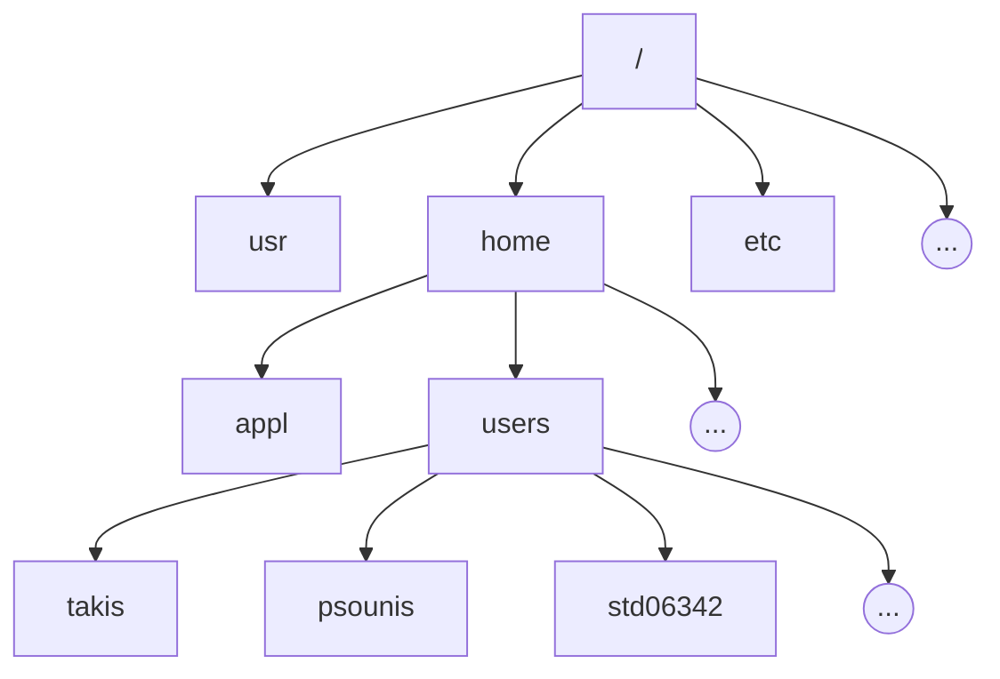
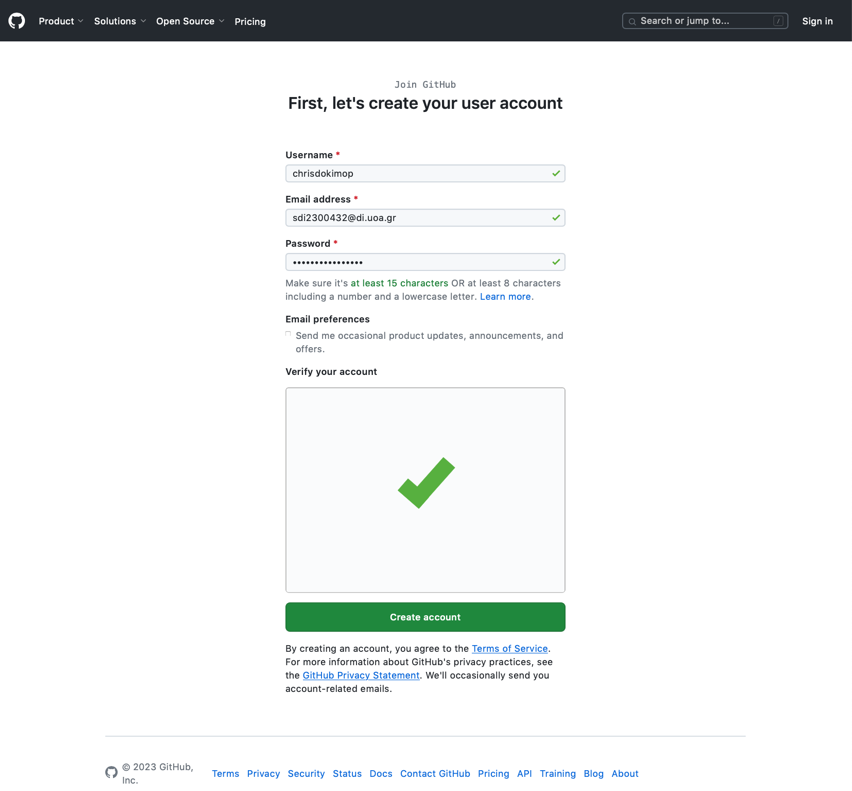
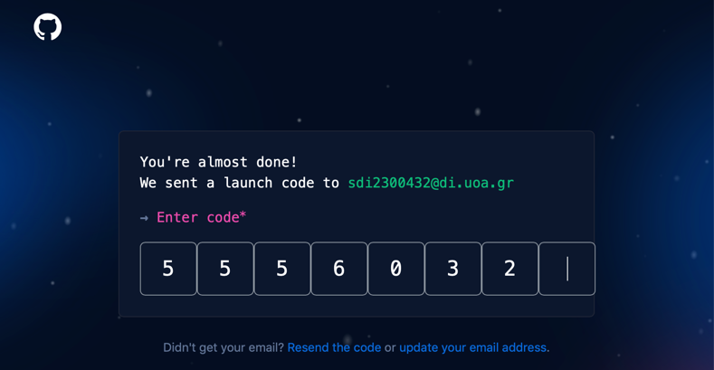
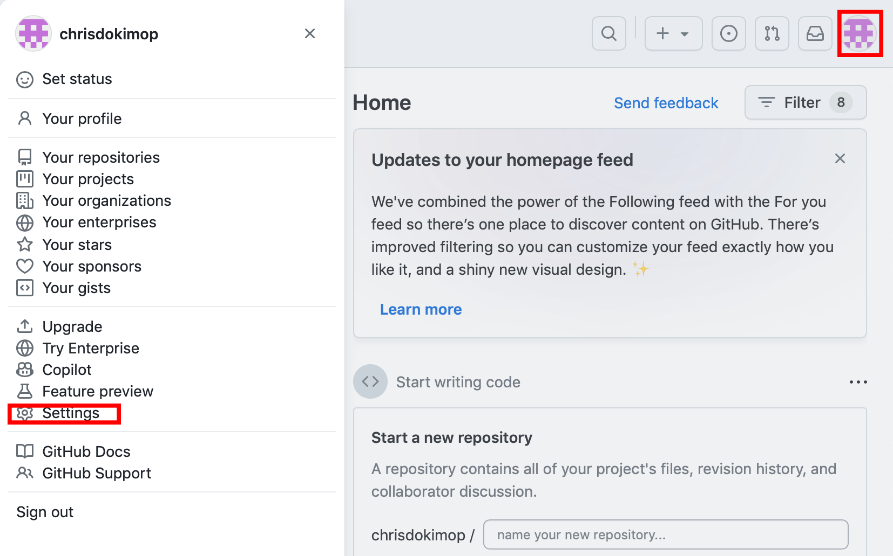
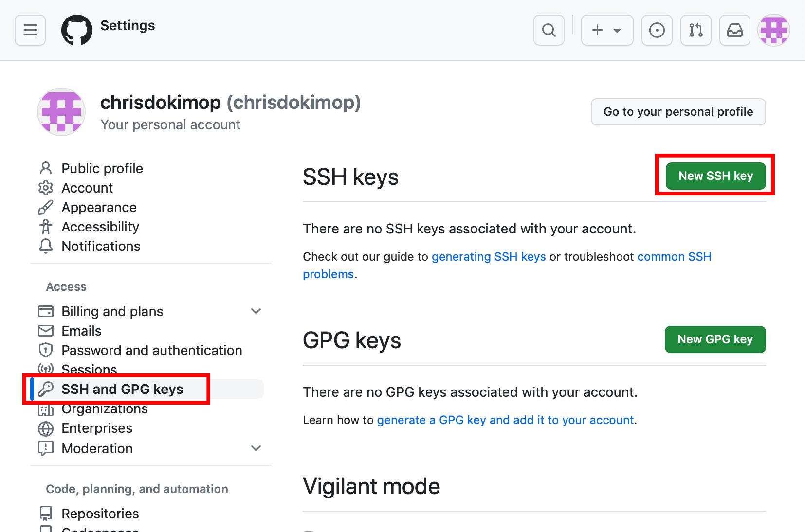
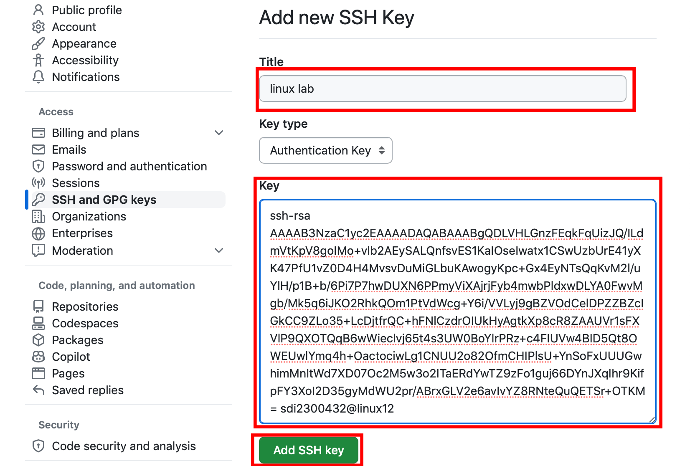

# Εργαστήριο #1: Unix και Git

Σκοπός του εργαστηρίου αυτού είναι να έλθουμε σε επαφή με: (1) τις βασικές εντολές του Unix και (2) το git, ένα σύστημα version control για την διαχείριση αρχείων κώδικα C.

## Unix Tutorial

Για να οργανώσουμε τα αρχεία μας, τα τοποθετούμε σε καταλόγους. Κάθε
κατάλογος μπορεί να περιέχει είτε αρχεία, είτε άλλους καταλόγους που
τους λέμε και υποκαταλόγους του αρχικού. Όλα ξεκινούν από έναν αρχικό
κατάλογο που λέγεται και ρίζα "/". Για παράδειγμα, η δόμηση του
συστήματος αρχείων στο μηχάνημα που έχετε συνδεθεί είναι ως εξής:



Θες να ζωγραφίσεις και εσύ live κάποια από αυτά τα διαγράμματα; Μπορείς με το [mermaid](https://mermaid.live/edit#pako:eNpdkDEPgjAQhf9KcxMkiIrGgcHBuDrp2KWhpxChbdrrYAj_3RZUgtu9795d8l4PlZYIJTysMDW7nbhibM1WqyPzzs6i1h3OCqmahdTkkiTP8zTlKuLoHTfCmHYBvEPrFiQeb3_XbHKMGxLPxi2Rcdqrf-hIbg67fbGk8W_x-QsZdGg70ciQs48-DlRjCARlGCXehW-JA1dDsApP-vpSFZRkPWbgjRSE50aEhrovRNmQtpepurHB4Q1beWSh).

Όταν εργαζόμαστε σε ένα σύστημα, βρισκόμαστε σε έναν κατάλογο που
θεωρείται ο τρέχων κατάλογος. Για παράδειγμα όταν συνδεόμαστε σε ένα
μηχάνημα με ssh, αυτόματα βρισκόμαστε στον αρχικό μας κατάλογο:
/home/users/stdXXYYY. Για να αναφερθούμε τώρα σε κάποιον άλλο κατάλογο
έχουμε δύο τρόπους:

-   Είτε με απόλυτο μονοπάτι, ξεκινώντας από την ρίζα, για παράδειγμα:
    `/home/users/std06342`.

-   Είτε με σχετικό μονοπάτι, σε σχέση με τον τρέχοντα κατάλογο. Για
    παράδειγμα, αν ο τρέχων κατάλογος είναι ο /home, τότε σχετικό
    μονοπάτι σε αυτόν είναι το users/std06342. Επίσης σε σχέση με τον
    τρέχοντα κατάλογο, υπάρχουν και οι ειδικοί κατάλογοι:

    -   `..` : Είναι συνώνυμο του γονικού καταλόγου (Για παράδειγμα, αν
        τρέχων κατάλογος είναι ο /home/users/std06342, τότε με `..`
        αναφερόμαστε στον κατάλογο /home/users).

    -   `.` : Είναι συνώνυμο του τρέχοντος καταλόγου

Εδώ να τονίσουμε ότι τα ονόματα που χρησιμοποιούνται στους καταλόγους
και στα αρχεία είναι case-sensitive, δηλαδή το όνομα καταλόγου `Psounis`
είναι διαφορετικό από το όνομα καταλόγου `psoUnis`. Αυτό είναι ένα
γενικότερο χαρακτηριστικό του Unix, βέβαια. Όλα τα ονόματα που
χρησιμοποιούμε, όχι μόνο για καταλόγους και αρχεία, αλλά και για εντολές
του λειτουργικού ή εντολές μέσα σε διάφορα βοηθητικά προγράμματα (π.χ.
κειμενογράφους) είναι case-sensitive.

Θα μελετήσουμε τώρα ένα πακέτο εντολών του Unix, που θα μας φανεί
χρήσιμο για να διαχειριστούμε τα αρχεία μας, να γράψουμε προγράμματα C,
να τα μεταγλωττίσουμε και να τα εκτελέσουμε.

Για τον λόγο αυτό θα διαβάζουμε την σύνταξη των εντολών και θα τις
χρησιμοποιούμε αναλόγως με το ζητούμενο στόχο.

> Ένα ιδιαίτερα χρήσιμο κείμενο, με περαιτέρω τρόπους σύνταξης
  εντολών, πέρα από αυτές που θα αξιοποιήσουμε σήμερα, μπορούν να
  βρεθούν εδώ: <https://progintro.github.io/assets/pdf/Unix.pdf>

Ακολουθήστε βήμα-βήμα το παρακάτω σενάριο:

### 1. Εμφανίστε τα περιεχόμενα του καταλόγου /usr/include.

 Η εντολή `ls` εμφανίζει τα περιεχόμενα καταλόγων.

 Σύνταξη:

 -   `ls` : Εμφανίζει τα περιεχόμενα του τρέχοντος
     καταλόγου

 -   `ls ονομα_καταλόγου`: Εμφανίζει τα περιεχόμενα
     του καταλόγου με όνομα ονομα_καταλόγου, που
     έχει δοθεί είτε απόλυτα (από root) είτε
     σχετικά (από τρέχοντα κατάλογο)

 Χρήσιμες επιλογές:

 -   `-a` : Εμφανίζει τα κρυφά αρχεία (αρχεία που
     αρχίζουν από τελεία)

 -   `-l` : Εμφανίζει εκτεταμένες πληροφορίες για
     τα περιεχόμενα του καταλόγου (δικαιώματα,
     μέγεθος, ημερομηνία τροποποίησης κ.λ.π.)

 Χρήση μεταχαρακτήρων (ταιριάζουν τμήμα ονόματος
 αρχείου ή καταλόγου με τα διαθέσιμα)

 -   `*` : Ταιριάζει με κανέναν ή περισσότερους
     χαρακτήρες

 -   `?` : Ταιριάζει με ακριβώς έναν χαρακτήρα

 Παραδείγματα χρήσης μεταχαρακτήρων:

 -   `ls *t` : Εμφάνισε τα αρχεία ή περιεχόμενα
     καταλόγων που το όνομα τους τελειώνει σε
     "t".

 -   `ls ??z8` : Εμφάνισε τα αρχεία ή περιεχόμενα
     καταλόγων που το όνομά τους έχει 4 γράμματα
     και τα δύο τελευταία είναι "z8"

### 2. Εμφανίστε το πλήρες όνομα του τρέχοντος καταλόγου.

 Η εντολή `pwd` εμφανίζει το πλήρες όνομα του
 τρέχοντος καταλόγου.

### 3. Δημιουργήστε κάτω από τον τρέχοντα κατάλογο ένα νέο κατάλογο με όνομα myWork.


 Η εντολή `mkdir` δημιουργεί τον κατάλογο που της
 δίνουμε σαν παράμετρο.

 Συνταξη:

 `mkdir ονομα_καταλόγου`


### 4. Μεταβείτε σε αυτόν τον νέο κατάλογο.

 Η εντολή `cd` χρησιμοποιείται για την μετάβαση σε
 έναν κατάλογο.

 Σύνταξη:

 -   `cd cat_name`: Μεταβαίνει στον κατάλογο
     `cat_name` κάτω από τον τρέχοντα κατάλογο

 -   `cd cat_path`: Μεταβαίνει στον κατάλογο που
     ορίζεται από το απόλυτο ή σχετικό μονοπάτι
     `cat_path`.

 Ειδική χρήση:

 -   `cd` : Μεταβαίνει στον αρχικό μας κατάλογο

### 5. Αντιγράψτε στον κατάλογο αυτό το πηγαίο αρχείο `~iphw/samples/mysin.c`

Η εντολή `cp` χρησιμοποιείται για την αντιγραφή αρχείων ή καταλόγων

Σύνταξη:

`cp όνομα νέο_όνομα`

`cp όνομα κατάλογος_προορισμού`

Επιλογές:

-   `-i` : Εμφανίζει ένα μήνυμα ελέγχου, όταν το
     αρχείο υπάρχει ήδη στον προορισμό και πρέπει
     να αντικατασταθεί.

-   `-R` : Αντιγράφει τον κατάλογο όνομα μαζί με
     όλα τα περιεχόμενα του (αρχεία,
     υποκαταλόγους) σε κατάλογο με όνομα
     νέο_ονομα.

### 6. Δημιουργήστε το εκτελέσιμο αρχείο mysin από το πηγαίο αρχείο που μόλις αντιγράψατε.

Ο μεταγλωττιστής (compiler) `gcc` χρησιμοποιείται για τη
μεταγλώττιση πηγαίων αρχείων σε εκτελέσιμα.

Σύνταξη:

`gcc -o εκτελέσιμο πηγαίο_αρχείο`

Επιλογές:

-   `-lm` : Ενσωμάτωση της μαθηματικής βιβλιοθήκης

### 7. Τρέξτε το εκτελέσιμο αυτό.

### 8. Αντιγράψτε στον τρέχοντα κατάλογο το πηγαίο αρχείο `~iphw/samples/mymain.c`

Διατηρήστε το όνομα (mymain.c) ώστε να μπορείτε να αναφερθείτε σε αυτό αργότερα:

```sh
cp ~iphw/samples/mymain.c mymain.c
```


### 9. Αντιγράψτε στον τρέχοντα κατάλογο το αντικειμενικό αρχείο `~iphw/samples/myfunct.o`

### 10. Μεταγλωττίστε το πηγαίο αρχείο `mymain.c` στο αντίστοιχο αντικειμενικό αρχείο.

Ο μεταγλωττιστής `gcc` χρησιμοποιείται για την μεταγλώττιση πηγαίων αρχείων σε αντικειμενικά

Σύνταξη:

 `gcc -c πηγαίο_αρχείο.c` : Παράγει το αντικειμενικό αρχείο με όνομα `πηγαίο_αρχειο.o`.

### 11. Συνδέστε το αντικειμενικό αρχείο που κατασκευάσατε και το αντικειμενικό αρχείο myfunct.o δημιουργώντας το εκτελέσιμο αρχείο myprog.

Ο μεταγλωττιστής `gcc` χρησιμοποιείται για την σύνδεση αντικειμενικών αρχείων σε ένα εκτελέσιμο.

Σύνταξη:

`gcc -o εκτελέσιμο αντικ_αρχείο1 αντικ_αρχείο2`


### 12. Εκτελέστε το myprog και ακολουθήστε τις οδηγίες που θα εκτυπωθούν.

### 13. Διαγράψτε όλα τα αρχεία που δημιουργήσατε καθώς και τον κατάλογο myWork.

Η εντολή `rm` χρησιμοποιείται για τη διαγραφή αρχείων ή καταλόγων

Σύνταξη για διαγραφή αρχείων:

`rm όνομα_αρχείου` (χρήση και μεταχαρακτήρων)

Σύνταξη για διαγραφή καταλόγων (μαζί με όλα τα περιεχόμενά τους):

`rm -r ονομα_καταλόγου`

Επιλογές:

-   `-i` : Εμφανίζει μήνυμα επιβεβαίωσης διαγραφής του αρχείου ή του καταλόγου.

### 14. Αντιγράψτε στον τρέχοντα κατάλογο το αρχείο `stdio.h` από τον κατάλογο `/usr/include`

### 15. Μετονομάστε το αρχείο που αντιγράψατε σε `Mystdio.h`

Η εντολή `mv` χρησιμοποιείται για τη μετονομασία ή μετακίνηση αρχείων ή καταλόγων

Σύνταξη:

`mv αρχικό_ονομα τελικό_όνομα`

`mv αρχικό_όνομα καταλογος_προορισμού`

Επιλογές:

-   `-i` : Εμφανίζει μήνυμα ελέγχου εφόσον υπάρχει ήδη το αρχείο στον προορισμό και πρέπει να αντικατασταθεί.

### 16. Εμφανίστε στην οθόνη τα περιεχόμενα του αρχείου αυτού.

Η εντολή `cat` χρησιμοποιείται για την εμφάνιση των περιεχομένων αρχείων.

Σύνταξη:

`cat όνομα_αρχείου`

Επιλογές:

-   `-n` : Εμφανίζει αρίθμηση στις γραμμές του αρχείου

### 17. Δημιουργήστε στον τρέχοντα κατάλογο ένα κενό αρχείο με όνομα .my_file (προσέξτε την τελεία στην αρχή του ονόματος).

Η εντολή `touch` χρησιμοποιείται για τη δημιουργία κενών αρχείων.

Σύνταξη:

`touch όνομα_αρχείου`

### 18. Εμφανίστε τα δικαιώματα προστασίας του αρχείου αυτού και ό,τι άλλες χρήσιμες πληροφορίες μας δίνει το λειτουργικό σύστημα για αυτό.

#### 19. Αλλάξτε τα δικαιώματα προστασίας έτσι ώστε εσείς (ο ιδιοκτήτης του) να έχει όλα τα δικαιώματα προστασίας (ανάγνωσης, εγγραφής και εκτέλεσης), τα μέλη της ομάδας στην οποία ανήκει το αρχείο να έχουν δικαιώματα ανάγνωσης και εκτέλεσης και οι υπόλοιποι να έχουν μόνο δικαίωμα ανάγνωσης.

Η εντολή `chmod` χρησιμοποιείται για τον καθορισμό
των δικαιωμάτων προστασίας ενός αρχείου

Σύνταξη:

`chmod XYZ όνομα_αρχείου`

όπου X, Y, Z είναι οκταδικοί αριθμοί από το 0
έως το 7 που καθορίζουν τα δικαιώματα του
ιδιοκτήτη, της ομάδας και των υπολοίπων
αντίστοιχα.

Τα δικαιώματα προκύπτουν αν γράψουμε τον αριθμό
σε δυαδική μορφή, όπου το 1ο bit καθορίζει το
δικαίωμα ανάγνωσης, το 2ο bit το δικαίωμα
εγγραφής και το 3ο bit το δικαίωμα εκτέλεσης.

### 20. Εμφανίστε πάλι τα δικαιώματα προστασίας του αρχείου .my_file (και τις άλλες πληροφορίες).

### 21. Εμφανίστε όλα τα αρχεία του τρέχοντος καταλόγου, μαζί με τα δικαιώματα προστασίας (και τις άλλες πληροφορίες), μη συμπεριλαμβανομένων των αρχείων που το όνομά τους αρχίζει από τελεία.

### 22. Το ίδιο με το προηγούμενο, αλλά να συμπεριληφθούν και τα αρχεία που το όνομά τους αρχίζει από τελεία.

### 23. Μέσω της εντολής man ενημερωθείτε σχετικά με τις δυνατότητες της εντολής grep.

Η εντολή `man` εμφανίζει πληροφορίες για την σύνταξη εντολών.

Σύνταξη:

`man όνομα_εντολής`

### 24. Χρησιμοποιείστε την εντολή grep για να βρείτε μέσα στο αρχείο `/usr/include/stdlib.h` τις γραμμές που περιλαμβάνουν το κείμενο size.

### 25. Επαναλάβετε την προηγούμενη εντολή αλλά να κάνετε ανακατεύθυνση της εξόδου της στο αρχείο grepout.txt

Η ανακατεύθυνση εξόδου σε αρχείο γίνεται με την
ακόλουθη σύνταξη:

`Εντολή > ονομα_αρχείου`

### 26. Συνδυάστε με κάποιον τρόπο τις εντολές ls και grep για να βρείτε στον τρέχοντα κατάλογο αρχεία στα οποία ο ιδιοκτήτης έχει δικαιώματα ανάγνωσης και εγγραφής, αλλά όχι εκτέλεσης και όλοι οι υπόλοιποι δεν έχουν κανένα δικαίωμα.

Η σωλήνωση (pipe) της εξόδου ενός προγράμματος στην
είσοδο ενός άλλου, γίνεται με την ακόλουθη
σύνταξη:

`Πρόγραμμα | Πρόγραμμα`

### 27. Αντιγράψτε στον τρέχοντα κατάλογο το πηγαίο αρχείο `~iphw/samples/capitalize.c` δημιουργήστε το αντίστοιχο εκτελέσιμο και τρέξτε το με ανακατεύθυνση της εισόδου από το ίδιο το πηγαίο αρχείο `capitalize.c` στέλνοντας την έξοδο (πάλι με ανακατεύθυνση) στο αρχείο `CAPITALIZE.c`

Η ανακατεύθυνση εισόδου και εξόδου γίνεται με
την ακόλουθη σύνταξη:

`Εντολή < Αρχείο_για_είσοδο > Αρχείο_για_έξοδο`

### 28. Δοκιμάστε να μεταγλωττίσετε το αρχείο `CAPITALIZE.c`. Μην ανησυχείτε όμως αν δεν μπορεί να μεταγλωττιστεί (γιατί άραγε;)

## Git και GitHub

Για τις ανάγκες του μαθήματος, ένα από τα εργαλεία που θα
χρησιμοποιήσουμε είναι το git καθώς και η cloud based υπηρεσία GitHub.
To git αποτελεί ένα εργαλείο που μας βοηθάει στη διαχείριση των εκδόσεων
του πηγαίου κώδικα των προγραμμάτων που γράφουμε. Η υπηρεσία GitHub
αποτελεί ένα on-line αποθετήριο για το git που είναι ελεύθερα διαθέσιμο.

### Δημιουργία λογαριασμού στο GitHub

Για να αποκτήσουμε λογαριασμό στην υπηρεσία GitHub (αν δεν έχουμε ήδη)
θα πρέπει να πραγματοποιήσουμε εγγραφή. Ανοίγουμε έναν browser και
πληκτρολογούμε τη διεύθυνση: <https://github.com/join>

Στη φόρμα που θα εμφανιστεί συμπληρώνουμε τα στοιχεία μας, λύνουμε το
πρόβλημα επιβεβαίωσης που θα μας ζητηθεί και πατάμε Create account.



Στη συνέχεια θα μας αποσταλεί ένα επιβεβαιωτικό email στη διεύθυνση που
δηλώσαμε με έναν κωδικό επιβεβαίωσης τον οποίο θα πρέπει να εισάγουμε
για να ολοκληρωθεί η δημιουργία του λογαριασμού μας.



Όταν εισάγουμε τον κωδικό επιβεβαίωσης ολοκληρώνεται η διαδικασία και ο
λογαριασμός μας στο GitHub είναι έτοιμος προς χρήση.

**Σύνδεση του λογαριασμού μας στο εργαστήριο με το λογαριασμό μας στο
GitHub**

Για να μπορούμε να χρησιμοποιήσουμε το GitHub ως αποθετήριο όταν
εκτελούμε την εντολή git στα μηχανήματα του εργαστηρίου linux, θα πρέπει
να δημιουργήσουμε ένα ζεύγος κλειδιών αυθεντικοποίησης και να το
ορίσουμε ως έμπιστο στην υπηρεσία GitHub.

### 1. Δημιουργία προσωπικού κλειδιού

Η δημιουργία του κλειδιού γίνεται με την εντολή ssh-keygen, όπως
φαίνεται παρακάτω

```bash
linux12:~>ssh-keygen
Generating public/private rsa key pair.
Enter file in which to save the key
(/home/users/sdi2300432/.ssh/id_rsa):
Created directory '/home/users/sdi2300432/.ssh'.
Enter passphrase (empty for no passphrase):
Enter same passphrase again:
Your identification has been saved in .ssh/temp
Your public key has been saved in .ssh/temp.pub
The key fingerprint is:
SHA256:Pb9/DeknwuU8cETcXME41Jyx0841g35W8kWB1TNjQFY thanassis@linux14
The key's randomart image is:
+---[RSA 3072]----+
|            o*XEX|
|            .++@*|
|             o+=O|
|         .  . .=B|
|        S o  o ++|
|           o. B  |
|           ..B ..|
|            o.* +|
|            .o.= |
+----[SHA256]-----+
```

### 2. Εκτύπωση προσωπικού κλειδιού

Εκτυπώνουμε τα περιεχόμενα του αρχείου **που περιέχει το public
key** με την εντολή `cat`:

```bash
linux12:~>cat .ssh/id_rsa.pub

ssh-rsa
AAAAB3NzaC1yc2EAAAADAQABAAABgQDL
VHLGnzFEqkFqUizJQ/ILdmVtKpV8goIMo+vlb2AEySALQnfsvES1KaIOseIwatx1
CSwUzbUrE41yXK47PfU1vZ0D4H4MvsvDuMiGLbuKAwogyKpc+Gx4EyNTsQqKvM2l
/uYlH/p1B+b/6Pi7P7hwDUXN6PPmyViXAjrjFyb4mwbPldxwDLYA0FwvMgb/Mk5q
6iJKO2RhkQOm1PtVdWcg+Y6i/VVLyj9gBZVOdCelDPZZBZcIGkCC9ZLo35+LcDjt
frQC+hFNlCzdrOIUkHyAgtkXp8cR8ZAAUVr1sFXVlP9QXOTQqB6wWieclvj65t4s
3UW0BoYlrPRz+c4FIUVw4BID5Qt8OWEUwlYmq4h+OactociwLg1CNUU2o82OfmCH
IPlsU+YnSoFxUUUGwhimMnItWd7XD07Oc2M5w3o2ITaERdYwTZ9zFo1guj66DYnJ
XqIhr9KifpFY3XoI2D35gyMdWU2pr/ABrxGLV2e6avIvYZ8RNteQuQETSr+OTKM=
sdi2300432@linux12
```

### 3. Προσθήκη προσωπικού κλειδιού στο GitHub

Τώρα πρέπει να εισάγουμε το παραπάνω κλειδί στο GitHub. Όντας
συνδεδεμένοι με το λογαριασμό που έχουμε στο github.com , πατάμε το
εικονίδιο στην πάνω δεξιά γωνία, και στο μενού που θα ανοίξει επιλέγουμε
το «Settings».



Στη συνέχεια επιλέγουμε το «SSH and GPG keys» και πατάμε την επιλογή
«New SSH Key», όπως φαίνεται παρακάτω:



Τέλος συμπληρώνουμε ένα όνομα, κάνουμε copy-paste το κλειδί από το βήμα
2 και πατάμε «Add SSH Key»



### 4. Ρύθμιση των παραμέτρων του git


Εκτελούμε τις παρακάτω εντολές, αντικαθιστώντας στα αντίστοιχα
σημεία τη διεύθυνση email μας καθώς και το όνομά μας με
λατινικούς χαρακτήρες:

```bash
git config --global user.email sdi2300432@di.uoa.gr

git config --global user.name "Christos Dokimopoulos"
```

Είμαστε πλέον έτοιμοι να χρησιμοποιήσουμε το git!

## Άσκηση (ότι θα κάνουμε και στις ασκήσεις)

Πατήστε τον [ακόλουθο σύνδεσμο](https://classroom.github.com/a/8_3_scjJ) για να δημιουργήσετε το δικό σας repository `progintro/lab01-YourGitHub` και πραγματοποιήστε τα ακόλουθα βήματα:

1. Κατεβάστε το repository τοπικά τρέχοντας την εντολή:

```sh
$ git clone git@github.com:progintro/lab01-YourGitHub
Cloning into 'lab01-ethan42'...
remote: Enumerating objects: 3, done.
remote: Counting objects: 100% (3/3), done.
remote: Compressing objects: 100% (2/2), done.
Receiving objects: 100% (3/3), 5.10 KiB | 871.00 KiB/s, done.
remote: Total 3 (delta 0), reused 2 (delta 0), pack-reused 0 (from 0)
```

2. Μέσα στον φάκελο `lab01-YourGitHub` που δημιούργησε η παραπάνω εντολή, προσθέστε ένα αρχείο `info.txt` με τα ακόλουθα στοιχεία:

```
Όνομα, Επώνυμο, sdiΧΧΝΝΝΝΝ(εφόσον έχετε)
```

3. Προσθέστε το αρχείο σας στο repository χρησιμοποιώντας την εντολή `git add`:

```sh
git add info.txt
```

4. Τρέξτε την εντολή `git commit` για να μονιμοποιήσετε τις αλλαγές σας:

```sh
git commit
```

5. Τρέξτε την εντολή `git push` για να ανεβάσετε τις αλλαγές σας στο GitHub.

```sh
$ git push
Enumerating objects: 4, done.
Counting objects: 100% (4/4), done.
Delta compression using up to 4 threads
Compressing objects: 100% (2/2), done.
Writing objects: 100% (3/3), 319 bytes | 63.00 KiB/s, done.
Total 3 (delta 0), reused 0 (delta 0)
To github.com:progintro/lab01-ethan42
   4ef457c..aa9f709  main -> main
```

Επιβεβαιώστε ότι βλέπετε τις αλλαγές πηγαίνοντας στο αντίστοιχο link του repository σας: https://github.com/progintro/lab01-YourGitHub .

## Advanced: Περισσότερα παιχνίδια με την κονσόλα

Υπάρχουν πολλά online Unix/Linux/Ubuntu tutorials. Ένα από αυτά που είναι κάπως πιο δύσκολο είναι το [overthewire](https://overthewire.org/wargames/bandit/bandit0.html), το οποίο έχει μια σειρά από προκλήσεις σε capture-the-flag format (μιας μορφής παιχνιδιού) με σταδιακά αυξανόμενη δυσκολία. Σημείωση: μέχρι το επίπεδο 11 τα προβλήματα σε αυτό το site είναι εντός θέματος για το μάθημα, από εκεί και πέρα γίνονται σαφώς πιο δύσκολα / απαιτούν γνώσεις που θα αποκτήσουμε σε μεγαλύτερα έτη. Φυσικά αν θέλετε μπορείτε να τα εξερευνήσετε - πολλά από αυτά έχουν και λεπτομερέστατα writeups online.
