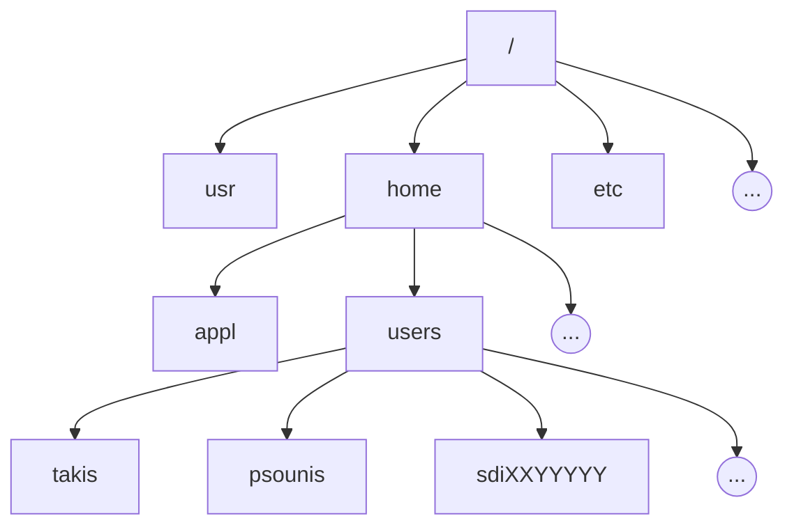

# Εργαστήριο #1: Unix και Git

> **Στόχοι**
>
> Μετά το εργαστήριο αυτό θα μπορείτε:
>
> - Να πλοηγείστε στο σύστημα αρχείων του Unix και να διαχειρίζεστε αρχεία και φακέλους.
> - Να διαβάζετε και να αλλάζετε τα δικαιώματα προστασίας ενός αρχείου.
> - Να συνδυάζετε εντολές με ανακατεύθυνση εισόδου/εξόδου και σωληνώσεις.
> - Να μεταγλωττίζετε χωριστά και να συνδέετε αντικειμενικά αρχεία με τον `gcc`.
> - Να δημιουργείτε ένα repository στο GitHub και να ανεβάζετε τις αλλαγές σας με git.
>
> **Προαπαιτούμενα:** [Εργαστήριο #0](https://progintro.github.io/lab-material/labs/lab00/) - ενεργοποιημένος λογαριασμός, σύνδεση με ssh και λογαριασμός GitHub με ρυθμισμένο κλειδί ssh.
>
> **Αρχεία που θα φτιάξετε:** `info.txt`

Σκοπός του εργαστηρίου αυτού είναι να έλθουμε σε επαφή με: (1) τις βασικές εντολές του Unix και (2) το git, ένα σύστημα version control για την διαχείριση αρχείων κώδικα C.

<!-- toc -->

**Περιεχόμενα**

- [Βήμα 1: Πλοήγηση στο σύστημα αρχείων](#βήμα-1-πλοήγηση-στο-σύστημα-αρχείων)
- [Βήμα 2: Μεταγλώττιση, σύνδεση και εκτέλεση](#βήμα-2-μεταγλώττιση-σύνδεση-και-εκτέλεση)
- [Βήμα 3: Αντιγραφή, μετονομασία και προβολή αρχείων](#βήμα-3-αντιγραφή-μετονομασία-και-προβολή-αρχείων)
- [Βήμα 4: Δικαιώματα προστασίας](#βήμα-4-δικαιώματα-προστασίας)
- [Βήμα 5: Αναζήτηση, ανακατεύθυνση και σωληνώσεις](#βήμα-5-αναζήτηση-ανακατεύθυνση-και-σωληνώσεις)
- [Βήμα 6: Git και GitHub](#βήμα-6-git-και-github)
- [Άσκηση 1: Το πρώτο σας repository (info.txt)](#άσκηση-1-το-πρώτο-σας-repository-infotxt)
- [Για να πάτε παρακάτω (Προαιρετικό)](#για-να-πάτε-παρακάτω-προαιρετικό)

<!-- /toc -->


Για να οργανώσουμε τα αρχεία μας, τα τοποθετούμε σε φακέλους. Κάθε φάκελος μπορεί να περιέχει είτε αρχεία, είτε άλλους φακέλους που τους λέμε και υποφακέλους του αρχικού. Όλα ξεκινούν από έναν αρχικό φάκελο που λέγεται και ρίζα "/". Για παράδειγμα, η δόμηση του συστήματος αρχείων στο μηχάνημα που έχετε συνδεθεί είναι ως εξής:


```mermaid
graph TB
  / --> usr
  / --> home
  / --> etc
  / --> dots((...))

  home --> appl
  home --> users
  home --> dots1((...))
  users --> takis
  users --> psounis
  users --> sdiXXYYYYY
  users --> dots2((...))
```

Θες να ζωγραφίσεις και εσύ live κάποια από αυτά τα διαγράμματα; Μπορείς με το [mermaid](https://mermaid.live/edit#pako:eNpdkDEPgjAQhf9KcxMkiIrGgcHBuDrp2KWhpxChbdrrYAj_3RZUgtu9795d8l4PlZYIJTysMDW7nbhibM1WqyPzzs6i1h3OCqmahdTkkiTP8zTlKuLoHTfCmHYBvEPrFiQeb3_XbHKMGxLPxi2Rcdqrf-hIbg67fbGk8W_x-QsZdGg70ciQs48-DlRjCARlGCXehW-JA1dDsApP-vpSFZRkPWbgjRSE50aEhrovRNmQtpepurHB4Q1beWSh).

Όταν εργαζόμαστε σε ένα σύστημα, βρισκόμαστε σε έναν φάκελο που θεωρείται ο τρέχων φάκελος. Για παράδειγμα όταν συνδεόμαστε σε ένα μηχάνημα με ssh, αυτόματα βρισκόμαστε στον αρχικό μας φάκελο: /home/users/sdiXXYYYYY. Για να αναφερθούμε τώρα σε κάποιον άλλο φάκελο έχουμε δύο τρόπους:

-   Είτε με απόλυτο μονοπάτι, ξεκινώντας από την ρίζα, για παράδειγμα:
    `/home/users/sdiXXYYYYY`.

-   Είτε με σχετικό μονοπάτι, σε σχέση με τον τρέχοντα φάκελο. Για
    παράδειγμα, αν ο τρέχων φάκελος είναι ο /home, τότε σχετικό
    μονοπάτι σε αυτόν είναι το users/sdiXXYYYYY. Επίσης σε σχέση με τον
    τρέχοντα φάκελο, υπάρχουν και οι ειδικοί φάκελοι:

    -   `..` : Είναι συνώνυμο του γονικού φακέλου (Για παράδειγμα, αν
        τρέχων φάκελος είναι ο /home/users/sdiXXYYYYY, τότε με `..`
        αναφερόμαστε στον φάκελο /home/users).

    -   `.` : Είναι συνώνυμο του τρέχοντος φακέλου

Εδώ να τονίσουμε ότι τα ονόματα που χρησιμοποιούνται στους φακέλους και στα αρχεία είναι case-sensitive, δηλαδή το όνομα φακέλου `Psounis` είναι διαφορετικό από το όνομα φακέλου `psoUnis`. Αυτό είναι ένα γενικότερο χαρακτηριστικό του Unix, βέβαια. Όλα τα ονόματα που χρησιμοποιούμε, όχι μόνο για φακέλους και αρχεία, αλλά και για εντολές του λειτουργικού ή εντολές μέσα σε διάφορα βοηθητικά προγράμματα (π.χ. κειμενογράφους) είναι case-sensitive.

Θα μελετήσουμε τώρα ένα πακέτο εντολών του Unix, που θα μας φανεί χρήσιμο για να διαχειριστούμε τα αρχεία μας, να γράψουμε προγράμματα C, να τα μεταγλωττίσουμε και να τα εκτελέσουμε.

Για τον λόγο αυτό θα διαβάζουμε την σύνταξη των εντολών και θα τις χρησιμοποιούμε αναλόγως με τον ζητούμενο στόχο.

> Ένα ιδιαίτερα χρήσιμο κείμενο, με περαιτέρω τρόπους σύνταξης
εντολών, πέρα από αυτές που θα αξιοποιήσουμε σήμερα, μπορεί να βρεθεί εδώ: <https://progintro.github.io/assets/pdf/Unix.pdf>

Ακολουθήστε βήμα-βήμα το παρακάτω σενάριο:

## Βήμα 1: Πλοήγηση στο σύστημα αρχείων

**1.** Εμφανίστε τα περιεχόμενα του φακέλου /usr/include.

Η εντολή `ls` εμφανίζει τα περιεχόμενα φακέλων.

Σύνταξη:

 -   `ls` : Εμφανίζει τα περιεχόμενα του τρέχοντος
     φακέλου

 -   `ls όνομα_φακέλου`: Εμφανίζει τα περιεχόμενα
     του φακέλου με όνομα όνομα_φακέλου, που
     έχει δοθεί είτε απόλυτα (από root) είτε
     σχετικά (από τρέχοντα φάκελο)

Χρήσιμες επιλογές:

 -   `-a` : Εμφανίζει τα κρυφά αρχεία (αρχεία που
     αρχίζουν από τελεία)

 -   `-l` : Εμφανίζει εκτεταμένες πληροφορίες για
     τα περιεχόμενα του φακέλου (δικαιώματα,
     μέγεθος, ημερομηνία τροποποίησης κ.λπ.)

Χρήση μεταχαρακτήρων (ταιριάζουν τμήμα ονόματος αρχείου ή φακέλου με τα διαθέσιμα)

 -   `*` : Ταιριάζει με κανέναν ή περισσότερους
     χαρακτήρες

 -   `?` : Ταιριάζει με ακριβώς έναν χαρακτήρα

Παραδείγματα χρήσης μεταχαρακτήρων:

 -   `ls *t` : Εμφάνισε τα αρχεία ή περιεχόμενα
     φακέλων που το όνομα τους τελειώνει σε
     "t".

 -   `ls ??z8` : Εμφάνισε τα αρχεία ή περιεχόμενα
     φακέλων που το όνομά τους έχει 4 γράμματα
     και τα δύο τελευταία είναι "z8"

**2.** Εμφανίστε το πλήρες όνομα του τρέχοντος φακέλου.

Η εντολή `pwd` εμφανίζει το πλήρες όνομα του τρέχοντος φακέλου.

**3.** Δημιουργήστε κάτω από τον τρέχοντα φάκελο ένα νέο φάκελο με όνομα myWork.


Η εντολή `mkdir` δημιουργεί τον φάκελο που της δίνουμε σαν παράμετρο.

Σύνταξη:

`mkdir όνομα_φακέλου`


**4.** Μεταβείτε σε αυτόν τον νέο φάκελο.

Η εντολή `cd` χρησιμοποιείται για την μετάβαση σε έναν φάκελο.

Σύνταξη:

 -   `cd cat_name`: Μεταβαίνει στον φάκελο
     `cat_name` κάτω από τον τρέχοντα φάκελο

 -   `cd cat_path`: Μεταβαίνει στον φάκελο που
     ορίζεται από το απόλυτο ή σχετικό μονοπάτι
     `cat_path`.

Ειδική χρήση:

 -   `cd` : Μεταβαίνει στον αρχικό μας φάκελο

## Βήμα 2: Μεταγλώττιση, σύνδεση και εκτέλεση

**5.** Αντιγράψτε στον φάκελο αυτό το πηγαίο αρχείο `~iphw/samples/mysin.c`

Η εντολή `cp` χρησιμοποιείται για την αντιγραφή αρχείων ή φακέλων

Σύνταξη:

`cp όνομα νέο_όνομα`

`cp όνομα φάκελος_προορισμού`

Επιλογές:

-   `-i` : Εμφανίζει ένα μήνυμα ελέγχου, όταν το
     αρχείο υπάρχει ήδη στον προορισμό και πρέπει
     να αντικατασταθεί.

-   `-R` : Αντιγράφει τον φάκελο όνομα μαζί με
     όλα τα περιεχόμενα του (αρχεία,
     υποφακέλους) σε φάκελο με όνομα
     νέο_όνομα.

**6.** Δημιουργήστε το εκτελέσιμο αρχείο mysin από το πηγαίο αρχείο που μόλις αντιγράψατε.

Ο μεταγλωττιστής (compiler) `gcc` χρησιμοποιείται για τη μεταγλώττιση πηγαίων αρχείων σε εκτελέσιμα.

Σύνταξη:

`gcc -o εκτελέσιμο πηγαίο_αρχείο`

Επιλογές:

-   `-lm` : Ενσωμάτωση της μαθηματικής βιβλιοθήκης

**7.** Τρέξτε το εκτελέσιμο αυτό.

**8.** Αντιγράψτε στον τρέχοντα φάκελο το πηγαίο αρχείο `~iphw/samples/mymain.c`

Διατηρήστε το όνομα (mymain.c) ώστε να μπορείτε να αναφερθείτε σε αυτό αργότερα:

```text
cp ~iphw/samples/mymain.c mymain.c
```


**9.** Αντιγράψτε στον τρέχοντα φάκελο το αντικειμενικό αρχείο `~iphw/samples/myfunct.o`

**10.** Μεταγλωττίστε το πηγαίο αρχείο `mymain.c` στο αντίστοιχο αντικειμενικό αρχείο.

Ο μεταγλωττιστής `gcc` χρησιμοποιείται για την μεταγλώττιση πηγαίων αρχείων σε αντικειμενικά

Σύνταξη:

`gcc -c πηγαίο_αρχείο.c` : Παράγει το αντικειμενικό αρχείο με όνομα `πηγαίο_αρχείο.o`.

**11.** Συνδέστε το αντικειμενικό αρχείο που κατασκευάσατε και το αντικειμενικό αρχείο myfunct.o δημιουργώντας το εκτελέσιμο αρχείο myprog.

Ο μεταγλωττιστής `gcc` χρησιμοποιείται για την σύνδεση αντικειμενικών αρχείων σε ένα εκτελέσιμο.

Σύνταξη:

`gcc -o εκτελέσιμο αντικ_αρχείο1 αντικ_αρχείο2`


**12.** Εκτελέστε το myprog και ακολουθήστε τις οδηγίες που θα εκτυπωθούν.

**13.** Διαγράψτε όλα τα αρχεία που δημιουργήσατε καθώς και τον φάκελο myWork.

Η εντολή `rm` χρησιμοποιείται για τη διαγραφή αρχείων ή φακέλων

Σύνταξη για διαγραφή αρχείων:

`rm όνομα_αρχείου` (χρήση και μεταχαρακτήρων)

Σύνταξη για διαγραφή φακέλων (μαζί με όλα τα περιεχόμενά τους):

`rm -r όνομα_φακέλου`

Επιλογές:

-   `-i` : Εμφανίζει μήνυμα επιβεβαίωσης διαγραφής του αρχείου ή του φακέλου.

## Βήμα 3: Αντιγραφή, μετονομασία και προβολή αρχείων

**14.** Αντιγράψτε στον τρέχοντα φάκελο το αρχείο `stdio.h` από τον φάκελο `/usr/include`

**15.** Μετονομάστε το αρχείο που αντιγράψατε σε `Mystdio.h`

Η εντολή `mv` χρησιμοποιείται για τη μετονομασία ή μετακίνηση αρχείων ή φακέλων

Σύνταξη:

`mv αρχικό_όνομα τελικό_όνομα`

`mv αρχικό_όνομα φάκελος_προορισμού`

Επιλογές:

-   `-i` : Εμφανίζει μήνυμα ελέγχου εφόσον υπάρχει ήδη το αρχείο στον προορισμό και πρέπει να αντικατασταθεί.

**16.** Εμφανίστε στην οθόνη τα περιεχόμενα του αρχείου αυτού.

Η εντολή `cat` χρησιμοποιείται για την εμφάνιση των περιεχομένων αρχείων.

Σύνταξη:

`cat όνομα_αρχείου`

Επιλογές:

-   `-n` : Εμφανίζει αρίθμηση στις γραμμές του αρχείου

## Βήμα 4: Δικαιώματα προστασίας

**17.** Δημιουργήστε στον τρέχοντα φάκελο ένα κενό αρχείο με όνομα .my_file (προσέξτε την τελεία στην αρχή του ονόματος).

Η εντολή `touch` χρησιμοποιείται για τη δημιουργία κενών αρχείων.

Σύνταξη:

`touch όνομα_αρχείου`

**18.** Εμφανίστε τα δικαιώματα προστασίας του αρχείου αυτού και όποιες άλλες χρήσιμες πληροφορίες μας δίνει το λειτουργικό σύστημα για αυτό.

**19.** Αλλάξτε τα δικαιώματα προστασίας έτσι ώστε εσείς (ο ιδιοκτήτης του) να έχετε όλα τα δικαιώματα προστασίας (ανάγνωσης, εγγραφής και εκτέλεσης), τα μέλη της ομάδας στην οποία ανήκει το αρχείο να έχουν δικαιώματα ανάγνωσης και εκτέλεσης και οι υπόλοιποι να έχουν μόνο δικαίωμα ανάγνωσης.

Η εντολή `chmod` χρησιμοποιείται για τον καθορισμό των δικαιωμάτων προστασίας ενός αρχείου

Σύνταξη:

`chmod XYZ όνομα_αρχείου`

όπου X, Y, Z είναι οκταδικοί αριθμοί από το 0 έως το 7 που καθορίζουν τα δικαιώματα του ιδιοκτήτη, της ομάδας και των υπολοίπων αντίστοιχα.

Τα δικαιώματα προκύπτουν αν γράψουμε τον αριθμό σε δυαδική μορφή, όπου το 1ο bit καθορίζει το δικαίωμα ανάγνωσης (4), το 2ο bit το δικαίωμα εγγραφής (2) και το 3ο bit το δικαίωμα εκτέλεσης (1). Για παράδειγμα, το 7 (=111 δυαδικό) δίνει και τα τρία δικαιώματα, ενώ το 5 (=101) δίνει ανάγνωση και εκτέλεση.

**20.** Εμφανίστε πάλι τα δικαιώματα προστασίας του αρχείου .my_file (και τις άλλες πληροφορίες).

**21.** Εμφανίστε όλα τα αρχεία του τρέχοντος φακέλου, μαζί με τα δικαιώματα προστασίας (και τις άλλες πληροφορίες), μη συμπεριλαμβανομένων των αρχείων που το όνομά τους αρχίζει από τελεία.

**22.** Το ίδιο με το προηγούμενο, αλλά να συμπεριληφθούν και τα αρχεία που το όνομά τους αρχίζει από τελεία.

## Βήμα 5: Αναζήτηση, ανακατεύθυνση και σωληνώσεις

**23.** Μέσω της εντολής `man` ενημερωθείτε σχετικά με τις δυνατότητες της εντολής grep.

Η εντολή `man` εμφανίζει πληροφορίες για την σύνταξη εντολών.

Σύνταξη:

`man όνομα_εντολής`

**24.** Χρησιμοποιήστε την εντολή `grep` για να βρείτε μέσα στο αρχείο `/usr/include/stdlib.h` τις γραμμές που περιλαμβάνουν το κείμενο size.

**25.** Επαναλάβετε την προηγούμενη εντολή αλλά να κάνετε ανακατεύθυνση της εξόδου της στο αρχείο grepout.txt

Η ανακατεύθυνση εξόδου σε αρχείο γίνεται με την ακόλουθη σύνταξη:

`Εντολή > όνομα_αρχείου`

**26.** Συνδυάστε με κάποιον τρόπο τις εντολές ls και grep για να βρείτε στον τρέχοντα φάκελο αρχεία στα οποία ο ιδιοκτήτης έχει δικαιώματα ανάγνωσης και εγγραφής, αλλά όχι εκτέλεσης και όλοι οι υπόλοιποι δεν έχουν κανένα δικαίωμα.

Η σωλήνωση (pipe) της εξόδου ενός προγράμματος στην είσοδο ενός άλλου, γίνεται με την ακόλουθη σύνταξη:

`Πρόγραμμα | Πρόγραμμα`

**27.** Αντιγράψτε στον τρέχοντα φάκελο το πηγαίο αρχείο `~iphw/samples/capitalize.c` δημιουργήστε το αντίστοιχο εκτελέσιμο και τρέξτε το με ανακατεύθυνση της εισόδου από το ίδιο το πηγαίο αρχείο `capitalize.c` στέλνοντας την έξοδο (πάλι με ανακατεύθυνση) στο αρχείο `CAPITALIZE.c`

Η ανακατεύθυνση εισόδου και εξόδου γίνεται με την ακόλουθη σύνταξη:

`Εντολή < Αρχείο_για_είσοδο > Αρχείο_για_έξοδο`

**28.** Δοκιμάστε να μεταγλωττίσετε το αρχείο `CAPITALIZE.c`. Μην ανησυχείτε όμως αν δεν μπορεί να μεταγλωττιστεί (γιατί άραγε;)

## Βήμα 6: Git και GitHub

Για τις ανάγκες του μαθήματος, ένα από τα εργαλεία που θα χρησιμοποιήσουμε είναι το git καθώς και η cloud based υπηρεσία GitHub. To git αποτελεί ένα εργαλείο που μας βοηθάει στη διαχείριση των εκδόσεων του πηγαίου κώδικα των προγραμμάτων που γράφουμε. Η υπηρεσία GitHub αποτελεί ένα on-line αποθετήριο για το git που είναι ελεύθερα διαθέσιμο.

Στο [Εργαστήριο #0](https://progintro.github.io/lab-material/labs/lab00/#github) φτιάξαμε λογαριασμό στο GitHub, προσθέσαμε σε αυτόν το προσωπικό μας κλειδί ssh και ρυθμίσαμε το git. Πριν συνεχίσετε, επιβεβαιώστε από το μηχάνημα του εργαστηρίου ότι η σύνδεση με το GitHub δουλεύει:

```text
linux12:~>ssh -T git@github.com
Hi YourGitHub! You've successfully authenticated, but GitHub does not provide shell access.
```

Αν αντί γι' αυτό δείτε `Permission denied (publickey)`, ή αν το `git config --global user.name` δεν τυπώνει το όνομά σας, επιστρέψτε στο [Βήμα 9 του Εργαστηρίου #0](https://progintro.github.io/lab-material/labs/lab00/#github-ssh) και ολοκληρώστε το.

## Άσκηση 1: Το πρώτο σας repository (info.txt)

Θα φτιάξετε ένα repository με όνομα `lab01` στον δικό σας λογαριασμό στο GitHub, δηλαδή `YourGitHub/lab01`, όπου `YourGitHub` είναι το όνομα χρήστη σας στο GitHub.

1. Όντας συνδεδεμένοι στο github.com, ανοίξτε τη διεύθυνση <https://github.com/new>. Στο «Repository name» γράψτε `lab01`, επιλέξτε «Private» και ενεργοποιήστε την επιλογή «Add a README file». Πατήστε «Create repository».

2. Κατεβάστε το repository τοπικά τρέχοντας την εντολή:

```text
$ git clone git@github.com:YourGitHub/lab01
Cloning into 'lab01'...
remote: Enumerating objects: 3, done.
remote: Counting objects: 100% (3/3), done.
remote: Compressing objects: 100% (2/2), done.
Receiving objects: 100% (3/3), 5.10 KiB | 871.00 KiB/s, done.
remote: Total 3 (delta 0), reused 2 (delta 0), pack-reused 0 (from 0)
```

3. Μέσα στον φάκελο `lab01` που δημιούργησε η παραπάνω εντολή, προσθέστε ένα αρχείο `info.txt` με τα ακόλουθα στοιχεία:

```text
Όνομα, Επώνυμο, sdiXXYYYYY (εφόσον έχετε)
```

4. Προσθέστε το αρχείο σας στο repository χρησιμοποιώντας την εντολή `git add`:

```text
git add info.txt
```

5. Τρέξτε την εντολή `git commit` για να μονιμοποιήσετε τις αλλαγές σας:

```text
git commit
```

6. Τρέξτε την εντολή `git push` για να ανεβάσετε τις αλλαγές σας στο GitHub.

```text
$ git push
Enumerating objects: 4, done.
Counting objects: 100% (4/4), done.
Delta compression using up to 4 threads
Compressing objects: 100% (2/2), done.
Writing objects: 100% (3/3), 319 bytes | 63.00 KiB/s, done.
Total 3 (delta 0), reused 0 (delta 0)
To github.com:ethan42/lab01
   4ef457c..aa9f709  main -> main
```

Επιβεβαιώστε ότι βλέπετε τις αλλαγές πηγαίνοντας στο αντίστοιχο link του repository σας: <https://github.com/YourGitHub/lab01>.

## Για να πάτε παρακάτω (Προαιρετικό)

Υπάρχουν πολλά online Unix/Linux/Ubuntu tutorials. Ένα από αυτά που είναι κάπως πιο δύσκολο είναι το [overthewire](https://overthewire.org/wargames/bandit/bandit0.html), το οποίο έχει μια σειρά από προκλήσεις σε capture-the-flag format (μιας μορφής παιχνιδιού) με σταδιακά αυξανόμενη δυσκολία. Σημείωση: μέχρι το επίπεδο 11 τα προβλήματα σε αυτό το site είναι εντός θέματος για το μάθημα, από εκεί και πέρα γίνονται σαφώς πιο δύσκολα / απαιτούν γνώσεις που θα αποκτήσουμε σε μεγαλύτερα έτη. Φυσικά αν θέλετε μπορείτε να τα εξερευνήσετε - πολλά από αυτά έχουν και λεπτομερέστατα writeups online.
