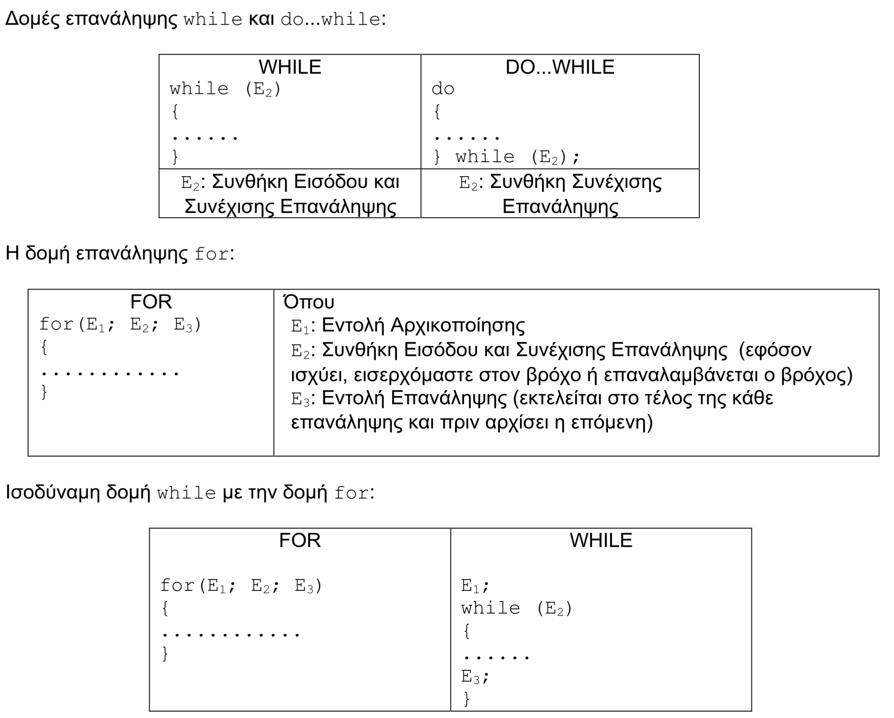
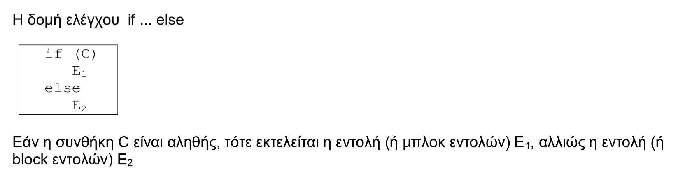

# Εργαστήριο #3: Δομές Επανάληψης

## Μεταβλητές, Δομές Ελέγχου και Επανάληψης

Στο εργαστήριο αυτό, θα εξοικειωθούμε με τους τύπους δεδομένων που μας
παρέχει η γλώσσα C, θα χρησιμοποιήσουμε τις δομές επανάληψης (for,
while, do...while), την δομή ελέγχου (if...else) και θα γράψουμε συναρτήσεις
προκειμένου να λύσουμε προγραμματιστικά προβλήματα.



| printf: Σύμβολα Ακεραίων | Σύμβολα Κινητής Υποδιαστολής |
|-----------------|----------------------------|
| `d`: int ||
| `ld`: long ||
| `lld`: long long|f: float ή double|
| `u`: unsigned int|Lf: long double|
| `lu`: unsigned long||
| `llu`: unsigned long long ||


## Άσκηση 1: Υπολογισμός Αθροίσματος Σειράς (seq.c)

Σε αυτήν την άσκηση, θα γράψουμε ένα πρόγραμμα `seq.c` το οποίο θα υπολογίζει
διάφορα αθροίσματα σειράς. Για κάθε ένα από αυτά, θα φτιάχνουμε μια διαφορετική
συνάρτηση υπολογισμού.

### 1.1. Γράψτε μια συνάρτηση `sum` που να υπολογίζει το άθροισμα της σειράς:

$$ \sum_{i=1}^{100} i $$

και να το εκτυπώνει στην οθόνη. Να χρησιμοποιηθεί η δομή επανάληψης `while`.


### 1.2. Γράψτε μια συνάρτηση `basel` που να υπολογίζει το άθροισμα της σειράς:

$$ \sum_{i=1}^{100} \frac{1}{i^2} $$

και να το εκτυπώνει στην οθόνη. Να χρησιμοποιηθεί η δομή επανάληψης `for`.

Τι συμβαίνει αν αυξήσετε τους όρους; Ρίξτε μια ματιά στο [Basel Theorem](https://en.wikipedia.org/wiki/Basel_problem) και ελέγξτε αν τα αποτελέσματά σας συμφωνούν με τα μαθηματικά.

> Υπόδειξη: Χρησιμοποιείστε μία ενδιάμεση μεταβλητή για να αποθηκεύετε προσωρινά τον τρέχοντα όρο της σειράς.


### 1.3. Γράψτε μια συνάρτηση `pi_approx` που να προσεγγίζει το $\pi$ χρησιμοποιώντας την έκφραση:

$$ \pi = \sqrt{6 \cdot \sum_{i=1}^\infty \frac{1}{i^2}} $$

χρησιμοποιώντας τους 100 πρώτους όρους της σειράς και να τυπώνει το αποτέλεσμα. Να χρησιμοποιηθεί η δομή επανάληψης `do...while`. Για την υλοποίηση θα χρειαστείτε την συνάρτηση `sqrt` (square root).

|`double sqrt(double)` |
|---|
| Απαιτείται η ενσωμάτωση του αρχείου επικεφαλίδας `math.h`.|
| |
| Επιστρέφει την τετραγωνική ρίζα του αριθμού που δέχεται σαν όρισμα. |
| |
| Στην μεταγλώττιση με τον `gcc` απαιτείται και η επιλογή `-lm` για να |
| συμπεριληφθεί η μαθηματική βιβλιοθήκη. |


#### 1.3.1. Τροποποίηση της `pi_approx` μέχρι όριο ακρίβειας $10^{-15}$.

Παρατηρήστε ότι οι όροι που προστίθενται στην σειρά γίνονται ολοένα και
πιο μικροί, με αποτέλεσμα από ένα σημείο και μετά να είναι
αρκούντως μικροί για να μην επηρεάζουν το αποτέλεσμα, αφού
χρησιμοποιούμε αριθμητική πεπερασμένης ακρίβειας. Αλλάξτε το κριτήριο
τερματισμού του υπολογισμού, ώστε ο υπολογισμός να σταματάει όταν ο
τρέχων όρος που προστίθεται στην σειρά είναι μικρότερος από
$10^{-15}$.

#### 1.3.2. Τροποποίηση της `pi_approx` ώστε να τυπώνει το αποτέλεσμα με ακρίβεια 8 δεκαδικών ψηφίων.

H συνάρτηση `printf()` μπορεί να εκτυπώσει την τιμή πραγματικών μεταβλητών που δέχεται σαν όρισμα με επιθυμητή μορφοποίηση. Σύνταξη:

```c
        printf(“%a.bf”, var);
```
όπου:
- `a`: Ορίζουμε το πλήθος των θέσεων που θα γίνει η εκτύπωση.
- `b`: Ορίζουμε το πλήθος των ψηφίων μετά την υποδιαστολή που θα εκτυπωθούν.


Μέχρι πόσα ψηφία του $\pi$ μπορείτε να υπολογίσετε / τυπώσετε; Αυτό το πρόβλημα έχει τυραννήσει γενιές και γενιές στα μαθηματικά και αργότερα - όταν οι αριθμοί έγιναν μεγάλοι - στην πληροφορική [[1]](https://en.wikipedia.org/wiki/Chronology_of_computation_of_%CF%80) [[2]](https://en.wikipedia.org/wiki/Approximations_of_%CF%80).


### 1.4. Υλοποιήστε μια συνάρτηση `eta_two` η οποία να υπολογίζει το άθροισμα της σειράς:

$$
S_{1} = \frac{1}{1^{2}} - \frac{1}{2^{2}} + \frac{1}{3^{2}} - \frac{1}{4^{2}} + \frac{1}{5^{2}} - \frac{1}{6^{2}} + \dots
$$

ή αλλιώς γραμμένη ως:

$$ S_{1} = \sum_{i=1}^\infty \frac{(-1)^{i-1}}{i^2} $$

Η συνάρτησή σας θέλουμε να ζητάει από τον χρήστη το πλήθος των όρων που θα χρησιμοποιήσει και να τυπώνει το αποτέλεσμα με ακρίβεια 6 δεκαδικών ψηφίων. Μπορείτε να χρησιμοποιήσετε όποια δομή επανάληψης επιθυμείτε.

Φαίνεται το αποτέλεσμά σας να συγκλίνει σε κάποιον αριθμό; Μπορείτε να το εξηγήσετε με την βοήθεια της συνάρτησης [Dirichlet eta](https://en.wikipedia.org/wiki/Dirichlet_eta_function);


### 1.5. Εξάσκηση σε Σειρές

Μπορείτε να κάνετε περισσότερη εξάσκηση, υλοποιώντας τις ακόλουθες συναρτήσεις στο πρόγραμμά `seq.c`:

- Συνάρτηση `harmonic` [[3]](https://en.wikipedia.org/wiki/Harmonic_series_(mathematics)) που υπολογίζει το άθροισμα:

$$
S_{2} = \sum_{i=1}^\infty \frac{(-1)^{i+1}}{i} = \frac{1}{1} - \frac{1}{2} + \frac{1}{3} - \frac{1}{4} + \cdots
$$

- Συνάρτηση `leibniz` [[4]](https://en.wikipedia.org/wiki/Leibniz_formula_for_%CF%80) που να υπολογίζει το άθροισμα:

$$
S_{3} = \sum_{i=0}^\infty \frac{(-1)^{i+1}}{2i+1} = \frac{1}{1} - \frac{1}{3} + \frac{1}{5} - \frac{1}{7} + \cdots
$$

- Συνάρτηση `zeta_four` [[5]](https://en.wikipedia.org/wiki/Riemann_zeta_function) που να υπολογίζει το άθροισμα:

$$
S_{6} = \sum_{i=1}^\infty \frac{1}{i^4} = \frac{1}{1^4} + \frac{1}{2^4} + \frac{1}{3^4} + \frac{1}{4^4} + \cdots
$$

- Συνάρτηση `wallis` [[6]](https://en.wikipedia.org/wiki/Wallis_product) που να υπολογίζει το γινόμενο:

$$
P = \prod_{i=1}^\infty \frac{2i}{2i-1}\cdot \frac{2i}{2i+1} = \frac{2}{1} \cdot \frac{2}{3} \cdot \frac{4}{3} \cdot \frac{4}{5} \cdot \frac{6}{5} \cdot \frac{6}{7} \cdots
$$


## Άσκηση 2: Υπολογισμός ριζών τριωνύμου (root.c)

### 2.1. Παραγωγή τυχαίων αριθμών

Γράψτε ένα πρόγραμμα `root.c` που να παράγει τρεις τυχαίους πραγματικούς αριθμούς στο
διάστημα `[0,1]` και να τους αποθηκεύει στις μεταβλητές τύπου `double` `a`, `b` και `c`, τις οποίες στη
συνέχεια να εκτυπώνει.

|`int rand()`|
| ---- |
| Απαιτείται ενσωμάτωση του αρχείου επικεφαλίδας `stdlib.h` |
| |
| Επιστρέφει έναν ψευδο-τυχαίο ακέραιο από 0 έως `RAND_MAX` - συμβολική σταθερά που |
| ορίζεται στο αρχείο επικεφαλίδας `stdlib.h` |

| `srand(unsigned int seed)`|
| --- |
| Απαιτείται ενσωμάτωση του αρχείου επικεφαλίδας `stdlib.h` |
| |
| Αρχικοποιεί την γεννήτρια ψευδο-τυχαίων αριθμών με βάση τον αριθμό/φύτρα `seed`. |
| Συνήθως χρησιμοποιούμε σα φύτρα την τρέχουσα ώρα, όπως επιστρέφεται από την κλήση|
| της συνάρτησης `time(NULL)` (απαιτείται το αρχείο επικεφαλίδας `time.h`)|

### 2.2. Εύρεση ριζών

Τροποποιήστε το `root.c` ώστε να υπολογίζει τις πραγματικές ρίζες ενός τριωνύμου. Τα
δεδομένα εισόδου (συντελεστές του τριωνύμου) θα είναι τυχαίες πραγματικές μεταβλητές `a`, `b`
, `c` στο διάστημα `[0,1]`. Αν το τριώνυμο δεν έχει πραγματικές ρίζες, να εκτυπώνεται ένα σχετικό
μήνυμα ενημέρωσης. Οι ρίζες να εκτυπώνονται με ακρίβεια 3 δεκαδικών ψηφίων.



### 2.3. Μιγαδικές Ρίζες

Ενσωματώστε στο πρόγραμμά σας και την περίπτωση το τριώνυμο να έχει μιγαδικές ρίζες, οπότε
θα πρέπει να τις υπολογίζει.

## Άσκηση 3: Υπολογισμός ημέρας μίας δεδομένης ημερομηνίας (birthdate.c)

Ο ακόλουθος αλγόριθμος υπολογίζει την ημέρα που αντιστοιχεί σε μία δεδομένη ημερομηνία:

Έστω η ημερομηνία $DD / MM / YYYY$ (δύο ψηφία για την μέρα DD - Day, δύο ψηφία για τον μήνα MM - Month, 4 ψηφία για τον χρόνο YYYY - Year).

**Αν** $\text{MM} \leq 2$, **τότε**:

$$
\begin{matrix}
\text{NYYYY} = \text{YYYY} - 1 \\
\text{NMM} = 0 \\
\end{matrix}
$$

**Αν** $\text{MM} > 2$, **τότε**:

$$
\begin{matrix}
\text{NYYYY} = \text{YYYY} \\
\text{NMM} = \left\lfloor \frac{4 \cdot \text{MM} + 23}{10} \right\rfloor \\
\end{matrix}
$$

$$ IDAY = 365 \cdot YYYY + DD + 31 \cdot (MM - 1) - NMM + \left\lfloor \frac{NYYYY}{4}\right\rfloor - \left\lfloor \frac{3}{4} \cdot \left(\left\lfloor \frac{NYYYY}{100} \right\rfloor + 1\right) \right\rfloor $$

Για τον υπολογισμό της ημέρας, αν:

- $IDAY \mod 7 = 0$, τότε DAY = **Saturday**
- $IDAY \mod 7 = 1$, τότε DAY = **Sunday**
- ...
- $IDAY \mod 7 = 6$, τότε DAY = **Friday**

Όπου, με $\lfloor x \rfloor$ συμβολίζουμε τον μέγιστο ακέραιο αριθμό που δεν είναι μεγαλύτερος του αριθμού $x$ - γνωστή και ως συνάρτηση `floor` ([αντίστοιχα υπάρχει και η συνάρτηση ceil](https://en.wikipedia.org/wiki/Floor_and_ceiling_functions)). Δεν είμαστε σίγουροι πως λειτουργεί - πως θα το βρούμε;

**Εργασία**: Γράψτε ένα πρόγραμμα `birthdate.c` το οποίο να χρησιμοποιεί τον αλγόριθμο παραπάνω και να υπολογίζει τι ημέρα γεννηθήκατε (ενσωματώστε την ημερομηνία γέννησής σας μέσα στο πρόγραμμα).

Ο παραπάνω υπολογισμός φαίνεται περίπλοκος; Δεν έχετε δει τίποτε ακόμη! Πραγματικές συναρτήσεις βιβλιοθήκης ημερομηνιών πρέπει να χειρίζονται ημερομηνίες και στο παρελθόν, με ιδιαίτερα περίπλοκες αλλαγές - τι γίνεται για παράδειγμα αν ο χρήστης θέλει να βρει την ημερομηνία 16 Φεβρουαρίου 1923 στην Ελλάδα [[7]](https://en.wikipedia.org/wiki/Adoption_of_the_Gregorian_calendar);

## ΠΑΡΑΡΤΗΜΑ: Αποσφαλμάτωση προγραμμάτων (Πράξη $2^η$)

Στο προηγούμενο εργαστήριο είδαμε την μέθοδο για να ανιχνεύουμε και να
διορθώνουμε συντακτικά λάθη. Στο παρόν εργαστήριο θα συνεχίσουμε τη
συζήτηση για την αποσφαλμάτωση προγραμμάτων, εστιάζοντας αυτή τη φορά
στα λάθη λογικής.

### Λογικά λάθη

Ένα λογικό λάθος είναι ένα λάθος που, ενώ επιτρέπει την επιτυχή μεταγλώττιση και εκτέλεση του προγράμματος, τελικά κάνει τα αποτελέσματά του να μην είναι σωστά. Αυτό μπορεί να οφείλεται είτε σε κάποιο λάθος στην αρχική μας σκέψη για το πώς θα λύσουμε το πρόβλημα, είτε ακόμα και στη λανθασμένη υλοποίηση μιας σωστής σκέψης.

Για παράδειγμα, ας θεωρήσουμε το πρόβλημα να υπολογίσουμε το άθροισμα 1+3+5+... για τους πρώτους 20 όρους. Ένα πρόγραμμα που επιχειρεί να κάνει αυτή τη δουλειά είναι το εξής:

<p align="center">

```c
#include <stdio.h>
#define N 20

int main() {
    int S = 0, a = 1;

    while (a <= N) {
        S = S + a;
        a = a + 2;
    }

    printf("%d\n", S);
}
```

</p>

Το προηγούμενο πρόγραμμα μεταγλωττίζεται με απόλυτη επιτυχία και εμφανίζει αποτελέσματα. Το πρόβλημα είναι ότι το αποτέλεσμα που εμφανίζει, το 100, δεν είναι σωστό. Εμείς θα αναμέναμε το 400. Άρα στο πρόγραμμά μας υπάρχει κάποιο λογικό λάθος, το οποίο πρέπει να αναζητήσουμε και να διορθώσουμε.

### Τεχνικές εύρεσης και διόρθωσης λογικών λαθών

Τα λογικά λάθη είναι, κατά γενική ομολογία, πολύ δύσκολο να εντοπιστούν. Ενώ με τα συντακτικά λάθη μπορούμε να αντλήσουμε πολύτιμες πληροφορίες από τα μηνύματα του μεταγλωττιστή, με τα λογικά λάθη όλα θα λειτουργούν σωστά, με εξαίρεση ότι τελικά θα παίρνουμε λανθασμένα αποτελέσματα (ή και καθόλου αποτελέσματα).

Όταν αντιμετωπίζουμε ένα λογικό λάθος το πρώτο που πρέπει να κάνουμε είναι να προσπαθήσουμε να εντοπίσουμε τις πιθανές πηγές του. Για να το πετύχουμε αυτό πρέπει να δούμε με προσοχή τα αποτελέσματα που εκτυπώνει το πρόγραμμά μας και να σκεφτούμε πιθανές αιτίες που μπορεί να οδήγησαν σε τέτοιου είδους αποτελέσματα. Για παράδειγμα, αν θέλουμε να εκτυπώνουμε κάποια στοιχεία με βάση ένα κριτήριο και καταλήγουμε να εκτυπώνουμε όλα τα στοιχεία, τότε πιθανότατα το πρόβλημα βρίσκεται στον τρόπο που έχουμε υλοποιήσει το κριτήριο επιλογής.

Έχοντας σκεφτεί περίπου τι μπορεί να φταίει, εντοπίζουμε το επίμαχο κομμάτι του κώδικα και το ξανακοιτάμε με προσοχή. Μήπως κάτι που έχουμε γράψει δε συνάδει με την αρχική μας σκέψη; Μήπως έχουμε παραλείψει κάτι;

Αν είναι δύσκολο να δούμε με το μάτι τι μπορεί να φταίει, τότε πρέπει να καταφύγουμε σε μια “ιχνηλάτηση” του προγράμματος. Στο επίμαχο κομμάτι του κώδικα και για όσες μεταβλητές περιλαμβάνει, εκτυπώνουμε την τιμή τους στα διάφορα στάδια εκτέλεσης με τη χρήση συναρτήσεων `printf`. Έτσι, μπορούμε να δούμε τις τιμές που παίρνουν και να αποκτήσουμε μια καλύτερη εικόνα για το στάδιο στο οποίο η υλοποίησή μας αρχίζει να χωλαίνει.

Ας επανέλθουμε στο προηγούμενο παράδειγμα και ας δούμε πώς θα το αντιμετωπίζαμε με βάση όσα είπαμε. Αρχικά παρατηρούμε ότι το αποτέλεσμα που παίρνουμε δεν είναι σωστό, συγκεκριμένα είναι σημαντικά μικρότερο από αυτό που θα περιμέναμε. Αυτό μπορεί να οφείλεται είτε στο ότι δεν κάνουμε σωστά το άθροισμα, είτε στο ότι δεν παράγουμε σωστά τους όρους που αθροίζουμε, είτε στο ότι αθροίζουμε λιγότερους όρους απ' ό,τι θα θέλαμε.

Σε κάθε περίπτωση, όλα τα προηγούμενα συγκλίνουν στο ότι δεν κάνουμε κάτι σωστά μέσα στη δομή επανάληψης. Οι επίμαχες μεταβλητές είναι το `S` και το `a`, οπότε ας εμφανίσουμε τις τιμές τους με σωστή τοποθέτηση συναρτήσεων `printf` ως εξής:

<p align="center">

```c
int main() {
    int S = 0, a = 1;

    while (a <= N) {
        S = S + a;
        printf("%d %d\n", S, a);
        a = a + 2;
    }

    printf("%d\n", S);
}
```

</p>

Εκτελώντας αυτόν τον κώδικα παίρνουμε σαν αποτέλεσμα:
```1 1
4 3
9 5
16 7
25 9
36 11
49 13
64 15
81 17
100 19
100
```

Από το αποτέλεσμα καταλαβαίνουμε ότι ο υπολογισμός του αθροίσματος και των όρων γίνεται σωστά. Άρα το πρόβλημα πρέπει να βρίσκεται στο πλήθος των όρων που χρησιμοποιούμε, το οποίο, όπως βλέπουμε, δεν είναι 20 όπως θα θέλαμε, αλλά 10. Οπότε, αυτό που φταίει είναι το πλήθος των φορών που εκτελείται η δομή επανάληψης. Όμως αυτό εξαρτάται από τη συνθήκη της, άρα το λάθος πρέπει να βρίσκεται σε αυτή. Αν τη δούμε καλύτερα, λέει `while (a <= N)`, το οποίο σημαίνει ότι ο τρέχων όρος πρέπει να είναι μικρότερος ή ίσος του πλήθους των όρων που θέλουμε να αθροίσουμε, ενώ εμείς θέλουμε απλά να αθροίσουμε 20 όρους. Αυτό μπορούμε να το πετύχουμε αν αντικαταστήσουμε τη while με μια for της μορφής for `(i = 1; i <= N; i++)`.

Φυσικά, θα υπάρξουν και φορές όπου ο κώδικάς μας θα είναι απόλυτα σύμφωνος με όσα έχουμε σκεφτεί και φαινομενικά σωστός, αλλά σε κάποια παραδείγματα δεν θα λειτουργεί σωστά. Τότε, αυτό που έχει συμβεί είναι ότι δεν έχουμε καλύψει όλες τις πιθανές περιπτώσεις, κάτι που είναι υποχρεωτικό για έναν σωστό προγραμματιστή. Γι' αυτό πρέπει πάντα να δοκιμάζουμε εξονυχιστικά τα προγράμματά μας με διάφορα παραδείγματα, όχι μόνο απλά, αλλά και σύνθετα και ασυνήθιστα, για να βεβαιωθούμε ότι είναι όντως σωστά.

Αν κάποιο από τα παραδείγματα που δοκιμάσαμε δεν δίνει το αναμενόμενο αποτέλεσμα, τότε έχουμε παραλείψει να καλύψουμε αυτή την περίπτωση στον κώδικά μας. Πρέπει να σκεφτούμε ποια είναι τα χαρακτηριστικά του συγκεκριμένου παραδείγματος που το κάνουν να μην εμπίπτει σε όσα έχουμε σκεφτεί και υλοποιήσει. Είναι πολύ πιθανό να χρειαστεί να καταφύγουμε ξανά στις τεχνικές που περιγράψαμε πριν και να τοποθετήσουμε κατάλληλες `printf` σε κρίσιμα σημεία του προγράμματος. Μόλις βρούμε τι φταίει, εμπλουτίζουμε την αρχική μας σκέψη ώστε να καλύψει και αυτήν την περίπτωση και κάνουμε τις απαραίτητες προσθήκες στον κώδικά μας.

Γενικά, η διόρθωση λογικών λαθών απαιτεί εμπειρία, υπομονή και εξοικείωση με το πρόβλημα και τον κώδικά μας. Αν και περιγράψαμε τεχνικές για την εύρεση και διόρθωση λογικών σφαλμάτων, πρέπει να έχουμε κατά νου ότι κάθε λογικό λάθος είναι διαφορετικό από οποιοδήποτε άλλο. Ο τρόπος με τον οποίο θα φτάσουμε από τα λανθασμένα αποτελέσματα στην αιτία τους μέσα στον κώδικά μας απαιτεί αναλυτική σκέψη και δε γίνεται να υπάρξουν καθολικά εφαρμόσιμες τεχνικές γι’ αυτό το σκοπό.

**Σημείωση:** Αν και αναφέραμε έναν τρόπο αποσφαλμάτωσης μέσω printf, αυτός ο τρόπος δεν είναι πάντα αποτελεσματικός ή εύκολα υλοποιήσιμος, ειδικά σε μεγάλα προγράμματα. Γι' αυτό το σκοπό υπάρχουν εξειδικευμένα εργαλεία, γνωστά ως debuggers, που βοηθούν πολύ στη διαδικασία αποσφαλμάτωσης. Είναι σημαντικό να εξοικειωθείτε με τη χρήση κάποιου τέτοιου προγράμματος, π.χ. με τον gdb που βρίσκεται εγκατεστημένος στα μηχανήματα Linux του Τμήματος. Παρουσίαση του gdb θα γίνει σε επόμενο εργαστήριο.

### Άσκηση Αποσφαλμάτωσης (limit.c)

Το παρακάτω πρόγραμμα `limit.c` ευελπιστεί να υπολογίζει την παράσταση 1 - 1/2 + 1/4 - 1/8 + 1/16 - ... για όσους όρους είναι μεγαλύτεροι από το `LIMIT`. Για να το πετύχει αυτό, ο προγραμματιστής του έκανε την εξής σκέψη:

> "Σε μια μεταβλητή `c` θα κρατάω τον τρέχοντα όρο που θα προστεθεί, ο οποίος παράγεται από τον προηγούμενο αν πολλαπλασιάσω με ½. Θέλω ανά πάσα στιγμή ο όρος `c` να μην ξεπερνά το `LIMIT`. To `c` έχει διαφορετικό πρόσημο σε κάθε όρο, οπότε θα χρησιμοποιήσω μια μεταβλητή `sign` που θα την πολλαπλασιάζω με το -1 ώστε ανά δύο όρους να έχει το ίδιο πρόσημο. Τελικά θα εκτυπώσω το άθροισμα `S`".

Το πρόγραμμα αυτό όμως, έχει συντακτικά και λογικά λάθη. Μπορείτε να το αποσφαλματώσετε και να γράψετε ένα σωστό `limit.c`;

```c
#include <stdio.h>

#define LIMIT 0.008

int main() {
    float S = 0, c = 1;
    int sign = 1;

    while (c < LIMIT) {
        S = S + c;
        sign = (-1) * sign;
        c = sign * (1.0 / 2) * c;
    }

    printf("%f\n", S);
}
```
