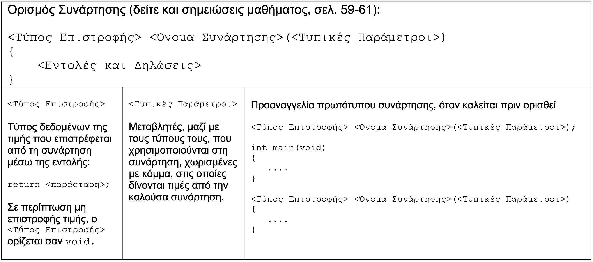
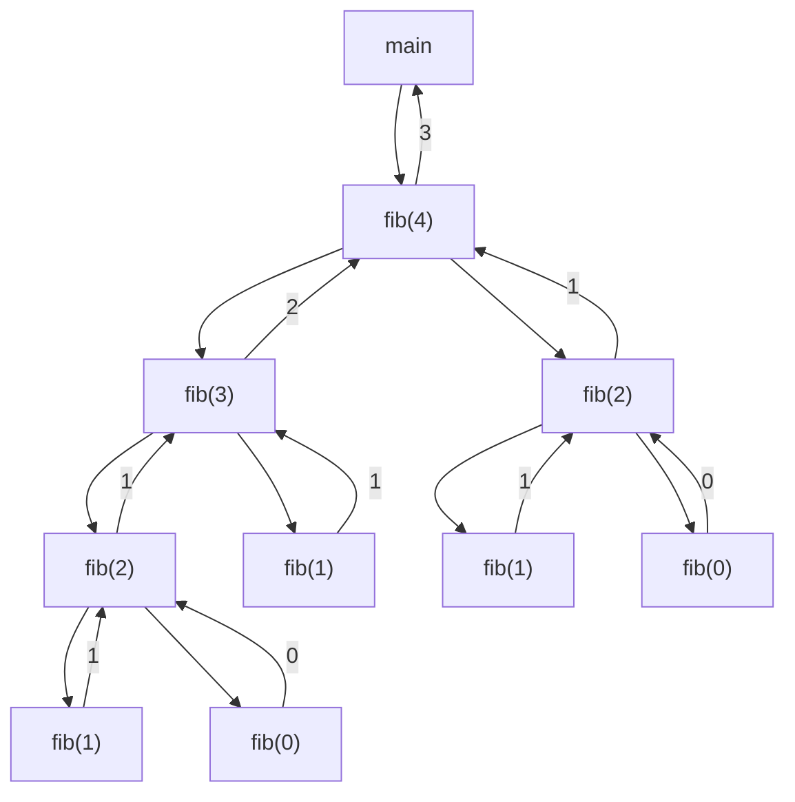

# Εργαστήριο #5: Συναρτήσεις και Αναδρομή

## Συναρτήσεις και Αναδρομή

Στο εργαστήριο αυτό θα συνεχίσουμε την εξοικείωσή μας με την χρήση συναρτήσεων
και θα υλοποιήσουμε τις πρώτες μας *αναδρομικές* συναρτήσεις, δηλαδή συναρτήσεις που στο σώμα τους καλούν τον εαυτό τους.

## Άσκηση 1. Η εικασία του Collatz (collatz.c)

Η εικασία Collatz είναι ένα από τα πιο [διάσημα άλυτα προβλήματα των μαθηματικών](https://en.wikipedia.org/wiki/Collatz_conjecture). Πολλοί μαθηματικοί έχουν επιχειρήσει κατά καιρούς να την αποδείξουν και μέχρι στιγμής δεν έχουμε ακόμα μια ευρέως αποδεκτή απόδειξη. Η εικασία ισχυρίζεται κάτι πολύ απλό: ότι η επανάληψη δυο απλών αριθμητικών πράξεων με μια συγκεκριμένη διαδικασία μπορεί να μετατρέψει οποιονδήποτε θετικό ακέραιο στο 1. Η διαδικασία των πράξεων έχει ως εξής:

1. Διάλεξε οποιονδήποτε θετικό ακέραιο $N$.
1. Αν ο αριθμός είναι 1, τότε τερμάτισε την διαδικασία.
1. Αν είναι άρτιος, ο επόμενος αριθμός στην ακολουθία θα είναι ο $N/2$.
1. Αν είναι περιττός, ο επόμενος αριθμός στην ακολουθία θα είναι ο $3\times N+1$.
1. Επανάλαβε τα βήματα 2-4 μέχρι να φτάσουμε στο 1.

Για παράδειγμα, έστω $N = 3$. Η παραπάνω διαδικασία θα παράξει την ακολουθία: 3, 10, 5, 16, 8, 4, 2, 1. Μπορείτε να δοκιμάσετε το ίδιο με τον αγαπημένο σας θετικό ακέραιο και να ελέγξετε την ακολουθία που παράγεται. Ο δικός μου για παράδειγμα είναι το 42 που οδηγεί στην ακολουθία: 42, 21, 64, 32, 16, 8, 4, 2, 1. Λογικά και η δική σας επιλογή κατέληξε στο 1 μετά από μερικά βήματα - αν όχι ίσως έχετε την [ευκαιρία να γίνετε εκατομμυριούχοι](https://www.prnewswire.com/news-releases/bakuage-offers-prize-of-120-million-jpy-to-whoever-solves-collatz-conjecture-math-problem-unsolved-for-84-years-301326629.html) (ποιος είπε ότι τα μαθηματικά δεν έχουν λεφτά!).

Για κάθε θετικό ακέραιο $N$, ο αριθμός στοιχείων της ακολουθίας που παράγεται μέχρι να καταλήξουμε στο 1, λέγεται *μήκος ακολουθίας Collatz*. Για παράδειγμα, για $N = 3$, το μήκος της ακολουθίας είναι 8 (η ακολουθία έχει 8 στοιχεία: 3, 10, 5, 16, 8, 4, 2, 1). Αντίστοιχα για τον αριθμό 42, το μήκος ακουλουθίας Collatz είναι 9. Αν $N = 1$, τότε έχουμε το ελάχιστο μήκος 1.

Σε αυτήν την άσκηση, καλείστε να γράψετε ένα πρόγραμμα `collatz.c` που να βρίσκει
μήκος της ακολουθίας collatz για έναν αριθμό.

**1.1** Κατασκευάστε τη συνάρτηση `int isodd(int n)` που δέχεται σαν
όρισμα έναν ακέραιο `n` και επιστρέφει 1, αν ο αριθμός είναι περιττός, ή 0,
αν ο αριθμός είναι άρτιος.

**1.2** Γράψτε σε γλώσσα C μια συνάρτηση
 `int collatz_it(int n)` που υπολογίζει το μήκος ακολουθίας collatz - δηλαδή
 τον αριθμό των βημάτων που απαιτούνται προκειμένου ο αριθμός `n` να φτάσει
 στο 1. Ολοκληρώστε την υλοποίηση με δομή επανάληψης.



**1.3** Υλοποιήστε τον ίδιο αλγόριθμο σε μια συνάρτηση `int collatz(int n)`
κάνοντας χρήση αναδρομής και **χωρίς** να χρησιμοποιήσετε άλλη δομή επανάληψης.

**1.4** Ελέγξτε τα αποτελέσματά σας ώστε να βεβαιωθείτε ότι το πρόγραμμά σας
λειτουργεί σωστά για διάφορες αρχικές τιμές:

```
$ ./collatz
Number to find the length of the collatz sequence: 42
Iterative result: 9
Recursive result: 9
$ ./collatz
Number to find the length of the collatz sequence: 950000001
Iterative result: 199
Recursive result: 199
```

Κάποιο από τα αποτελέσματά μας δεν συμφωνεί; Τι μπορεί να πηγαίνει στραβά;

**1.5 (Αdvanced - Προαιρετικό)** Κάνετε το πρόγραμμά σας να δέχεται τον
ακέραιο από την γραμμή εντολών, για παράδειγμα:

```
$ ./collatz 950000001
Iterative result: 199
Recursive result: 199
```

## Άσκηση 2. Η ακολουθία Fibonacci (fib.c).

Η ακολουθία Fibonacci είναι από τις [πιο διάσημες μαθηματικές ακολουθίες](https://en.wikipedia.org/wiki/Fibonacci_sequence). Ο αναδρομικός ορισμός
της συνάρτησης είναι ιδιαίτερα απλός:

$$
fib(n)
\begin{cases}
0 & \text{if } n = 0, \\
1 & \text{if } n = 1, \\
fib(n-1) + fib(n-2) & \text{if } n \geq 2.
\end{cases}
$$

και προκύπτει η ακολουθία (συνδέεται και με την [χρυσή τομή](https://en.wikipedia.org/wiki/Golden_ratio)):

>     0, 1, 1, 2, 3, 5, 8, 13, 21, 34, 55, 89, 144, ...

Σε αυτήν την άσκηση θα υλοποιήσετε ένα πρόγραμμα `fib.c` που υπολογίζει
τον n-οστό αριθμό της ακολουθίας Fibonacci.

**2.1:** Ορίστε την αναδρομική συνάρτηση `int fib(int n)` που να υλοποιεί τον
υπολογισμό του n-οστού όρου της ακολουθίας Fibonacci.

**2.2** Μετατρέψτε το πρόγραμμά σας έτσι ώστε να δέχεται από τον χρήστη το
πόσους αριθμούς Fibonacci θέλει να εκτυπωθούν και στην συνέχεια θα καλεί
την συνάρτηση `fib` για να εκτυπώσει τον κάθε όρο. Παράδειγμα
εκτέλεσης ακολουθεί:

```
$ ./fib
How many fibonacci terms would you like: 35
fib(0) = 0
fib(1) = 1
fib(2) = 1
fib(3) = 2
fib(4) = 3
fib(5) = 5
fib(6) = 8
fib(7) = 13
fib(8) = 21
fib(9) = 34
...
fib(31) = 1346269
fib(32) = 2178309
fib(33) = 3524578
fib(34) = 5702887
```

Τρέξτε το πρόγραμμά σας για περισσότερους όρους, για παράδειγμα 45.
Τι παρατηρείτε;

**2.3** Μετρήστε τις αναδρομικές κλήσεις για κάθε εκτέλεση του παραπάνω
προγράμματος χρησιμοποιώντας μία καθολική (global) μεταβλητή. Εκτυπώστε
το πλήθος των αναδρομικών κλήσεων μετά από κάθε εκτέλεση.



**2.4** Παρατηρήστε το δένδρο αναδρομικών κλήσεων του προγράμματος για
n=4 για εξηγήστε την αύξηση του χρόνου υπολογισμού του προγράμματος σε
σχέση με τον όρο που υπολογίζεται.

**2.5** Ο n-οστός όρος της ακολουθίας Fibonacci μπορεί να υπολογισθεί
και επαναληπτικά, αν χρησιμοποιήσουμε δύο μεταβλητές για να αποθηκεύουμε
σε κάθε βήμα τους δύο προηγούμενους αριθμούς, ώστε προσθέτοντας τους, να
υπολογίζουμε τον επόμενο. Γράψτε μια συνάρτηση `int fib_it(int n)` η οποία
να υπολογίζει τον n-οστό όρο της ακολουθίας Fibonacci ακολουθώντας την
παραπάνω επαναληπτική διαδικασία. Μετατρέψτε το πρόγραμμά σας ώστε
να χρησιμοποιεί την επαναληπτική διαδικασία και ξανατρέξτε το
παραπάνω πείραμα. Τι παρατηρείτε;

**2.6 (Advanced - Προαιρετικό)** Μπορείτε να υπολογίσετε τον n-οστό όρο
Fibonacci αναδρομικά με απόδοση κοντά στον επαναληπτικό αλγόριθμο; Αν ναι,
υλοποιήστε την λύση σας σε μια συνάρτηση `int fib_rec_fast(int n)` και μετατρέψτε το πρόγραμμά σας
ώστε να χρησιμοποιεί την συνάρτηση `fib_rec_fast`.

## Άσκηση 3 (Παλιό Θέμα / Προαιρετικό). Σκαλί-Σκαλί (ladder.c)

´Ενα παιδί ανεβαίνει μια σκάλα και σε κάθε βήμα του ανεβαίνει 1, 2 ή 3 σκαλιά. Έστω ότι η σκάλα έχει 5 σκαλιά. Ένας τρόπος να τα ανέβει είναι 1-1-1-1-1, δηλαδή ένα σκαλί την φορά. Ένας άλλος είναι ο 2-2-1 (δύο σκαλιά στα πρώτα δύο βήματα και μετά ένα σκαλί). Άλλοι πιθανοί τρόποι είναι οι 3-2, 2-3, 3-1-1, κ.ο.κ - σε κάθε περίπτωση ο συνολικός αριθμός των σκαλιών που ανέβηκε πρέπει να ισούται με τον αριθμό των σκαλιών της σκάλας. Γράψτε ένα πρόγραμμα `ladder.c` το οποίο διαβάζει τον συνολικό αριθμό των σκαλοπατιών και επιστρέφει τον αριθμό των διαφορετικών τρόπων με τους οποίους το παιδί μπορεί να ανέβει την σκάλα. Το πρόγραμμά σας θέλουμε να βγάζει σωστά αποτελέσματα για σκάλες μέχρι 50 σκαλιά. Λάβετε υπόψη σας ότι στην C δεν μπορούν να αναπαρασταθούν ακέραιοι μεγαλύτεροι από το $2^{64} - 1$, δεδομένου ότι ο ευρύτερος τύπος ακεραίου που μπορούμε να έχουμε είναι ο `unsigned long long` (των 8 bytes). Ακολουθούν ενδεικτικές εκτελέσεις:

```
$ ./step
Please provide the number of steps: 4
There are 7 different ways to climb the ladder
$ ./step
Please provide the number of steps: 5
There are 13 different ways to climb the ladder
$ ./step
Please provide the number of steps: 6
There are 24 different ways to climb the ladder
$ ./step
Please provide the number of steps: 50
There are 10562230626642 different ways to climb the ladder
```

