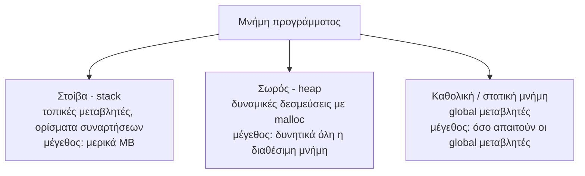

# Εργαστήριο #9: Δομές και Αυτοαναφορικές Δομές

> **Στόχοι**
>
> Μετά το εργαστήριο αυτό θα μπορείτε:
>
> - Να ομαδοποιείτε δεδομένα σε δομές (`struct`) και να τις περνάτε σε συναρτήσεις.
> - Να κατασκευάζετε αυτοαναφορικές δομές: συνδεδεμένες λίστες και δυαδικά δένδρα.
> - Να διασχίζετε αναδρομικά ένα ταξινομημένο δυαδικό δένδρο.
> - Να ελέγχετε τη διαχείριση μνήμης του προγράμματός σας με το `valgrind`.
>
> **Προαπαιτούμενα:** [Εργαστήριο #7](https://progintro.github.io/lab-material/labs/lab07/) - δυναμική δέσμευση μνήμης.
>
> **Αρχεία που θα φτιάξετε:** `point.c`, `person.c`, `grades.c`, `tree.c`

Σε αυτό το εργαστήριο θα μελετήσουμε τις δυνατότητες που μας προσφέρει η C για να ομαδοποιούμε δεδομένα χρησιμοποιώντας δομές. Μέσω των δομών θα κατασκευάσουμε συνδεδεμένες λίστες και δυαδικά δένδρα, τα οποία ονομάζονται αυτοαναφορικές δομές.

<!-- toc -->

**Περιεχόμενα**

- [Άσκηση 1: Δομές και συναρτήσεις (point.c)](#άσκηση-1-δομές-και-συναρτήσεις-pointc)
- [Άσκηση 2: Δομές και δείκτες (person.c)](#άσκηση-2-δομές-και-δείκτες-personc)
- [Άσκηση 3: Συνδεδεμένες λίστες (grades.c)](#άσκηση-3-συνδεδεμένες-λίστες-gradesc)
- [Άσκηση 4: Δυαδικά δένδρα (tree.c)](#άσκηση-4-δυαδικά-δένδρα-treec)
- [Παράρτημα: Αποσφαλμάτωση προγραμμάτων (Πράξη 5η)](#παράρτημα-αποσφαλμάτωση-προγραμμάτων-πράξη-5η)
  - [Η μνήμη ενός προγράμματος](#η-μνήμη-ενός-προγράμματος)
  - [Τι είναι το valgrind](#τι-είναι-το-valgrind)
  - [Μεταγλώττιση και εκτέλεση](#μεταγλώττιση-και-εκτέλεση)
  - [Τι εντοπίζει το valgrind](#τι-εντοπίζει-το-valgrind)
  - [Παράδειγμα 1: παράνομη προσπέλαση (oob.c)](#παράδειγμα-1-παράνομη-προσπέλαση-oobc)
  - [Παράδειγμα 2: μη αρχικοποιημένη μνήμη (uninit.c)](#παράδειγμα-2-μη-αρχικοποιημένη-μνήμη-uninitc)
  - [Παράδειγμα 3: διαρροή σε συνδεδεμένη λίστα (grades.c)](#παράδειγμα-3-διαρροή-σε-συνδεδεμένη-λίστα-gradesc)
  - [Το ζητούμενο](#το-ζητούμενο)
  - [Άσκηση 5: Καθαρή διαχείριση μνήμης (grades.c και tree.c)](#άσκηση-5-καθαρή-διαχείριση-μνήμης-gradesc-και-treec)
  - [Πού να μάθετε περισσότερα](#πού-να-μάθετε-περισσότερα)

<!-- /toc -->

## Άσκηση 1: Δομές και συναρτήσεις (point.c)

**1.1** Κατασκευάστε το αρχείο `point.c` και ορίστε σε αυτό τη δομή `point` που αποθηκεύει τις συντεταγμένες (τύπου `double`) ενός σημείου στον δισδιάστατο χώρο.

**1.2** Ορίστε τη συνάρτηση:
```c
struct point middle(struct point a, struct point b);
```

Η συνάρτηση θα υπολογίζει και θα επιστρέφει το σημείο που βρίσκεται στο μέσο του ευθυγράμμου τμήματος με άκρα τα σημεία `a` και `b`.

**1.3** Υπολογίστε και τυπώστε το μέσο του ευθυγράμμου τμήματος με άκρα τα σημεία `(1.2,5.4)` και `(7.3,1.8)`.

## Άσκηση 2: Δομές και δείκτες (person.c)

**2.1** Δημιουργήστε το αρχείο `person.c` και ορίστε τη δομή `person` που αποθηκεύει το όνομα, το επώνυμο και το πατρώνυμο ενός ατόμου.

```c
struct person {
    char *fname;
    char *lname;
    char *mname;
};
```

**2.2** Κατασκευάστε τη συνάρτηση:

```c
struct person *person_init(char *firstname, char *lastname, char *middlename);
```

Η συνάρτηση θα δεσμεύει χώρο για μία δομή τύπου `person`, θα την αρχικοποιεί και θα επιστρέφει τη διεύθυνσή της. Καλέστε τη συνάρτηση από την `main` για να καταχωρίσετε τα στοιχεία του πατέρα σας.

**2.3** Ορίστε τη συνάρτηση:
```c
struct person *childof(struct person father, char *newname);
```

Η συνάρτηση θα καταχωρεί τα στοιχεία ενός παιδιού με μικρό όνομα `newname`, χρησιμοποιώντας τον πατέρα του `father`. Καλέστε τη συνάρτηση από την `main` για να καταχωρίσετε τα στοιχεία σας.

## Άσκηση 3: Συνδεδεμένες λίστες (grades.c)

**3.1** Κατασκευάστε το πρόγραμμα `grades.c` και ορίστε μία αυτοαναφορική δομή λίστας ακεραίων αριθμών.

```c
typedef struct listnode *Listptr;

struct listnode {
    int data;
    Listptr next;
};
```

**3.2** Κατασκευάστε τη συνάρτηση:
```c
void insert_at_start(Listptr *ptr, int grade);
```

Η συνάρτηση θα προσθέτει έναν βαθμό στην αρχή της λίστας. Τροποποιήστε τη `main` για να διαβάζει βαθμούς από το πληκτρολόγιο και να τους προσθέτει στη λίστα.

**3.3** Κατασκευάστε τη συνάρτηση:
```c
float average(Listptr ptr);
```

Η συνάρτηση θα διασχίζει τα περιεχόμενα της λίστας και θα υπολογίζει τον μέσο όρο των βαθμών που είναι αποθηκευμένοι σε αυτήν.


## Άσκηση 4: Δυαδικά δένδρα (tree.c)

**4.1** Δημιουργήστε το αρχείο `tree.c` και ορίστε μία αυτοαναφορική δομή δυαδικού δένδρου ακεραίων αριθμών.

```c
typedef struct tnode *Treeptr;

struct tnode {
    int data;
    Treeptr left;
    Treeptr right;
};
```

**4.2** Ένα ταξινομημένο δυαδικό δένδρο είναι ένα δυαδικό δένδρο στο οποίο κάθε κόμβος έχει στο αριστερό του υποδένδρο αριθμούς μικρότερους από τον ίδιο και στο δεξί του υποδένδρο αριθμούς μεγαλύτερους από τον ίδιο. Η ιδιότητα αυτή ισχύει αναδρομικά για κάθε υποδένδρο.

Ορίστε την αναδρομική συνάρτηση:
```c
Treeptr addtree(Treeptr p, int x);
```
Η συνάρτηση προσθέτει έναν αριθμό `x` στο ταξινομημένο δυαδικό δένδρο `p`, διατηρώντας το ταξινομημένο, και επιστρέφει το νέο δένδρο. Ο αλγόριθμος λειτουργεί ως εξής:

- Αν το δένδρο `p` είναι κενό (`NULL`), δημιουργείται ένας νέος κόμβος που περιέχει τον αριθμό `x`.
- Αν ο αριθμός που περιέχει ο τρέχων κόμβος είναι μεγαλύτερος από το `x`, η συνάρτηση καλείται για το αριστερό παιδί του κόμβου.
- Αν ο αριθμός είναι μικρότερος από το `x`, η συνάρτηση καλείται για το δεξί παιδί.
- Αν ο αριθμός είναι ίσος με το `x`, δεν γίνεται εισαγωγή.

Τροποποιήστε τη συνάρτηση `main` ώστε να διαβάζει αριθμούς από το πληκτρολόγιο μέχρι το τέλος της εισόδου και να τους προσθέτει στο δένδρο.

**4.3** Κατασκευάστε την αναδρομική συνάρτηση:
```c
void treeprint(Treeptr p);
```

Η συνάρτηση δέχεται ως όρισμα το δένδρο και εκτυπώνει τα περιεχόμενά του με in-order διάσχιση. Ο αλγόριθμος λειτουργεί ως εξής:

1. Αν το δένδρο είναι κενό (`NULL`), η συνάρτηση επιστρέφει.
2. Διαφορετικά, εκτελούνται τα εξής βήματα:
    - Καλείται η `treeprint` για το αριστερό παιδί.
    - Εκτυπώνεται η τιμή του τρέχοντος κόμβου.
    - Καλείται η `treeprint` για το δεξί παιδί.

Καλέστε τη `treeprint` από τη συνάρτηση `main` για να εκτυπώσετε το δένδρο που κατασκευάσατε.

## Παράρτημα: Αποσφαλμάτωση προγραμμάτων (Πράξη 5η)

Στα προηγούμενα εργαστήρια είδαμε πώς εντοπίζουμε συντακτικά λάθη (Πράξη 1η), λογικά λάθη (Πράξη 2η) και σφάλματα διαχείρισης μνήμης με τη βοήθεια του `gdb` (Πράξεις 3η και 4η). Με τις αυτοαναφορικές δομές που φτιάξαμε σήμερα το πρόβλημα της μνήμης γίνεται σοβαρότερο: μια συνδεδεμένη λίστα ή ένα δυαδικό δένδρο δεν είναι ένα `malloc`, αλλά δεκάδες ή χιλιάδες, καθένα από τα οποία κάποια στιγμή πρέπει να αποδεσμευτεί. Σε ένα πρόγραμμα με πολλές συναρτήσεις, συχνές δεσμεύσεις και δομές που περιέχουν δείκτες σε άλλες δομές, η παρακολούθηση της μνήμης «με το μάτι» γίνεται πρακτικά αδύνατη. Χρειαζόμαστε εργαλείο.

> Η ενότητα αυτή βασίζεται στην παρουσίαση *Memory Management with Valgrind* του Γιώργου Σπύρου, τον οποίο ευχαριστούμε θερμά.

### Η μνήμη ενός προγράμματος

Πριν μιλήσουμε για εργαλεία, ας θυμηθούμε πού ζουν τα δεδομένα μας:



Η στοίβα καθαρίζει μόνη της: όταν τερματίσει μια συνάρτηση, οι τοπικές της μεταβλητές εξαφανίζονται. Ο σωρός **δεν** καθαρίζει μόνος του - ό,τι δεσμεύσουμε με `malloc` μένει δεσμευμένο μέχρι να καλέσουμε `free`. Εκεί ακριβώς γεννιούνται οι διαρροές μνήμης.

### Τι είναι το valgrind

Το [valgrind](https://valgrind.org/) είναι μια συλλογή εργαλείων για την αποσφαλμάτωση και την ανάλυση επιδόσεων. Το πιο διαδεδομένο εργαλείο του ονομάζεται **Memcheck** και απευθύνεται κυρίως σε προγράμματα C και C++.

Όταν ένα πρόγραμμα εκτελείται υπό την επίβλεψη του Memcheck, **κάθε εντολή που αφορά μνήμη παρακολουθείται, ελέγχεται και καταγράφεται**. Η τεχνική αυτή λέγεται *dynamic program instrumentation*: προστίθενται έλεγχοι κατά την εκτέλεση, χωρίς να αλλάξει η λογική του προγράμματός μας. Το τίμημα είναι η ταχύτητα - ένα πρόγραμμα κάτω από το Memcheck τρέχει περίπου **10 με 30 φορές πιο αργά**. Για τα προγράμματα του μαθήματος αυτό είναι εντελώς αδιάφορο.

### Μεταγλώττιση και εκτέλεση

Όπως και με τον `gdb`, μεταγλωττίζουμε με `-g3` ώστε το valgrind να μπορεί να μας δείξει ονόματα αρχείων και αριθμούς γραμμών:

```text
gcc -g3 -o grades grades.c
valgrind --leak-check=full ./grades
```

Χωρίς το `--leak-check=full` το valgrind μας λέει *ότι* υπάρχει διαρροή· με αυτό μας λέει και *πού* δεσμεύτηκε η μνήμη που χάθηκε.

### Τι εντοπίζει το valgrind

1. Παράνομες προσπελάσεις μνήμης (εκτός ορίων, σε αποδεσμευμένη μνήμη).
2. Χρήση μη αρχικοποιημένης μνήμης.
3. Λάθη αποδέσμευσης (διπλό `free`, `free` σε δείκτη που δεν ήρθε από `malloc`).
4. Διαρροές μνήμης (memory leaks).

Ας δούμε τις τρεις πρώτες κατηγορίες σε μικρά παραδείγματα και μετά την τέταρτη - που είναι και η πιο σχετική με το σημερινό εργαστήριο.

### Παράδειγμα 1: παράνομη προσπέλαση (oob.c)

```c
#include <stdlib.h>

int main(void) {
    int *a = malloc(5 * sizeof(int));
    a[5] = 42;
    free(a);
    return 0;
}
```

```text
==2547== Invalid write of size 4
==2547==    at 0x108808: main (oob.c:5)
==2547==  Address 0x4a7f054 is 0 bytes after a block of size 20 alloc'd
==2547==    at 0x488545C: malloc (vg_replace_malloc.c:446)
==2547==    by 0x1087F7: main (oob.c:4)
```

Το `Invalid write of size 4` σημαίνει ότι γράψαμε 4 bytes (το μέγεθος ενός `int`) σε μνήμη που δεν μας ανήκει. Το valgrind μας δίνει **δύο** στοίβες κλήσεων: πού έγινε η παράνομη εγγραφή (`oob.c:5`) και πού είχε δεσμευτεί το μπλοκ (`oob.c:4`). Το `0 bytes after a block of size 20` είναι η εξήγηση: δεσμεύσαμε 5 × 4 = 20 bytes και γράψαμε ακριβώς μία θέση παραπέρα.

### Παράδειγμα 2: μη αρχικοποιημένη μνήμη (uninit.c)

```c
#include <stdio.h>

int main(void) {
    int n;
    if (n > 10)
        printf("big\n");
    return 0;
}
```

```text
==2551== Conditional jump or move depends on uninitialised value(s)
==2551==    at 0x1087B8: main (uninit.c:5)
==2551== ...
==2551== Use --track-origins=yes to see where uninitialised values come from
```

Η μεταβλητή `n` δεν πήρε ποτέ τιμή, οπότε η σύγκριση `n > 10` έχει απρόβλεπτο αποτέλεσμα. Προσέξτε την τελευταία γραμμή: το ίδιο το valgrind μάς προτείνει την επιλογή `--track-origins=yes`, που μας δείχνει και *από πού* ξεκίνησε η μη αρχικοποιημένη τιμή.

### Παράδειγμα 3: διαρροή σε συνδεδεμένη λίστα (grades.c)

Ας πάρουμε τώρα μια λίστα σαν αυτή της Άσκησης 3 - χωρίς όμως καμία αποδέσμευση:

```c
#include <stdio.h>
#include <stdlib.h>

typedef struct listnode *Listptr;

struct listnode {
    int data;
    Listptr next;
};

void insert_at_start(Listptr *ptr, int grade) {
    Listptr new = malloc(sizeof(struct listnode));
    new->data = grade;
    new->next = *ptr;
    *ptr = new;
}

int main(void) {
    Listptr list = NULL;
    int grades[] = {8, 5, 10, 7};
    for (int i = 0; i < 4; i++)
        insert_at_start(&list, grades[i]);
    printf("Head: %d\n", list->data);
    return 0;
}
```

```text
==2563== HEAP SUMMARY:
==2563==     in use at exit: 64 bytes in 4 blocks
==2563==   total heap usage: 5 allocs, 1 frees, 4,160 bytes allocated
==2563==
==2563== 64 (16 direct, 48 indirect) bytes in 1 blocks are definitely lost in loss record 2 of 2
==2563==    at 0x488545C: malloc (vg_replace_malloc.c:446)
==2563==    by 0x1087FF: insert_at_start (grades.c:12)
==2563==    by 0x108883: main (grades.c:22)
==2563==
==2563== LEAK SUMMARY:
==2563==    definitely lost: 16 bytes in 1 blocks
==2563==    indirectly lost: 48 bytes in 3 blocks
==2563==      possibly lost: 0 bytes in 0 blocks
==2563==    still reachable: 0 bytes in 0 blocks
==2563==         suppressed: 0 bytes in 0 blocks
```

Εδώ φαίνεται καθαρά γιατί οι αυτοαναφορικές δομές είναι ιδιαίτερη περίπτωση. Χάσαμε **έναν** δείκτη - τον `list` - αλλά μαζί του χάθηκε ολόκληρη η αλυσίδα:

- **definitely lost** (16 bytes, 1 block): ο πρώτος κόμβος. Δεν υπάρχει πια κανένας δείκτης προς αυτόν, άρα είναι οριστικά χαμένος.
- **indirectly lost** (48 bytes, 3 blocks): οι υπόλοιποι τρεις κόμβοι. Θα μπορούσαμε ακόμα να τους φτάσουμε μέσω του `next` του πρώτου - μόνο που ο πρώτος έχει κι αυτός χαθεί.

Διορθώνοντας το `definitely lost` (αποδεσμεύοντας σωστά τη λίστα) εξαφανίζεται αυτόματα και το `indirectly lost`. Γι' αυτό ξεκινάμε **πάντα** από τα `definitely lost`.

| Κατηγορία | Τι σημαίνει |
|---|---|
| `definitely lost` | Δεν υπάρχει κανένας δείκτης σε αυτή τη μνήμη. Σίγουρη διαρροή - διορθώστε την. |
| `indirectly lost` | Χάθηκε επειδή χάθηκε η δομή που την περιείχε. Φεύγει μόνη της όταν διορθωθούν τα `definitely lost`. |
| `possibly lost` | Υπάρχει δείκτης, αλλά δείχνει στη μέση του μπλοκ. Σχεδόν πάντα λάθος. |
| `still reachable` | Δεν έγινε `free`, αλλά ο δείκτης υπάρχει ακόμα στο τέλος του προγράμματος. |

> Γιατί `5 allocs` και όχι 4, αφού καλέσαμε `malloc` τέσσερις φορές; Η πέμπτη δέσμευση είναι ο εσωτερικός buffer της `printf`. Η βιβλιοθήκη της C τον αποδεσμεύει μόνη της, γι' αυτό και δεν εμφανίζεται στο `LEAK SUMMARY`.

### Το ζητούμενο

Προσθέτοντας μια `free_list` και καλώντας την πριν το `return`:

```c
void free_list(Listptr ptr) {
    while (ptr != NULL) {
        Listptr next = ptr->next;
        free(ptr);
        ptr = next;
    }
}
```

παίρνουμε τη μόνη έξοδο που θεωρούμε καθαρή:

```text
==2578== HEAP SUMMARY:
==2578==     in use at exit: 0 bytes in 0 blocks
==2578==   total heap usage: 5 allocs, 5 frees, 4,160 bytes allocated
==2578==
==2578== All heap blocks were freed -- no leaks are possible
==2578==
==2578== ERROR SUMMARY: 0 errors from 0 contexts (suppressed: 0 from 0)
```

Προσέξτε τη σειρά μέσα στην `free_list`: κρατάμε τον `next` **πριν** αποδεσμεύσουμε τον τρέχοντα κόμβο. Αν γράφαμε `free(ptr); ptr = ptr->next;` θα διαβάζαμε μνήμη που μόλις αποδεσμεύσαμε - και το valgrind θα μας το έλεγε με ένα `Invalid read of size 8`.

### Άσκηση 5: Καθαρή διαχείριση μνήμης (grades.c και tree.c)

**5.1** Καθαρίστε τις δομές σας.

Επιστρέψτε στις Ασκήσεις 3 και 4 αυτού του εργαστηρίου. Καμία από τις δύο δεν αποδεσμεύει τη μνήμη που δεσμεύει.

**5.1.1** Γράψτε τη συνάρτηση `void free_list(Listptr ptr)` και καλέστε την από τη `main` του `grades.c`. Επιβεβαιώστε με valgrind ότι βλέπετε το μήνυμα `All heap blocks were freed`.

**5.1.2** Γράψτε την **αναδρομική** συνάρτηση `void free_tree(Treeptr p)` για το `tree.c`. Προσοχή στη σειρά: πρέπει να αποδεσμεύσετε πρώτα τα υποδένδρα και μετά τον κόμβο. Τι θα δείξει το valgrind αν το κάνετε ανάποδα;

**5.2** Ξαναδείτε ένα παλιό σφάλμα.

Στο εργαστήριο 8 αποσφαλματώσαμε το `wages.c` με τη βοήθεια ενός debugger. Τρέξτε τώρα την **αρχική, λανθασμένη** έκδοση του με valgrind. Ποιο ακριβώς μήνυμα σας δίνει, και σε ποια γραμμή; Σας οδηγεί πιο γρήγορα στο πρόβλημα από ό,τι ο `gdb`;

### Πού να μάθετε περισσότερα

- Η επίσημη ιστοσελίδα του valgrind: <https://valgrind.org/>
- Αναλυτική εξήγηση για κάθε είδος διαρροής: [Memcheck: Memory leak detection](https://valgrind.org/docs/manual/mc-manual.html#mc-manual.leaks)
- Μια σύγχρονη εναλλακτική που δουλεύει κατά τη μεταγλώττιση αντί για την εκτέλεση, και είναι πολύ ταχύτερη: `gcc -fsanitize=address,undefined -g3 -o prog prog.c`
