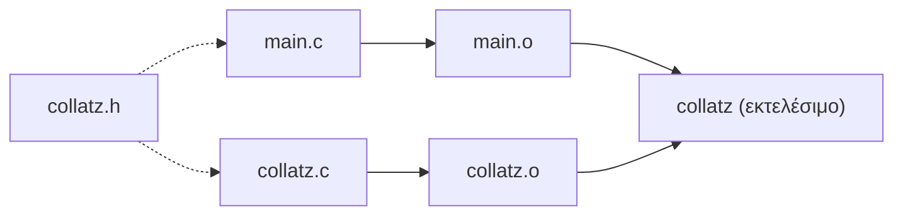

# Εργαστήριο #10: Είσοδος και Έξοδος με Αρχεία

> **Στόχοι**
>
> Μετά το εργαστήριο αυτό θα μπορείτε:
>
> - Να ανοίγετε, να διαβάζετε και να κλείνετε αρχεία κειμένου με ρεύματα.
> - Να γράφετε και να διαβάζετε δυαδικά αρχεία με `fread` και `fwrite`.
> - Να αναγνωρίζετε το τέλος ενός αρχείου και να χειρίζεστε σφάλματα ανοίγματος.
> - Να οργανώνετε ένα πρόγραμμα σε πολλαπλά αρχεία και να το χτίζετε με `make`.
>
> **Προαπαιτούμενα:** [Εργαστήριο #9](https://progintro.github.io/lab-material/labs/lab09/) - δομές και δυναμική μνήμη.
>
> **Αρχεία που θα φτιάξετε:** `more.c`, `bgrades.c`, `filediff.c`, `count.c`

Στο εργαστήριο αυτό θα μελετήσουμε τους μηχανισμούς εισόδου/εξόδου που μας παρέχει η C. Θα αναφερθούμε στις μονάδες εισόδου/εξόδου, που είναι τα ρεύματα, θα κάνουμε μία επισκόπηση στα προκαθορισμένα ρεύματα και θα ορίσουμε δικά μας ρεύματα για την επεξεργασία αρχείων κειμένου και δυαδικών αρχείων.

<!-- toc -->

**Περιεχόμενα**

- [Άσκηση 1: Αρχεία κειμένου (more.c)](#άσκηση-1-αρχεία-κειμένου-morec)
- [Άσκηση 2: Δυαδικά αρχεία (bgrades.c)](#άσκηση-2-δυαδικά-αρχεία-bgradesc)
- [Άσκηση 3: Σύγκριση αρχείων (filediff.c)](#άσκηση-3-σύγκριση-αρχείων-filediffc)
- [Άσκηση 4: Μέτρηση στατιστικών αρχείων (count.c)](#άσκηση-4-μέτρηση-στατιστικών-αρχείων-countc)
- [Παράρτημα: Οργάνωση προγράμματος σε πολλαπλά αρχεία](#παράρτημα-οργάνωση-προγράμματος-σε-πολλαπλά-αρχεία)
  - [Εμβέλεια και διάρκεια ζωής μεταβλητών](#εμβέλεια-και-διάρκεια-ζωής-μεταβλητών)
  - [Πηγαία αρχεία και αρχεία επικεφαλίδας](#πηγαία-αρχεία-και-αρχεία-επικεφαλίδας)
  - [Γιατί υπάρχουν τα include guards](#γιατί-υπάρχουν-τα-include-guards)
  - [Χωριστή μεταγλώττιση και σύνδεση](#χωριστή-μεταγλώττιση-και-σύνδεση)
  - [Αυτοματοποίηση με make](#αυτοματοποίηση-με-make)
  - [Άσκηση 5: Σπάστε το πρόγραμμά σας σε αρθρώματα (more.c)](#άσκηση-5-σπάστε-το-πρόγραμμά-σας-σε-αρθρώματα-morec)

<!-- /toc -->

## Άσκηση 1: Αρχεία κειμένου (more.c)

Κατασκευάστε το πρόγραμμα `more.c` που δέχεται ως όρισμα γραμμής εντολής το όνομα ενός αρχείου κειμένου και προβάλλει τις γραμμές του αρχείου ανά 20, προτρέποντας τον χρήστη να συνεχίσει, αν επιθυμεί, έως ότου συναντήσει το τέλος του αρχείου.

**Συναρτήσεις Εισόδου/Εξόδου στην C**

**Άνοιγμα και Κλείσιμο Αρχείων**
```c
FILE *fopen(const char *filename, const char *mode);
int fclose(FILE *fp);
```

- `fopen`: Ανοίγει το αρχείο με όνομα `filename` με τρόπο προσπέλασης που καθορίζεται από το `mode`. Επιστρέφει ένα ρεύμα μέσω του οποίου μπορούμε στη συνέχεια να αναφερόμαστε στο αρχείο, ή `NULL` αν δεν ήταν δυνατόν να ανοίξει το αρχείο.

    - `mode` **Παραδείγματα:**
        - `"r"`: Διάβασμα από υπάρχον αρχείο.
        - `"w"`: Γράψιμο σε αρχείο. Δημιουργείται αν δεν υπάρχει ή διαγράφονται τα περιεχόμενα αν υπάρχει.
        - `"a"`: Προσάρτηση δεδομένων στο τέλος του αρχείου.
        - `"r+"`, `"w+"`, `"a+"`: Διάφοροι συνδυασμοί ανάγνωσης και εγγραφής.
- `fclose`: Κλείνει το ρεύμα `fp`. Επιστρέφει `0` σε περίπτωση επιτυχίας.

**Άλλες Συναρτήσεις**

1. `int feof(FILE *fp)`
   - Επιστρέφει τιμή διαφορετική από το 0 αν το προηγούμενο διάβασμα απέτυχε λόγω τέλους αρχείου, αλλιώς επιστρέφει 0.
2. `int fprintf(FILE *fp, ...)`
   - Αντίστοιχη της `printf`, αλλά γράφει στο ρεύμα `fp` αντί του `stdout`.
3. `int fscanf(FILE *fp, ...)`
   - Αντίστοιχη της `scanf`, αλλά διαβάζει από το ρεύμα `fp` αντί του `stdin`.
4. `char *fgets(char *buf, int max, FILE *fp)`
   - Διαβάζει το πολύ `max-1` χαρακτήρες από το ρεύμα `fp` μέχρι την αλλαγή γραμμής και τους φυλάσσει στο `buf`. Αν δεν υπάρχουν δεδομένα, επιστρέφει `NULL`.
5. `int getc(FILE *fp)`
   - Επιστρέφει τον επόμενο χαρακτήρα από το ρεύμα `fp`, ή `EOF` αν φτάσει στο τέλος του αρχείου.


## Άσκηση 2: Δυαδικά αρχεία (bgrades.c)

**2.1** Κατασκευάστε το πρόγραμμα `bgrades.c`, το οποίο να ανοίγει το αρχείο `grades.dat` για γράψιμο σε δυαδική μορφή. Στη συνέχεια, να διαβάζει ένα όνομα (συμβολοσειρά) από την πρότυπη είσοδο και έναν βαθμό και να τα γράφει στο αρχείο. Το πρόγραμμα να τερματίζει όταν επισημανθεί, με κάποιο τρόπο, το τέλος της εισόδου.

**2.2** Στη συνέχεια, επεκτείνετε το πρόγραμμά σας, ώστε να ανοίγει το αρχείο `grades.dat` για διάβασμα, να διαβάζει τα δεδομένα που έχουν γραφεί σ' αυτό και να τα προβάλλει στην οθόνη.

**Συναρτήσεις για Δυαδική Εισαγωγή/Εξαγωγή:**

1. `size_t fread(void *ptr, size_t size, size_t count, FILE *fp)`
   - Διαβάζει από το ρεύμα `fp` το πολύ `count` δεδομένα μεγέθους `size` το καθένα και τα αποθηκεύει στη διεύθυνση `ptr`.
2. `size_t fwrite(const void *ptr, size_t size, size_t count, FILE *fp)`
   - Γράφει στο ρεύμα `fp` το πολύ `count` δεδομένα μεγέθους `size` το καθένα, από τη διεύθυνση `ptr`.

Για να δείτε τα περιεχόμενα του αρχείου `grades.dat`, αν δουλεύετε σ' ένα Unix σύστημα, χρησιμοποιήστε την εντολή `od -tu1c grades.dat` ή `hexdump -C grades.dat`.

## Άσκηση 3: Σύγκριση αρχείων (filediff.c)

Δημιουργήστε το πρόγραμμα `filediff.c`, το οποίο να δέχεται στη γραμμή εντολής τα ονόματα δύο αρχείων και να ελέγχει αν τα αρχεία αυτά είναι ίδια byte προς byte.

## Άσκηση 4: Μέτρηση στατιστικών αρχείων (count.c)

Στην άσκηση αυτή θα υλοποιήσουμε ένα υποσύνολο της εντολής `wc` του Unix. Συγκεκριμένα, θα κατασκευάσουμε πρόγραμμα που θα μετράει το πλήθος των χαρακτήρων και το πλήθος των γραμμών ενός αρχείου κειμένου.

**4.1** Κατασκευάστε το πρόγραμμα `count.c` που να δέχεται ως όρισμα γραμμής εντολής το όνομα ενός αρχείου κειμένου, να το ανοίγει για διάβασμα, να μετράει το πλήθος των χαρακτήρων του αρχείου και να προβάλλει το αποτέλεσμα στην οθόνη.

**4.2** Τροποποιήστε το πρόγραμμά σας, ώστε να μετράει και το πλήθος των γραμμών του αρχείου.

## Παράρτημα: Οργάνωση προγράμματος σε πολλαπλά αρχεία

Μέχρι τώρα κάθε πρόγραμμα που γράψαμε ζούσε σε ένα και μόνο αρχείο `.c`. Αυτό δουλεύει μια χαρά για εκατό γραμμές κώδικα, αλλά κανένα πραγματικό πρόγραμμα δεν γράφεται έτσι: όταν τα αρχεία μεγαλώνουν, γίνονται δύσκολα στην πλοήγηση, δύο άνθρωποι δεν μπορούν να δουλέψουν ταυτόχρονα πάνω τους, και κάθε μικρή αλλαγή απαιτεί να ξαναμεταγλωττιστεί ολόκληρο το πρόγραμμα.

Στο εργαστήριο 1 είχαμε ήδη δει τις εντολές: μεταγλωττίσαμε ένα πηγαίο αρχείο σε αντικειμενικό με `gcc -c` και συνδέσαμε δύο αντικειμενικά αρχεία σε ένα εκτελέσιμο. Εδώ θα δούμε *γιατί* το κάνουμε αυτό και πώς οργανώνουμε σωστά ένα πρόγραμμα σε πολλά αρχεία.

### Εμβέλεια και διάρκεια ζωής μεταβλητών

Πριν σπάσουμε ένα πρόγραμμα σε κομμάτια, πρέπει να ξέρουμε ποιες μεταβλητές είναι ορατές από πού - και για πόσο ζουν. Ας δούμε ένα πρόγραμμα `scope.c` που τα δείχνει όλα μαζί:

```c
#include <stdio.h>

int total = 0;
static int secret = 0;

void tick(void) {
    int local = 0;
    static int calls = 0;

    local++;
    calls++;
    total++;
    secret++;
    printf("local=%d calls=%d total=%d\n", local, calls, total);
}

int main(void) {
    tick();
    tick();
    tick();
    return 0;
}
```

```text
$ ./scope
local=1 calls=1 total=1
local=1 calls=2 total=2
local=1 calls=3 total=3
```

Η `local` ξαναγεννιέται σε κάθε κλήση και ξαναρχίζει από το 1. Η `calls` έχει την ίδια *εμβέλεια* με τη `local` (φαίνεται μόνο μέσα στην `tick`), αλλά διαφορετική *διάρκεια ζωής*: επειδή είναι `static`, ζει όσο και το πρόγραμμα και θυμάται την τιμή της ανάμεσα στις κλήσεις.

| Δήλωση | Πού φαίνεται | Πόσο ζει |
|---|---|---|
| `int local;` μέσα σε συνάρτηση | μόνο στη συνάρτηση | όσο διαρκεί η κλήση |
| `static int calls;` μέσα σε συνάρτηση | μόνο στη συνάρτηση | όσο όλο το πρόγραμμα |
| `int total;` έξω από συναρτήσεις | σε όλο το αρχείο, **και σε άλλα αρχεία** με `extern` | όσο όλο το πρόγραμμα |
| `static int secret;` έξω από συναρτήσεις | μόνο σε αυτό το αρχείο | όσο όλο το πρόγραμμα |

Η λέξη `static` κάνει επομένως δύο εντελώς διαφορετικές δουλειές ανάλογα με το πού γράφεται: **μέσα** σε συνάρτηση επεκτείνει τη ζωή μιας μεταβλητής, ενώ **έξω** από συναρτήσεις περιορίζει την ορατότητά της στο αρχείο. Το δεύτερο είναι ο βασικός τρόπος με τον οποίο ένα αρχείο κρύβει τις λεπτομέρειές του από τα υπόλοιπα.

> Οι καθολικές μεταβλητές είναι βολικές αλλά επικίνδυνες: οποιαδήποτε συνάρτηση μπορεί να τις αλλάξει, οπότε όταν πάρετε λάθος τιμή δεν ξέρετε ποιος φταίει. Χρησιμοποιήστε τις με φειδώ - μια καλή περίπτωση είδαμε στο εργαστήριο 5, όπου μετρήσαμε τις αναδρομικές κλήσεις της `fib`.

### Πηγαία αρχεία και αρχεία επικεφαλίδας

Ας πάρουμε το `collatz.c` που γράψαμε στο εργαστήριο 5 και ας το σπάσουμε σε δύο μέρη: τον *υπολογισμό* και το *πρόγραμμα που τον χρησιμοποιεί*.

Ο κανόνας είναι απλός. Ο **κώδικας** μιας συνάρτησης πάει σε ένα αρχείο `.c`. Το **πρωτότυπό** της πάει σε ένα αρχείο επικεφαλίδας `.h`, το οποίο κάνει `#include` όποιο αρχείο θέλει να την καλέσει.

`collatz.h` - τι προσφέρει το άρθρωμα:

```c
#ifndef COLLATZ_H
#define COLLATZ_H

int isodd(int n);
int collatz_it(int n);

#endif
```

`collatz.c` - πώς το κάνει:

```c
#include "collatz.h"

int isodd(int n) {
    return n % 2 != 0;
}

int collatz_it(int n) {
    int length = 1;
    while (n != 1) {
        n = isodd(n) ? 3 * n + 1 : n / 2;
        length++;
    }
    return length;
}
```

`main.c` - ποιος το χρησιμοποιεί:

```c
#include <stdio.h>
#include "collatz.h"

int main(void) {
    int n;
    printf("Number: ");
    scanf("%d", &n);
    printf("Collatz length of %d: %d\n", n, collatz_it(n));
    return 0;
}
```

Προσέξτε δύο λεπτομέρειες:

- Γράφουμε `#include "collatz.h"` με **εισαγωγικά** και όχι `<collatz.h>` με γωνιακές αγκύλες. Τα εισαγωγικά λένε στον μεταγλωττιστή να ψάξει πρώτα στον κατάλογό μας· οι γωνιακές αγκύλες προορίζονται για τα αρχεία επικεφαλίδας του συστήματος, όπως το `stdio.h`.
- Το ίδιο το `collatz.c` κάνει `#include "collatz.h"`. Δεν το χρειάζεται για να μεταγλωττιστεί, αλλά έτσι ο μεταγλωττιστής θα μας προειδοποιήσει αν το πρωτότυπο στο `.h` πάψει κάποια στιγμή να συμφωνεί με τον κώδικα στο `.c`.

### Γιατί υπάρχουν τα include guards

Οι τρεις γραμμές `#ifndef` / `#define` / `#endif` που περιβάλλουν το `collatz.h` λέγονται *include guard*. Χωρίς αυτές, αν ένα αρχείο κατέληγε να κάνει `#include "collatz.h"` δύο φορές - κάτι πολύ εύκολο όταν τα αρχεία επικεφαλίδας συμπεριλαμβάνουν το ένα το άλλο - ο μεταγλωττιστής θα έβλεπε τα ίδια πρωτότυπα δύο φορές και θα διαμαρτυρόταν. Το guard φροντίζει ώστε τα περιεχόμενα να διαβαστούν μόνο την πρώτη φορά.

### Χωριστή μεταγλώττιση και σύνδεση

Τώρα το πρόγραμμα φτιάχνεται σε δύο στάδια. Πρώτα κάθε `.c` μεταγλωττίζεται **ανεξάρτητα** σε ένα αντικειμενικό αρχείο `.o`, και μετά όλα τα `.o` συνδέονται σε ένα εκτελέσιμο:



```text
$ gcc -Wall -c collatz.c        # παράγει το collatz.o
$ gcc -Wall -c main.c           # παράγει το main.o
$ gcc -Wall -o collatz main.o collatz.o
$ ./collatz
Number: 42
Collatz length of 42: 9
```

Το κέρδος φαίνεται όταν αλλάξουμε κάτι: αν πειράξουμε μόνο το `main.c`, αρκεί να ξαναφτιάξουμε το `main.o` και να ξανασυνδέσουμε. Το `collatz.o` μένει ως έχει. Σε ένα πρόγραμμα με πενήντα αρχεία η διαφορά είναι δραματική.

### Αυτοματοποίηση με make

Το να θυμόμαστε ποιο `.o` πρέπει να ξαναφτιαχτεί μετά από κάθε αλλαγή είναι ακριβώς η δουλειά που δεν θέλουμε να κάνουμε με το χέρι. Το εργαλείο `make` διαβάζει ένα αρχείο με όνομα `Makefile`, στο οποίο δηλώνουμε τι **εξαρτάται** από τι, και ξαναχτίζει μόνο ό,τι χρειάζεται:

```make
CC = gcc
CFLAGS = -Wall -g3

collatz: main.o collatz.o
	$(CC) $(CFLAGS) -o collatz main.o collatz.o

main.o: main.c collatz.h
	$(CC) $(CFLAGS) -c main.c

collatz.o: collatz.c collatz.h
	$(CC) $(CFLAGS) -c collatz.c

clean:
	rm -f collatz main.o collatz.o
```

Κάθε κανόνας έχει τη μορφή `στόχος: προϋποθέσεις`, και από κάτω - **με στηλογνώμονα (tab) και όχι με κενά** - τις εντολές που τον παράγουν. Παρατηρήστε ότι το `main.o` εξαρτάται και από το `collatz.h`: αν αλλάξει το πρωτότυπο, το `main.c` πρέπει να ξαναμεταγλωττιστεί.

```text
$ make
gcc -Wall -g3 -c main.c
gcc -Wall -g3 -c collatz.c
gcc -Wall -g3 -o collatz main.o collatz.o
$ make
make: 'collatz' is up to date.
$ make clean
rm -f collatz main.o collatz.o
```

Τρέχοντας `make` δεύτερη φορά χωρίς καμία αλλαγή, το `make` δεν κάνει τίποτα - ξέρει ότι όλα είναι ενημερωμένα.

### Άσκηση 5: Σπάστε το πρόγραμμά σας σε αρθρώματα (more.c)

Πάρτε το πρόγραμμα `more.c` της Άσκησης 1 και οργανώστε το σε πολλαπλά αρχεία:

**1.** Μεταφέρετε τη λογική ανάγνωσης και προβολής γραμμών σε ένα άρθρωμα `pager.c` με αντίστοιχο `pager.h`, αφήνοντας στη `main` μόνο τον χειρισμό των ορισμάτων γραμμής εντολής και το άνοιγμα του αρχείου.

**2.** Βάλτε include guard στο `pager.h`.

**3.** Κάντε τη σταθερά των 20 γραμμών `static` μέσα στο `pager.c`, ώστε να μην είναι ορατή από το `main.c`.

**4.** Μεταγλωττίστε πρώτα με το χέρι (`gcc -c` και σύνδεση) και μετά γράψτε ένα `Makefile` που κάνει το ίδιο. Επιβεβαιώστε ότι μετά από αλλαγή μόνο στο `main.c` το `make` ξαναμεταγλωττίζει μόνο αυτό.

**5.** Προσθέστε στο `Makefile` έναν στόχο `clean`.
